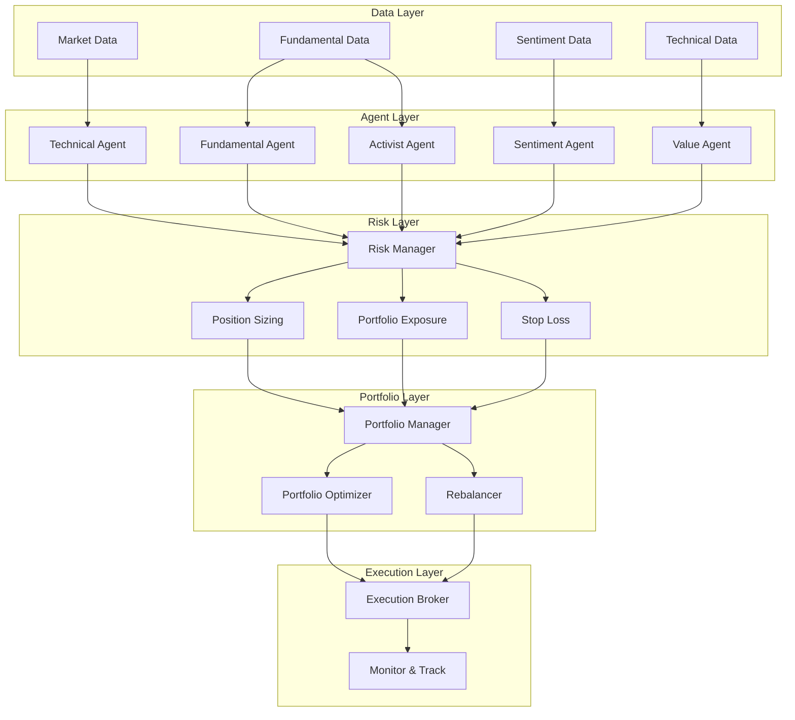
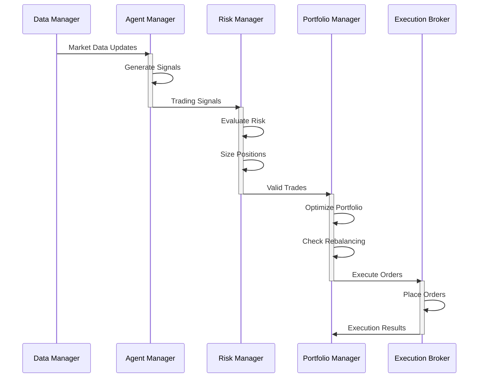
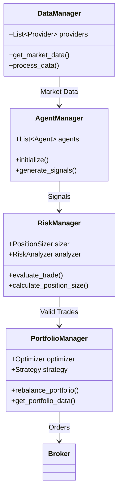
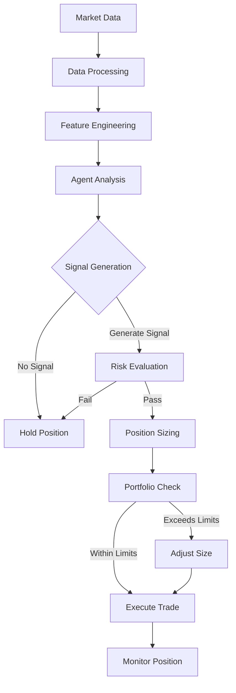
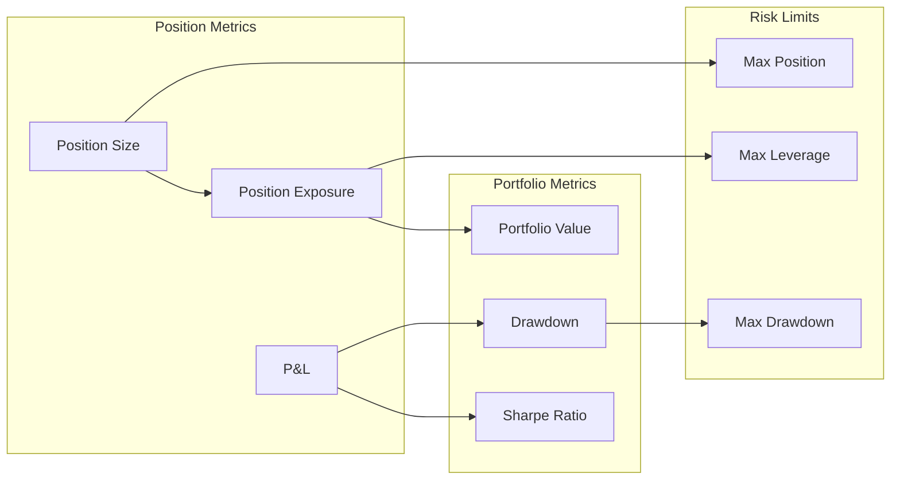

# AI Hedge Fund Technical Documentation

## 1. Overview and Purpose

The AI Hedge Fund project is an advanced algorithmic trading system that combines multiple AI agents, sophisticated risk management, and portfolio optimization to make data-driven investment decisions in cryptocurrency markets. 

### Key Objectives
- Automate trading decisions using multiple specialized AI agents
- Implement robust risk management controls
- Optimize portfolio allocation across multiple assets
- Provide real-time monitoring and performance analytics

### Value Proposition
- **Multi-Agent Architecture**: Combines insights from technical, fundamental, sentiment, and value analysis
- **Risk-First Approach**: Implements multiple layers of risk controls and position sizing
- **Portfolio Optimization**: Uses modern portfolio theory and adaptive rebalancing
- **Extensible Framework**: Modular design allows easy addition of new strategies and data sources

## 2. System Architecture

### High-Level Architecture



### Component Interactions



## 3. Code Structure

### Project Organization
```
alpha_pulse/
├── agents/                 # Trading agents implementation
├── api/                   # API endpoints and routing
├── backtesting/          # Backtesting framework
├── config/               # Configuration files
├── data_pipeline/        # Data ingestion and processing
├── examples/             # Example scripts and demos
├── execution/            # Order execution and broker interfaces
├── features/             # Feature engineering
├── hedging/              # Hedging strategies
├── models/               # ML models
├── monitoring/           # Performance monitoring
├── portfolio/            # Portfolio management
├── risk_management/      # Risk controls
└── tests/                # Unit and integration tests
```

### Core Classes Relationship



## 4. Core Logic and Algorithms

### Technical Agent Signal Generation
```python
def generate_technical_signal(self, data: pd.DataFrame) -> Signal:
    # Calculate technical indicators
    trend_score = self._calculate_trend_score(data)
    momentum_score = self._calculate_momentum_score(data)
    volatility_score = self._calculate_volatility_score(data)
    volume_score = self._calculate_volume_score(data)
    pattern_score = self._calculate_pattern_score(data)
    
    # Weight and combine scores
    technical_score = (
        trend_score * 0.30 +      # Trend following
        momentum_score * 0.20 +   # Price momentum
        volatility_score * 0.20 + # Volatility regime
        volume_score * 0.15 +     # Volume analysis
        pattern_score * 0.15      # Chart patterns
    )
    
    # Generate signal based on score
    if abs(technical_score) > self.min_threshold:
        direction = SignalDirection.BUY if technical_score > 0 else SignalDirection.SELL
        confidence = min(abs(technical_score), self.max_confidence)
        return Signal(direction=direction, confidence=confidence)
    
    return None
```

### Position Sizing Algorithm
```python
def calculate_position_size(self, portfolio_value: float, signal: Signal) -> float:
    # Kelly Criterion for base position size
    win_rate = self._calculate_win_rate(signal.symbol)
    avg_win = self._calculate_avg_win(signal.symbol)
    avg_loss = self._calculate_avg_loss(signal.symbol)
    
    kelly_fraction = (win_rate * avg_win - (1 - win_rate) * avg_loss) / avg_win
    kelly_fraction = min(kelly_fraction, self.max_size_pct)
    
    # Adjust by signal confidence and volatility
    confidence_adj = signal.confidence / self.max_confidence
    vol_adj = self._calculate_volatility_adjustment(signal.symbol)
    
    # Final position size
    position_size = portfolio_value * kelly_fraction * confidence_adj * vol_adj
    return min(position_size, portfolio_value * self.max_size_pct)
```

## 5. Workflow Examples

### Trading Decision Flow



## 6. Deployment and Usage

### Environment Setup
1. Clone repository and install dependencies:
```bash
git clone https://github.com/your-org/alpha-pulse.git
cd alpha-pulse
pip install -r requirements.txt
```

2. Configure environment variables:
```bash
export ALPHA_PULSE_ENV=production
export ALPHA_PULSE_CONFIG=/path/to/config.yaml
```

3. Initialize database:
```bash
python scripts/init_db.py
```

### Running the System
1. Start the data pipeline:
```bash
python -m alpha_pulse.data_pipeline
```

2. Launch the trading engine:
```bash
python -m alpha_pulse.main
```

3. Monitor performance:
```bash
python -m alpha_pulse.monitoring
```

## 7. Risk Management and Validation

### Risk Controls
- Position Size Limits: Maximum 20% of portfolio per position
- Portfolio Leverage: Maximum 1.5x total exposure
- Stop Loss: Dynamic ATR-based stops with 2% maximum loss per trade
- Drawdown Protection: Reduce exposure when approaching maximum drawdown limit

### Validation Process
1. Historical Backtesting
2. Paper Trading Validation
3. Small-Scale Live Testing
4. Gradual Capital Allocation

## 8. Further Development

### Planned Enhancements
1. Additional Data Sources
   - On-chain metrics
   - Order book data
   - Social media sentiment

2. Advanced Analytics
   - Deep learning models
   - Reinforcement learning
   - Natural language processing

3. Infrastructure Improvements
   - Real-time processing
   - Distributed computing
   - Cloud deployment

### Performance Optimizations
- Implement data caching
- Parallelize agent computations
- Optimize database queries
- Use GPU acceleration for ML models

## 9. Appendices

### Risk Metrics Calculation



### References
1. Modern Portfolio Theory
2. Kelly Criterion
3. Risk-Adjusted Position Sizing
4. Technical Analysis
5. Machine Learning in Finance
