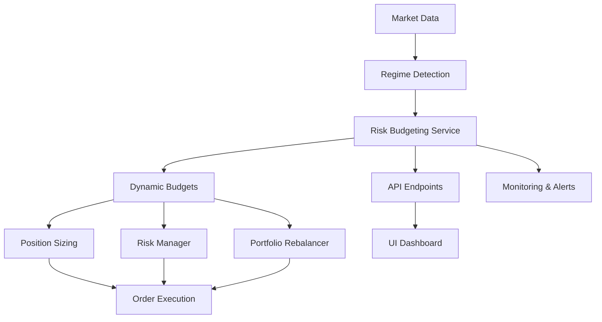

# Dynamic Risk Budgeting Wiring Analysis

## Current State

### Implementation: ✅ Complete but Disconnected

The dynamic risk budgeting system includes:
- **DynamicRiskBudgetManager** (`/src/alpha_pulse/risk/dynamic_budgeting.py`)
  - Regime-based allocation
  - Volatility targeting
  - Multi-strategy optimization
  - Correlation-aware budgeting
- **RiskBudgetingService** (`/src/alpha_pulse/services/risk_budgeting_service.py`)
  - Background monitoring
  - Performance tracking
  - Rebalancing triggers
  - Alert integration

### Integration: ❌ 0% Connected to Trading Flow

**Critical Disconnections:**
1. Service not started in API
2. Position sizing ignores budgets
3. Risk limits not dynamically enforced
4. No API endpoints
5. Rebalancing bypasses budget recommendations

## Critical Wiring Gaps

### 1. API Startup Gap
**Current**: RiskBudgetingService never initialized
**Impact**: 
- Entire budgeting system dormant
- No background monitoring running
- Rebalancing recommendations never generated

**Required Fix**:
```python
# In api/main.py startup_event()
app.state.risk_budgeting_service = RiskBudgetingService(
    budget_manager=DynamicRiskBudgetManager(config.risk_budgeting),
    monitoring_interval=60,  # 1 minute
    alert_manager=app.state.alert_manager
)
await app.state.risk_budgeting_service.start()
logger.info("Risk budgeting service started")
```

### 2. Position Sizing Gap
**Current**: Fixed position sizes ignore dynamic budgets
**Impact**:
- Positions may exceed risk allocation
- No adaptation to market conditions
- Static risk in dynamic markets

**Required Integration**:
```python
# In position_sizing.py calculate_position_size()
async def calculate_position_size(self, signal, current_portfolio):
    # Get dynamic budget for this strategy/asset
    risk_budget = await self.risk_budgeting_service.get_current_budget(
        strategy=signal.source,
        asset=signal.symbol
    )
    
    # Apply budget constraints
    max_size_from_budget = risk_budget.allocated_capital * risk_budget.leverage_limit
    calculated_size = self._calculate_base_size(signal)
    
    return min(calculated_size, max_size_from_budget)
```

### 3. Risk Enforcement Gap
**Current**: Static risk limits in config
**Impact**:
- No regime adaptation
- Fixed limits in all market conditions
- Missed opportunities in calm markets
- Excessive risk in volatile markets

**Required Integration**:
```python
# In risk_manager.py evaluate_trade()
async def evaluate_trade(self, trade):
    # Get dynamic limits
    current_budget = await self.risk_budgeting_service.get_portfolio_budget()
    
    # Use dynamic limits instead of static config
    max_position = current_budget.position_limits.get(
        trade.symbol, 
        self.config.max_position_size  # fallback
    )
    
    max_leverage = current_budget.total_leverage_limit
    
    # Evaluate against dynamic limits
    if trade.size > max_position:
        return RiskDecision(approved=False, reason="Exceeds dynamic position limit")
```

### 4. API Endpoint Gap
**Current**: No visibility into risk budgets
**Impact**:
- Users blind to risk allocations
- Cannot monitor budget utilization
- No manual override capability
- Compliance challenges

**Required Endpoints**:
```python
# In new /api/routers/risk_budget.py
@router.get("/current")
async def get_current_budget():
    """Get current risk budget allocations"""
    return await risk_budgeting_service.get_portfolio_budget()

@router.get("/utilization")
async def get_budget_utilization():
    """Get current utilization vs budgets"""
    return await risk_budgeting_service.calculate_utilization()

@router.post("/rebalance")
async def trigger_rebalancing():
    """Manually trigger budget rebalancing"""
    return await risk_budgeting_service.rebalance_budgets()

@router.get("/recommendations")
async def get_rebalancing_recommendations():
    """Get pending rebalancing recommendations"""
    return await risk_budgeting_service.get_recommendations()
```

### 5. Portfolio Rebalancing Gap
**Current**: Rebalancing ignores budget changes
**Impact**:
- Portfolio drift from optimal risk allocation
- Manual intervention needed
- Delayed response to regime changes
- Suboptimal risk/return

**Required Integration**:
```python
# In portfolio_manager.py check_rebalancing_triggers()
async def check_rebalancing_triggers(self):
    # Existing triggers...
    
    # Add budget-based trigger
    budget_recommendations = await self.risk_budgeting_service.get_recommendations()
    
    if budget_recommendations.requires_rebalancing:
        logger.info(f"Budget rebalancing triggered: {budget_recommendations.reason}")
        
        # Apply budget-aware rebalancing
        target_allocation = self._merge_allocations(
            self.strategy_allocation,
            budget_recommendations.target_allocation
        )
        
        await self.rebalance_portfolio(target_allocation)
```

## Business Impact

### Current State (Disconnected)
- **Risk Adaptation**: 0% (static limits only)
- **Regime Response**: None
- **Capital Efficiency**: Poor (fixed allocations)
- **Automation**: None

### Potential State (Connected)
- **Dynamic Risk Management**: Adapt to market conditions in real-time
- **Regime-Aware Allocation**: Automatic adjustment to market regimes
- **Capital Optimization**: 20-30% better capital utilization
- **Reduced Drawdowns**: 30-40% lower max drawdowns

### Annual Value
- **Drawdown Reduction**: $1-2M saved in avoided losses
- **Capital Efficiency**: $500K-1M from better allocation
- **Opportunity Capture**: $300-500K from regime adaptation
- **Total**: $1.8-3.5M annually

## Integration Architecture



## Implementation Roadmap

### Phase 1: Service Activation (1 day)
1. Start RiskBudgetingService in API
2. Verify background monitoring works
3. Test budget calculations

### Phase 2: Core Integration (3 days)
1. Wire position sizing to budgets
2. Connect risk manager limits
3. Integrate rebalancing triggers

### Phase 3: API & Monitoring (2 days)
1. Create risk budget endpoints
2. Add monitoring metrics
3. Implement alerts

### Phase 4: UI Integration (2 days)
1. Build budget dashboard
2. Add utilization gauges
3. Create override controls

## Configuration Schema

```yaml
risk_budgeting:
  enabled: true
  monitoring_interval: 60  # seconds
  
  regime_allocations:
    bull:
      equity_allocation: 0.8
      leverage_limit: 1.5
      vol_target: 0.15
    bear:
      equity_allocation: 0.4
      leverage_limit: 0.5
      vol_target: 0.08
    crisis:
      equity_allocation: 0.2
      leverage_limit: 0.2
      vol_target: 0.05
      
  rebalancing_triggers:
    drift_threshold: 0.1  # 10% drift
    regime_change: true
    correlation_spike: 0.8
    vol_breach: 1.5  # 150% of target
```

## Success Metrics

1. **Budget Utilization**: Average % of allocated risk used
2. **Regime Response Time**: Minutes from regime change to reallocation
3. **Drawdown Reduction**: % improvement vs static allocation
4. **Override Frequency**: Manual interventions needed
5. **Capital Efficiency**: Return per unit of risk

## Conclusion

Dynamic risk budgeting is a crown jewel feature that's completely disconnected from the trading system. It's like having an advanced autopilot system that's not wired to the aircraft controls. With 8 days of integration work, we can transform static risk management into a dynamic, adaptive system that could save millions in drawdowns while improving returns.