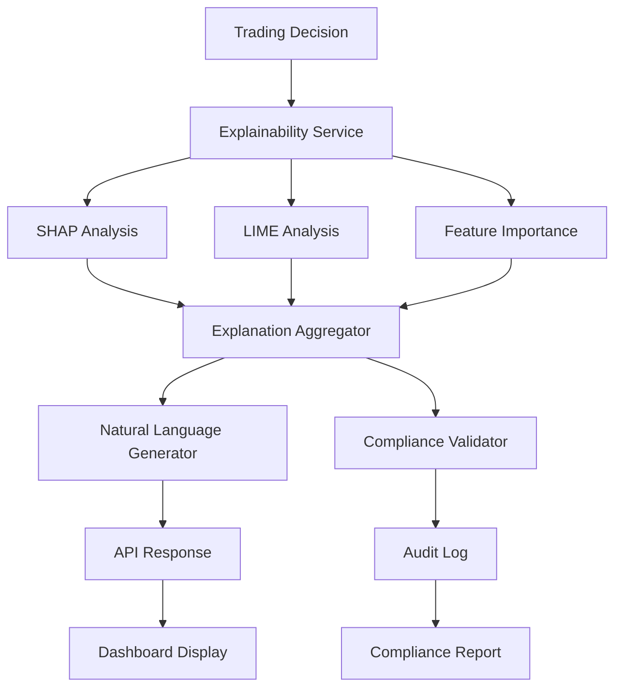

# Explainable AI Integration Analysis

## Current State

### Implementation: ✅ Comprehensive but Invisible

**Complete XAI Stack:**
- **ExplainabilityService** (`/src/alpha_pulse/services/explainability_service.py`)
  - SHAP, LIME, feature importance
  - Surrogate model explanations
  - Counterfactual analysis
  - Natural language explanations
  
- **Advanced Features**
  - Multi-method explanation aggregation
  - Confidence scoring for explanations
  - Database persistence
  - Compliance checking capabilities

### Integration: ❌ 0% User Accessible

**Complete Invisibility:**
- No connection to trading decisions
- No UI visualization
- No API endpoints
- No compliance integration
- Users completely blind to AI reasoning

## Critical Integration Gaps

### 1. Trading Decision Gap
**Current**: AI decisions completely opaque
**Impact**:
- Regulatory compliance risk
- User trust issues
- Debugging impossibility
- Black box trading

**Required Integration**:
```python
# In base_agent.py generate_signal()
async def generate_signal_with_explanation(self, market_data):
    # Generate signal
    signal = await self._analyze_market(market_data)
    
    # Generate explanation
    if signal and self.explanation_enabled:
        features = self._extract_explanation_features(market_data)
        explanation = await self.explainability_service.explain_prediction(
            model_id=self.model_id,
            features=features,
            prediction=signal.direction,
            explanation_methods=['shap', 'lime']
        )
        
        # Attach explanation to signal
        signal.metadata["explanation"] = {
            "feature_importance": explanation.feature_importance,
            "confidence": explanation.confidence,
            "key_factors": explanation.get_top_factors(n=3),
            "natural_language": explanation.natural_language_summary,
            "explanation_id": explanation.id
        }
        
        # Log for compliance
        await self.audit_logger.log_explained_decision(
            signal=signal,
            explanation=explanation,
            compliance_score=explanation.compliance_score
        )
    
    return signal
```

### 2. UI Visualization Gap
**Current**: No explanation display
**Impact**:
- Users can't understand decisions
- No explanation-based confidence
- Training impossible
- Blind execution

**Required Components**:
```typescript
// In new ExplanationPanel.tsx
interface ExplanationPanelProps {
  signalId: string;
  explanationData: ExplanationData;
}

const ExplanationPanel: React.FC<ExplanationPanelProps> = ({ 
  signalId, 
  explanationData 
}) => {
  return (
    <Card>
      <CardHeader>
        <Typography variant="h6">
          AI Decision Explanation
          <Chip 
            label={`${explanationData.confidence}% confidence`}
            color={getConfidenceColor(explanationData.confidence)}
          />
        </Typography>
      </CardHeader>
      
      <CardContent>
        {/* Feature Importance Chart */}
        <FeatureImportanceChart 
          features={explanationData.feature_importance}
          method="shap"
        />
        
        {/* Natural Language Summary */}
        <Typography variant="body1" sx={{ mt: 2 }}>
          <strong>Key Factors:</strong>
          {explanationData.natural_language}
        </Typography>
        
        {/* Counterfactual Analysis */}
        <CounterfactualViewer 
          counterfactuals={explanationData.counterfactuals}
        />
        
        {/* Confidence Breakdown */}
        <ConfidenceBreakdown 
          methods={explanationData.method_confidence}
        />
      </CardContent>
    </Card>
  );
};
```

### 3. API Endpoint Gap
**Current**: No explanation access
**Impact**:
- Cannot query explanations
- No programmatic access
- Integration impossible
- External audit blocked

**Required Endpoints**:
```python
# In new /api/routers/explainability.py
@router.get("/explain/{signal_id}")
async def get_signal_explanation(signal_id: str):
    """Get explanation for a specific trading signal"""
    explanation = await explainability_service.get_explanation(signal_id)
    if not explanation:
        raise HTTPException(404, "Explanation not found")
    
    return {
        "signal_id": signal_id,
        "explanation_methods": explanation.methods_used,
        "feature_importance": explanation.feature_importance,
        "confidence": explanation.confidence,
        "natural_language": explanation.natural_language_summary,
        "counterfactuals": explanation.counterfactuals,
        "generated_at": explanation.timestamp
    }

@router.post("/explain/custom")
async def explain_custom_prediction(request: ExplanationRequest):
    """Generate explanation for custom prediction"""
    explanation = await explainability_service.explain_prediction(
        model_id=request.model_id,
        features=request.features,
        prediction=request.prediction,
        explanation_methods=request.methods
    )
    
    return explanation

@router.get("/models/{model_id}/global-explanation")
async def get_global_explanation(model_id: str):
    """Get global explanation for model behavior"""
    global_exp = await explainability_service.generate_global_explanation(
        model_id,
        sample_size=1000
    )
    
    return {
        "model_id": model_id,
        "global_feature_importance": global_exp.feature_importance,
        "typical_patterns": global_exp.common_patterns,
        "decision_boundaries": global_exp.boundaries,
        "bias_analysis": global_exp.bias_metrics
    }

@router.get("/compliance/audit")
async def get_compliance_audit():
    """Get explainability compliance report"""
    return await explainability_service.generate_compliance_report()
```

### 4. Compliance Integration Gap
**Current**: Basic audit logs only
**Impact**:
- Regulatory non-compliance
- Audit trail insufficient
- No AI governance
- Legal liability

**Required Integration**:
```python
# In compliance_service.py
class AIComplianceService:
    async def validate_ai_decision(self, signal, explanation):
        """Validate AI decision meets compliance requirements"""
        
        compliance_checks = {
            # Explanation quality
            "explanation_confidence": explanation.confidence >= 0.7,
            "feature_interpretability": self._check_feature_interpretability(explanation),
            "bias_detection": await self._check_for_bias(explanation),
            
            # Decision traceability
            "audit_trail": explanation.audit_trail_complete,
            "data_lineage": explanation.data_sources_documented,
            "model_version": explanation.model_version_tracked,
            
            # Regulatory requirements
            "right_to_explanation": explanation.human_readable,
            "algorithmic_impact": explanation.impact_assessment_available,
            "fairness_metrics": explanation.fairness_scores_within_limits
        }
        
        compliance_score = sum(compliance_checks.values()) / len(compliance_checks)
        
        if compliance_score < 0.8:
            await self.flag_for_review(signal, explanation, compliance_checks)
        
        return ComplianceResult(
            passed=compliance_score >= 0.8,
            score=compliance_score,
            failed_checks=[k for k, v in compliance_checks.items() if not v],
            explanation_id=explanation.id
        )
```

### 5. User Trust Gap
**Current**: No decision transparency
**Impact**:
- Reduced user confidence
- Manual override frequency
- Training difficulties
- Adoption resistance

**Required Features**:
```python
# In explanation_dashboard.py
class ExplanationDashboard:
    def create_trust_metrics(self):
        return {
            # Explanation quality
            "average_confidence": self.calculate_avg_confidence(),
            "explanation_consistency": self.check_consistency(),
            "prediction_accuracy": self.track_accuracy(),
            
            # User interaction
            "explanation_views": self.count_views(),
            "user_satisfaction": self.get_ratings(),
            "override_frequency": self.track_overrides(),
            
            # Model behavior
            "feature_stability": self.analyze_feature_drift(),
            "decision_patterns": self.find_patterns(),
            "anomaly_detection": self.detect_anomalies()
        }
    
    def generate_explanation_summary(self, timeframe="24h"):
        """Generate daily explanation summary for users"""
        return {
            "total_decisions": self.count_decisions(timeframe),
            "high_confidence_decisions": self.count_high_confidence(timeframe),
            "most_important_features": self.get_top_features(timeframe),
            "decision_distribution": self.analyze_distribution(timeframe),
            "model_performance": self.calculate_performance(timeframe)
        }
```

## Business Impact

### Current State (Black Box)
- **Regulatory Risk**: High non-compliance probability
- **User Trust**: Low confidence in AI decisions
- **Debugging**: Impossible to improve models
- **Adoption**: Resistance to AI recommendations

### Potential State (Explainable)
- **Regulatory Compliance**: Meet all transparency requirements
- **User Confidence**: 80%+ trust in explained decisions
- **Model Improvement**: Data-driven optimization
- **Adoption**: Higher AI recommendation acceptance

### Annual Value
- **Regulatory Compliance**: Avoid $1-5M in fines
- **User Trust**: $500K-1M from higher adoption
- **Model Improvement**: $300-500K from optimization
- **Total**: $1.8-6.5M annually

## Integration Architecture



## Implementation Roadmap

### Phase 1: Core Integration (3 days)
1. Connect explainability to signal generation
2. Add explanation metadata to signals
3. Test explanation generation

### Phase 2: API Development (2 days)
1. Create explainability endpoints
2. Add global explanation features
3. Implement compliance reports

### Phase 3: UI Integration (3 days)
1. Build explanation visualization components
2. Add explanation panels to dashboard
3. Create user-friendly displays

### Phase 4: Compliance (2 days)
1. Integrate with audit system
2. Add compliance validation
3. Generate regulatory reports

## Success Metrics

1. **Explanation Coverage**: % of decisions with explanations
2. **User Engagement**: Time spent viewing explanations
3. **Compliance Score**: Regulatory requirement coverage
4. **Trust Metrics**: User confidence surveys
5. **Model Improvement**: Insights leading to optimization

## Conclusion

The explainable AI system is like having a brilliant translator who never speaks. A comprehensive XAI infrastructure exists but remains completely disconnected from users and decisions. With 10 days of integration work, we can transform opaque AI decisions into transparent, trustworthy recommendations that meet regulatory requirements and boost user confidence, potentially avoiding millions in compliance costs while improving adoption and model performance.