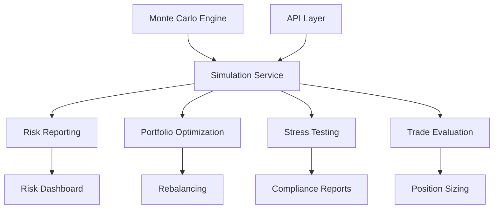

# Monte Carlo Simulation Integration Analysis

## Current State

### Implementation: ✅ Advanced but Unused

**Core Components:**
- **MonteCarloEngine** (`/src/alpha_pulse/risk/monte_carlo_engine.py`)
  - Multiple stochastic processes (GBM, Jump Diffusion, Heston, Variance Gamma)
  - Variance reduction techniques
  - GPU acceleration support
  - Greeks calculation
  
- **SimulationService** (`/src/alpha_pulse/services/simulation_service.py`)
  - Portfolio simulation orchestration
  - Stress testing scenarios
  - Model backtesting
  - Result caching and parallelization

### Integration: ❌ 0% Used in Decision Making

**Complete Isolation:**
- Not used in risk reporting
- Portfolio optimization ignores scenarios
- No API endpoints
- Stress testing disconnected
- Zero impact on trading decisions

## Critical Integration Gaps

### 1. Risk Reporting Gap
**Current**: Risk reports show basic VaR only
**Impact**:
- Incomplete risk picture
- No tail risk visibility
- Missing scenario analysis
- Regulatory compliance issues

**Required Integration**:
```python
# In risk_reporter.py generate_risk_report()
async def generate_risk_report(self, portfolio):
    # Add Monte Carlo simulation
    simulation_report = await self.simulation_service.generate_simulation_report(
        portfolio,
        horizons=[1, 5, 20],  # 1 day, 1 week, 1 month
        confidence_levels=[0.95, 0.99],
        scenarios=10000
    )
    
    report = {
        "traditional_metrics": self._calculate_traditional_metrics(portfolio),
        "monte_carlo_var": simulation_report.var_estimates,
        "monte_carlo_cvar": simulation_report.cvar_estimates,
        "tail_risk_analysis": simulation_report.tail_statistics,
        "scenario_analysis": simulation_report.scenario_results,
        "stress_test_results": simulation_report.stress_test_results
    }
    
    return RiskReport(**report)
```

### 2. Portfolio Optimization Gap
**Current**: Optimization uses historical data only
**Impact**:
- Fragile to future scenarios
- No robustness testing
- Overfits to past data
- Surprises in new regimes

**Required Integration**:
```python
# In portfolio_optimizer.py optimize()
async def optimize_with_scenarios(self, portfolio, constraints):
    # Generate future scenarios
    scenarios = await self.simulation_service.generate_portfolio_scenarios(
        portfolio,
        num_scenarios=1000,
        horizon=20,  # days
        process_type="regime_switching"
    )
    
    # Robust optimization across scenarios
    optimal_weights = self._solve_robust_optimization(
        scenarios,
        constraints,
        objective="worst_case_sharpe"  # or "cvar_minimization"
    )
    
    # Test robustness
    backtest_results = await self.simulation_service.backtest_strategy(
        optimal_weights,
        scenarios
    )
    
    return OptimizationResult(
        weights=optimal_weights,
        expected_performance=backtest_results.summary_stats,
        scenario_analysis=backtest_results.scenario_breakdown
    )
```

### 3. API Endpoint Gap
**Current**: No simulation endpoints
**Impact**:
- Cannot run what-if analysis
- No stress testing interface
- Hidden simulation capabilities
- No user scenario exploration

**Required Endpoints**:
```python
# In new /api/routers/simulation.py
@router.post("/portfolio-simulation")
async def run_portfolio_simulation(request: SimulationRequest):
    """Run Monte Carlo simulation for portfolio"""
    results = await simulation_service.simulate_portfolio(
        request.portfolio,
        request.horizons,
        request.num_scenarios,
        request.process_type
    )
    return results

@router.post("/stress-test")
async def run_stress_test(request: StressTestRequest):
    """Run stress test scenarios"""
    results = await simulation_service.run_stress_tests(
        request.portfolio,
        request.scenarios  # e.g., "2008_crisis", "covid_crash", "custom"
    )
    return results

@router.post("/option-pricing")
async def price_options(request: OptionRequest):
    """Price options using Monte Carlo"""
    greeks = await simulation_service.calculate_option_greeks(
        request.underlying,
        request.strike,
        request.expiry,
        request.option_type
    )
    return greeks

@router.post("/what-if")
async def what_if_analysis(request: WhatIfRequest):
    """Run custom what-if scenarios"""
    results = await simulation_service.run_custom_scenario(
        request.portfolio,
        request.market_shocks,
        request.correlation_changes
    )
    return results
```

### 4. Decision Integration Gap
**Current**: Decisions ignore simulation insights
**Impact**:
- Blind to tail risks
- No scenario-based sizing
- Reactive not proactive
- Surprises cost money

**Required Integration**:
```python
# In risk_manager.py evaluate_trade()
async def evaluate_trade_with_simulation(self, trade):
    # Simulate trade impact
    simulation_result = await self.simulation_service.simulate_trade_impact(
        self.portfolio,
        trade,
        scenarios=1000
    )
    
    # Check tail risk
    if simulation_result.tail_risk_increase > self.max_tail_risk:
        return RiskDecision(
            approved=False,
            reason=f"Trade increases tail risk by {simulation_result.tail_risk_increase:.1%}"
        )
    
    # Check scenario performance
    worst_case = simulation_result.get_percentile_outcome(5)  # 5th percentile
    if worst_case.portfolio_loss > self.max_scenario_loss:
        return RiskDecision(
            approved=False,
            reason=f"Worst case loss {worst_case.portfolio_loss:.1%} exceeds limit"
        )
    
    return RiskDecision(
        approved=True,
        simulation_metrics=simulation_result.summary
    )
```

### 5. Stress Testing Gap
**Current**: Basic stress test disconnected from Monte Carlo
**Impact**:
- Limited scenario coverage
- No probabilistic outcomes
- Cannot test complex scenarios
- Regulatory inadequacy

**Required Integration**:
```python
# Merge stress_tester.py with simulation
class UnifiedStressTester:
    def __init__(self, simulation_service):
        self.simulation = simulation_service
        
    async def run_comprehensive_stress_test(self, portfolio):
        # Historical scenarios
        historical = await self.simulation.run_stress_tests(
            portfolio,
            scenarios=["2008_crisis", "covid_crash", "dot_com_burst"]
        )
        
        # Hypothetical scenarios
        hypothetical = await self.simulation.run_custom_scenarios(
            portfolio,
            [
                {"name": "rates_spike", "shocks": {"rates": +0.03}},
                {"name": "liquidity_crisis", "shocks": {"liquidity": -0.5}},
                {"name": "correlation_breakdown", "correlation_override": 0.9}
            ]
        )
        
        # Reverse stress testing
        breaking_point = await self.simulation.find_breaking_point(
            portfolio,
            target_loss=0.25  # Find scenario causing 25% loss
        )
        
        return StressTestReport(
            historical_scenarios=historical,
            hypothetical_scenarios=hypothetical,
            breaking_points=breaking_point
        )
```

## Business Impact

### Current State (Unused)
- **Risk Visibility**: Basic metrics only
- **Scenario Planning**: None
- **Stress Testing**: Limited
- **Decision Quality**: Historical-based only

### Potential State (Integrated)
- **Complete Risk Picture**: Full distribution of outcomes
- **Proactive Planning**: Test strategies across scenarios
- **Robust Decisions**: Scenario-aware position sizing
- **Regulatory Compliance**: Advanced risk metrics

### Annual Value
- **Avoided Losses**: $1-2M from better tail risk management
- **Improved Decisions**: $500K-1M from scenario planning
- **Regulatory Compliance**: Avoid fines/restrictions
- **Total**: $1.5-3M annually

## Integration Architecture



## Implementation Roadmap

### Phase 1: Service Activation (1 day)
1. Start SimulationService in API
2. Configure simulation parameters
3. Test basic functionality

### Phase 2: Risk Integration (3 days)
1. Add Monte Carlo to risk reports
2. Integrate with trade evaluation
3. Create simulation-based alerts

### Phase 3: API Development (2 days)
1. Create simulation endpoints
2. Add stress test interface
3. Build what-if analysis tools

### Phase 4: Decision Integration (3 days)
1. Connect to portfolio optimization
2. Add scenario-based sizing
3. Integrate stress test results

## Configuration Schema

```yaml
monte_carlo:
  enabled: true
  default_scenarios: 10000
  default_horizon: 20  # days
  
  processes:
    default: "gbm"
    regime_aware: "regime_switching"
    fat_tails: "variance_gamma"
    
  variance_reduction:
    antithetic: true
    control_variates: true
    importance_sampling: false
    
  gpu:
    enabled: true
    batch_size: 100000
    
  caching:
    enabled: true
    ttl: 3600  # 1 hour
    
  risk_metrics:
    var_levels: [0.95, 0.99]
    cvar_levels: [0.95, 0.99]
    stress_scenarios: ["2008", "covid", "custom"]
```

## Success Metrics

1. **Simulation Usage**: Daily simulation runs
2. **Risk Accuracy**: Predicted vs actual tail events
3. **Decision Impact**: % of trades using simulation
4. **Stress Test Coverage**: Scenarios tested monthly
5. **User Engagement**: What-if analyses performed

## Conclusion

The Monte Carlo simulation system is a powerful analytical engine running in neutral. It's like having a flight simulator that's never used for pilot training. With 9 days of integration work, we can transform static risk analysis into dynamic, forward-looking risk management that could prevent millions in losses while enabling more confident decision-making.