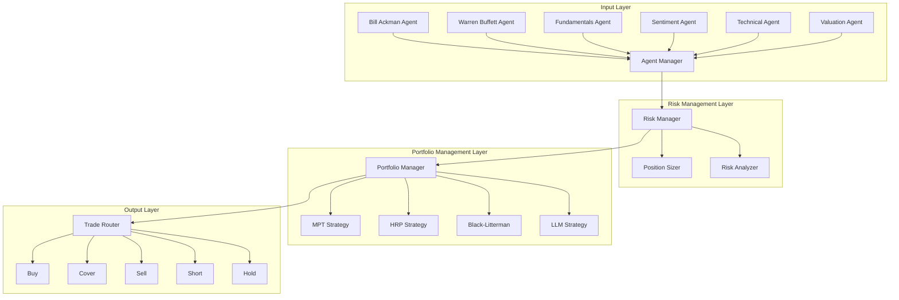

# AI Hedge Fund System Architecture

## System Overview

The AI Hedge Fund system implements a multi-agent trading architecture with four main layers:
1. Input Layer (Specialized Agents)
2. Risk Management Layer
3. Portfolio Management Layer
4. Output Layer (Trading Actions)

Additionally, the system includes advanced features:
- **Market Regime Detection** (HMM-based, currently 10% integrated)
- **Explainable AI** (SHAP, LIME, counterfactual explanations)
- **Distributed Computing** (Ray & Dask for parallel processing)
- **High-Performance Caching** (Multi-tier Redis architecture)
- **Database Optimization** (Connection pooling, query optimization)

## Component Architecture



## Component Interactions

### 1. Input Layer - Signal Generation
- **Implementation**: `src/alpha_pulse/agents/manager.py`
- **Key Components**:
  - Agent Factory (`AgentFactory`)
  - Individual Agents (6 specialized agents)
  - Agent Manager (coordinates signals)
- **Signal Flow**:
  ```python
  # Agent signal generation
  signals = await agent.generate_signals(market_data)
  
  # Signal aggregation with weights
  weighted_strength = signal.confidence * agent_weight
  
  # Consensus threshold check
  if dominant_direction[1] >= 0.6:  # Minimum consensus
      # Generate aggregated signal
  ```

### 2. Risk Management Layer - Signal Processing
- **Implementation**: `src/alpha_pulse/risk_management/manager.py`
- **Key Components**:
  - Risk Manager
  - Position Sizer
  - Risk Analyzer
- **Risk Controls**:
  ```python
  # Position size limits
  if position_size > self.config.max_position_size:
      return False
      
  # Portfolio leverage check
  if total_exposure / portfolio_value > self.config.max_portfolio_leverage:
      return False
      
  # Drawdown monitoring
  if abs(self.state.risk_metrics.max_drawdown) > self.config.max_drawdown:
      return False
  ```

### 3. Portfolio Management Layer - Decision Making
- **Implementation**: `src/alpha_pulse/portfolio/portfolio_manager.py`
- **Key Components**:
  - Portfolio Manager
  - Multiple Strategy Support
  - Rebalancing Logic
- **Portfolio Operations**:
  ```python
  # Strategy selection and execution
  target_allocation = self.strategy.compute_target_allocation(
      current_allocation,
      historical_data,
      self.risk_constraints
  )
  
  # Trade computation
  trades = self.compute_rebalancing_trades(
      current_allocation,
      target_allocation,
      total_value
  )
  ```

### 4. Output Layer - Trade Execution
- **Implementation**: `src/alpha_pulse/execution/`
- **Key Components**:
  - Trade Router
  - Execution Handlers
  - Order Management
- **Trade Actions**:
  ```python
  # Trade execution with rollback support
  result = await self._retry_with_timeout(
      exchange.execute_trade(
          asset=trade['asset'],
          amount=abs(trade['value']),
          side=trade['type'],
          order_type=self.trading_config.get('execution_style', 'market')
      )
  )
  ```

## Data Flow

1. **Market Data Flow**
   - Real-time data from exchanges
   - Fundamental data from providers
   - Sentiment analysis from news/social
   - Technical indicators computation

2. **Signal Flow**
   - Individual agent analysis
   - Signal generation with confidence
   - Signal aggregation with weights
   - Consensus-based final signals

3. **Risk Processing Flow**
   - Signal validation
   - Risk metric computation
   - Position size calculation
   - Portfolio constraint checking

4. **Portfolio Management Flow**
   - Strategy selection
   - Portfolio optimization
   - Rebalancing decisions
   - Trade generation

5. **Execution Flow**
   - Order routing
   - Trade execution
   - Position tracking
   - Performance monitoring

## System Features

### 1. Market Regime Detection (Currently 10% Integrated)
- **Implemented**: HMM-based regime detection with 5 states (Bull, Bear, Sideways, Crisis, Recovery)
- **Missing**: Service not started, agents not integrated, no dashboard
- **Impact**: System operates without market context awareness
- **Files**: `src/alpha_pulse/models/market_regime_hmm.py`, `src/alpha_pulse/services/regime_detection_service.py`

### 2. Adaptive Learning
- Performance-based agent weight adjustment
- Strategy adaptation based on market conditions
- Risk parameter optimization

### 3. Risk Management
- Multi-level risk controls
- Dynamic position sizing
- Portfolio-level risk monitoring
- Drawdown protection

### 4. Portfolio Optimization
- Multiple strategy support
- Adaptive rebalancing
- Transaction cost consideration
- LLM-assisted analysis

### 5. Execution Management
- Smart order routing
- Transaction cost analysis
- Trade impact monitoring
- Error handling and rollback

### 6. High-Performance Caching
- Multi-tier Redis architecture (L1 Memory, L2 Local, L3 Distributed)
- Intelligent invalidation and warming strategies
- Performance monitoring and optimization
- 90%+ cache hit rates for frequently accessed data

### 7. Database Optimization
- Advanced connection pooling with pgbouncer
- Query optimization and intelligent routing
- Read/write splitting across replicas
- Automated index management

## Monitoring and Control

### 1. Performance Metrics
- Risk-adjusted returns
- Sharpe/Sortino ratios
- Maximum drawdown
- Win/loss ratio

### 2. Risk Metrics
- Value at Risk (VaR)
- Expected Shortfall
- Beta exposure
- Correlation analysis

### 3. Operational Metrics
- Signal accuracy by agent
- Execution efficiency
- System latency
- Decision accuracy

## Implementation Notes

1. **Scalability**
   - Async operations throughout
   - Efficient data caching
   - Parallel signal processing
   - Modular component design

2. **Reliability**
   - Comprehensive error handling
   - Automatic retry mechanisms
   - Trade rollback capability
   - State management

3. **Maintainability**
   - Clear component boundaries
   - Standardized interfaces
   - Comprehensive logging
   - Configuration-driven

4. **Extensibility**
   - Plugin architecture for agents
   - Strategy framework
   - Provider interfaces
   - Custom risk controls