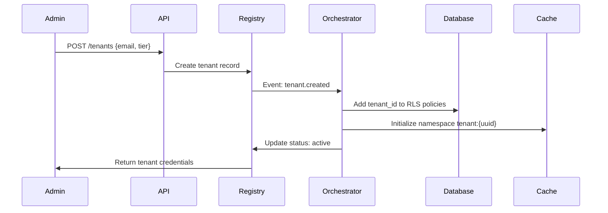

# ADR 002: Tenant Provisioning Architecture

Date: 2025-10-20
Status: Proposed

## Context

As a multi-tenant SaaS platform, AlphaPulse needs a tenant provisioning system that:

- **Automates onboarding**: New tenant setup < 5 minutes end-to-end
- **Ensures isolation**: Each tenant gets isolated compute and data resources
- **Scales efficiently**: Support 100+ tenants without manual intervention
- **Provides flexibility**: Different resource allocations for Starter/Pro/Enterprise tiers
- **Enables observability**: Track resource usage per tenant for billing and monitoring
- **Supports self-service**: API-driven provisioning for admin portal

### Current Architecture Constraints

- Monolithic FastAPI application (not containerized)
- Single Redis instance for caching
- PostgreSQL database (to be multi-tenant per ADR-001)
- Manual configuration via YAML files
- No orchestration layer (Kubernetes, Docker Swarm, etc.)

### Provisioning Requirements by Tier

| Aspect | Starter | Pro | Enterprise |
|--------|---------|-----|------------|
| **Compute** | Shared workers | Shared workers | Dedicated workers |
| **Database** | Shared DB + RLS | Shared DB + RLS | Dedicated schema |
| **Cache** | Shared Redis (namespaced) | Shared Redis (namespaced) | Dedicated Redis instance |
| **API Rate Limit** | 10k/day | 100k/day | Unlimited |
| **Provisioning Time** | < 2 min | < 2 min | < 10 min |

## Decision

We will implement a **Hybrid Container-Based Provisioning** strategy with resource pooling:

### Architecture: Shared Application Containers + Tenant Configuration Isolation

**Core Components:**

1. **Tenant Registry Service** (new microservice)
   - Central database of all tenants with metadata (tier, status, created_at, config_overrides)
   - RESTful API for CRUD operations: `POST /tenants`, `GET /tenants/{id}`, `PATCH /tenants/{id}`
   - Emits events for provisioning workflow (tenant.created, tenant.upgraded, tenant.deleted)

2. **Application Runtime** (existing FastAPI app - containerized)
   - Run as Docker containers behind load balancer (NGINX or Traefik)
   - Multi-tenant aware: Extract tenant from JWT → Load tenant config from registry
   - Horizontal scaling: Add/remove containers based on load
   - Resource quotas enforced at application level (agent limits, position limits, API rate limits)

3. **Provisioning Orchestrator** (new background worker)
   - Listens to tenant events from Tenant Registry
   - Executes provisioning workflows (database setup, cache namespace, config initialization)
   - Idempotent operations (can retry without side effects)
   - Tracks provisioning state: pending → provisioning → active → suspended → deleted

4. **Configuration Management**
   - Tenant-specific configs stored in PostgreSQL `tenant_configs` table
   - Hot-reloadable without container restarts
   - Hierarchical: Default config → Tier config → Tenant overrides
   - Secrets stored in HashiCorp Vault (per ADR-003)

### Provisioning Workflow

**Step-by-Step:**

1. **Admin initiates**: POST `/api/v1/tenants` with `{email, tier, plan}`
2. **Tenant Registry**:
   - Generate `tenant_id` (UUID v4)
   - Create record in `tenants` table with status=pending
   - Generate API key for tenant (JWT with tenant_id claim)
   - Emit `tenant.created` event to **durable queue** (Redis Streams with consumer groups or RabbitMQ with persistent messages)
3. **Provisioning Orchestrator** (async worker, consuming from durable queue with at-least-once delivery):
   - **Database Setup** (30s):
     - For Starter/Pro: Run `INSERT INTO tenant_configs (tenant_id, ...) VALUES (...)`
     - For Enterprise: Run `CREATE SCHEMA tenant_{uuid}` + copy base schema
   - **Cache Setup** (5s):
     - Initialize Redis namespace: `tenant:{tenant_id}:*`
     - Set quota: `tenant:{tenant_id}:quota` = tier.cache_quota_mb
   - **Configuration** (5s):
     - Copy default config to tenant_configs
     - Apply tier-specific overrides (agent limits, position limits)
   - **Health Check** (10s):
     - Verify database connectivity
     - Verify cache write/read
     - Run smoke test (create dummy portfolio, delete)
4. **Update Status**: Set tenant status = active; on failure, acknowledge with a retry payload (including attempt count) and route to a dead-letter stream after the retry budget is exhausted
5. **Notification**: Send welcome email with API credentials

**Total Time:**
- Starter/Pro: ~50 seconds (well under 2-minute target)
- Enterprise: ~3 minutes (database schema creation + dedicated Redis)

### Container Orchestration Strategy

**Phase 1 (MVP)**: Docker Compose with manual scaling
- Run 3-5 FastAPI containers behind NGINX
- Manual scaling via `docker-compose scale app=10`
- Sufficient for 50-100 tenants

**Phase 2 (Production)**: Kubernetes with auto-scaling
- Deploy to managed Kubernetes (EKS, GKE, or AKS)
- HorizontalPodAutoscaler based on CPU/memory + custom metrics (tenant count)
- Per-tier node pools for Enterprise clients
- Helm charts for deployment

### Resource Isolation

**Compute Isolation:**
- Starter/Pro: Shared worker pool (fair queuing per tenant)
- Enterprise: Dedicated Kubernetes pods with resource requests/limits

**Network Isolation:**
- All tiers: API rate limiting via middleware (tenant_id extracted from JWT)
- Enterprise: Optional private VPC/VPN access

**Storage Isolation:**
- Implemented via ADR-001 (database RLS + optional dedicated schema)

### Tenant Lifecycle Management

**States:**
- `pending`: Provisioning in progress
- `active`: Fully operational
- `suspended`: Payment failed or policy violation (read-only access)
- `deleted`: Marked for deletion (30-day retention)

**Operations:**
- **Upgrade tier**: Change `tier` field → Apply new resource limits → Email notification
- **Suspend**: Set status=suspended → Block write operations → Allow read access for export
- **Delete**: Set status=deleted → Schedule cleanup job (remove data after 30 days)

## Consequences

### Positive

✅ **Fast Provisioning**: 50 seconds for Starter/Pro, 3 minutes for Enterprise (meets SLA)
✅ **Scalability**: Horizontal scaling via containers supports 1000+ tenants
✅ **Cost Efficiency**: Shared containers reduce infrastructure cost by 80% vs dedicated VMs
✅ **Flexibility**: Easy to upgrade tenants between tiers (just update config)
✅ **Observability**: Tenant-specific metrics via Prometheus labels (tenant_id)
✅ **Self-Service**: API-driven provisioning enables customer portal
✅ **Resource Control**: Enforce quotas at application level (no runaway costs)

### Negative

⚠️ **Complexity**: New Tenant Registry microservice adds operational overhead
⚠️ **Noisy Neighbors**: Shared containers may have performance interference (mitigated by rate limits)
⚠️ **Container Overhead**: Requires containerization of existing monolith (2-3 weeks effort)
⚠️ **State Management**: Provisioning orchestrator must handle failures gracefully (idempotent operations)
⚠️ **Monitoring Complexity**: Need per-tenant dashboards (adds Grafana/Datadog cost)

### Mitigation Strategies

1. **Idempotent Provisioning**: All operations check current state before applying changes
2. **Circuit Breakers**: Limit impact of one tenant's heavy load (queue depth limits, timeouts)
3. **Gradual Rollout**: Start with 10 beta tenants, increase by 10/week while monitoring
4. **Fallback Plan**: Keep manual provisioning scripts for emergencies
5. **Cost Monitoring**: Alert when per-tenant infrastructure cost exceeds revenue

## Alternatives Considered

### Option A: Dedicated VM per Tenant

**Pros:**
- Maximum isolation (CPU, memory, network)
- Easy to debug (one tenant = one VM)

**Cons:**
- ❌ **Cost**: 100 tenants × $30/mo VM = $3,000/mo (vs $300/mo for shared containers)
- ❌ **Slow provisioning**: 5-10 minutes to spin up VM
- ❌ **Operational overhead**: Managing 100+ VMs (patching, monitoring, backups)

**Why Rejected:** Too expensive and slow for Starter/Pro tiers. Considered for Enterprise only if VPC requirement emerges.

### Option B: Serverless Functions (AWS Lambda / Cloud Run)

**Pros:**
- Auto-scaling to zero (pay-per-request)
- No container management
- Fast cold start (<2 seconds)

**Cons:**
- ❌ **Cold starts**: 5-10 second latency for idle tenants (poor UX)
- ❌ **State management**: Requires external state store (adds latency)
- ❌ **Vendor lock-in**: Difficult to migrate between clouds
- ❌ **Complexity**: Async agents require orchestration (Step Functions or Cloud Workflows)

**Why Rejected:** Cold start latency unacceptable for trading system. Long-running agent workflows don't fit serverless model.

### Option C: Multi-Tenant Kubernetes Namespaces

**Pros:**
- Native Kubernetes isolation (NetworkPolicy, ResourceQuota)
- Per-tenant scaling policies

**Cons:**
- ❌ **Overhead**: 100 namespaces × N resources = high API server load
- ❌ **Complexity**: Managing RBAC, network policies per namespace
- ❌ **Cost**: Kubernetes control plane overhead significant for small deployments

**Why Rejected:** Over-engineered for current scale (100 tenants). Revisit at 500+ tenants.

## Implementation Plan

### Phase 1: Containerization (Sprint 1)

1. Dockerize FastAPI application
2. Create docker-compose.yml for local multi-container testing
3. Add tenant context middleware to extract tenant_id from JWT
4. Test with 2 tenants on local Docker

### Phase 2: Tenant Registry Service (Sprint 2)

1. Create new FastAPI microservice: `tenant-registry`
2. Database schema: `tenants`, `tenant_configs`, `tenant_events`
3. RESTful API: CRUD operations + search
4. Event emission via durable queue (Redis Streams consumer group or RabbitMQ persistent exchange)

### Phase 3: Provisioning Orchestrator (Sprint 2-3)

1. Create background worker (Celery or RQ)
2. Implement provisioning workflow (idempotent)
3. Add health checks and rollback logic
4. Integration tests for all provisioning scenarios

### Phase 4: Production Deployment (Sprint 3)

1. Deploy to Kubernetes (EKS or GKE)
2. Set up NGINX Ingress with rate limiting
3. Configure auto-scaling (HPA)
4. Add tenant-specific monitoring dashboards

### Phase 5: Admin Portal (Sprint 4)

1. Build React admin UI for tenant management
2. Integrate with Tenant Registry API
3. Add billing integration (Stripe or Chargebee)
4. Self-service tenant creation flow

## Links

- Issue: [To be created - Tenant Provisioning Epic]
- Related: ADR-001 (Data Isolation), ADR-003 (Credential Management), ADR-005 (Billing System)
- Supersedes: Manual YAML-based configuration
- Reference: [Kubernetes Multi-Tenancy Guide](https://kubernetes.io/docs/concepts/security/multi-tenancy/)
- Reference: [Docker Best Practices](https://docs.docker.com/develop/dev-best-practices/)
