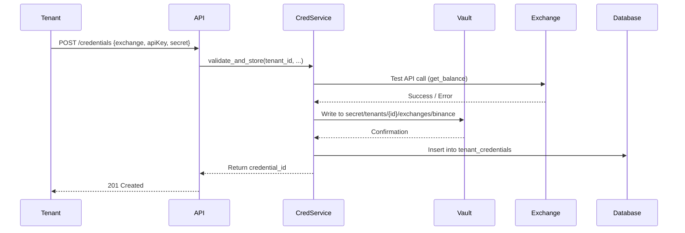

# ADR 003: Credential Management for Multi-Tenant Environment

Date: 2025-10-20
Status: Proposed

## Context

AlphaPulse currently has a credential management system (`src/alpha_pulse/exchanges/credentials/`) designed for single-tenant use. As we transition to multi-tenant SaaS, we need a secure, scalable credential management strategy that:

- **Isolates secrets per tenant**: Each tenant's exchange API keys must be completely isolated
- **Supports multiple exchanges**: Binance, Coinbase, Kraken, etc. (currently CCXT supports 100+ exchanges)
- **Encrypts at rest**: All credentials encrypted in database
- **Provides audit trail**: Track credential creation, rotation, access, and deletion
- **Enables key rotation**: Support for automatic and manual key rotation
- **Handles key lifecycle**: Creation, active use, rotation, revocation, deletion
- **Complies with regulations**: SOC2, GDPR, PCI-DSS requirements for key management
- **Scales efficiently**: Sub-10ms credential retrieval for trading operations

### Current Credential Architecture

From `src/alpha_pulse/exchanges/credentials/`:
- Credentials stored as encrypted JSON files on disk
- Uses Fernet symmetric encryption (key from environment variable)
- Manual rotation process
- No audit logging
- Single-tenant design (one set of credentials per exchange)

### Multi-Tenant Requirements

1. **Per-Tenant Exchange Credentials**: Each tenant provides their own exchange API keys
2. **Multiple Exchanges per Tenant**: Pro/Enterprise tiers support 3+ exchanges simultaneously
3. **Credential Validation**: Verify credentials before saving (test API call)
4. **Expiration Handling**: Detect expired/revoked credentials and notify tenant
5. **Read-Only vs Full Access**: Support both read-only (data) and trading (write) credentials
6. **Backup Keys**: Allow tenants to configure backup credentials for failover

## Decision

We will implement a **HashiCorp Vault-Based Credential Management System** with database metadata tracking:

### Architecture: Vault for Secrets + PostgreSQL for Metadata

**Components:**

1. **HashiCorp Vault** (Secret Storage)
   - Store all exchange API keys and secrets
   - Path structure: `secret/tenants/{tenant_id}/exchanges/{exchange_id}/credentials`
   - Transit encryption engine for encrypting/decrypting credentials
   - Dynamic secrets for database connections (future enhancement)
   - Automatic secret versioning and rollback
   - Audit logging (who accessed what, when)

2. **PostgreSQL Metadata Table** (Credential Tracking)
   ```sql
   CREATE TABLE tenant_credentials (
     id UUID PRIMARY KEY DEFAULT gen_random_uuid(),
     tenant_id UUID NOT NULL REFERENCES tenants(id) ON DELETE CASCADE,
     exchange VARCHAR(50) NOT NULL, -- 'binance', 'coinbase', etc.
     credential_type VARCHAR(20) NOT NULL, -- 'readonly' or 'trading'
     vault_path TEXT NOT NULL, -- Path in Vault
     status VARCHAR(20) NOT NULL, -- 'active', 'rotating', 'revoked', 'expired'
     last_validated_at TIMESTAMP,
     validation_error TEXT,
     created_at TIMESTAMP NOT NULL DEFAULT NOW(),
     updated_at TIMESTAMP NOT NULL DEFAULT NOW(),
     expires_at TIMESTAMP,
     UNIQUE(tenant_id, exchange, credential_type)
   );

   CREATE INDEX idx_tenant_credentials_tenant ON tenant_credentials(tenant_id);
   CREATE INDEX idx_tenant_credentials_status ON tenant_credentials(status);
   ```

3. **Credential Service** (Application Layer)
   - Abstraction layer between application and Vault
   - Caching layer (TTL: 5 minutes) to reduce Vault calls
   - Automatic credential validation on save
   - Background job for credential health checks (every 6 hours)
   - Webhook notifications on credential errors

### Credential Lifecycle Workflow

#### 1. Tenant Adds Exchange Credentials



**Steps:**
1. Tenant submits credentials via API or dashboard
2. Credential Service validates by making test API call to exchange
3. If valid: Store in Vault + create metadata record (status=active)
4. If invalid: Return error with details (invalid key, insufficient permissions, etc.)
5. Schedule first health check in 6 hours

#### 2. Application Retrieves Credentials for Trading

```python
# Example usage in agent code
async def execute_trade(tenant_id: UUID, exchange: str, order: Order):
    # Get credentials from service (cached or from Vault)
    creds = await credential_service.get_credentials(
        tenant_id=tenant_id,
        exchange=exchange,
        credential_type='trading'
    )

    # Initialize exchange client
    exchange_client = ccxt.binance({
        'apiKey': creds.api_key,
        'secret': creds.secret,
    })

    # Execute trade
    result = await exchange_client.create_order(...)
```

**Caching Strategy:**
- Credentials cached in-memory for 5 minutes
- Cache key: `cred:{tenant_id}:{exchange}:{type}`
- Invalidate on credential update or rotation
- Use Redis for distributed cache (multiple app instances)

#### 3. Automatic Credential Health Checks

Background job runs every 6 hours:
1. For each active credential in database
2. Make test API call to exchange
3. If success: Update `last_validated_at`
4. If failure: Update status=expired, send webhook to tenant
5. After 3 consecutive failures: Suspend trading (switch to read-only mode)

#### 4. Credential Rotation

**Manual Rotation (Tenant-Initiated):**
1. Tenant generates new API key on exchange website
2. Submits new credentials via API: `PUT /credentials/{id}`
3. System validates new credentials
4. If valid: Store in Vault (new version), update metadata
5. Old credentials remain accessible for 24 hours (grace period)
6. After 24 hours: Delete old version from Vault

**Automatic Rotation (Future Enhancement):**
- Not supported by most centralized exchanges (manual rotation required)
- Possible for internal services (database passwords, API tokens)

### Security Implementation

**Encryption at Rest:**
- Vault uses AES-256-GCM encryption
- Vault seal keys stored in cloud KMS (AWS KMS, GCP KMS, Azure Key Vault)
- Database contains only metadata (no secrets)

**Encryption in Transit:**
- TLS 1.3 for all Vault communication
- Vault client certificate authentication
- mTLS between application and Vault

**Access Control:**
- Vault policies enforce tenant isolation:
  ```hcl
  path "secret/tenants/{{identity.entity.metadata.tenant_id}}/*" {
    capabilities = ["read", "list"]
  }
  ```
- Application authenticates to Vault via Kubernetes ServiceAccount or AppRole
- Each request includes tenant_id context for policy enforcement

**Audit Trail:**
- Vault audit log: Every secret read/write operation
- Application audit log: Credential creation, validation, rotation, deletion
- Logs include: tenant_id, timestamp, operation, IP address, user agent

### Credential Validation Logic

Before storing, test credentials with minimal permissions call:

```python
async def validate_exchange_credentials(exchange: str, api_key: str, secret: str) -> ValidationResult:
    """Validate credentials by making test API call."""
    try:
        client = getattr(ccxt, exchange)({
            'apiKey': api_key,
            'secret': secret,
            'enableRateLimit': True,
        })

        # Test call (requires API read permission only)
        balance = await client.fetch_balance()

        # Detect permission level
        has_trading = await _test_trading_permission(client)

        return ValidationResult(
            valid=True,
            credential_type='trading' if has_trading else 'readonly',
            exchange_account_id=client.uid,
        )
    except ccxt.AuthenticationError as e:
        return ValidationResult(valid=False, error='Invalid credentials')
    except ccxt.InsufficientPermissions as e:
        return ValidationResult(valid=False, error='Insufficient permissions')
    except Exception as e:
        return ValidationResult(valid=False, error=str(e))
```

## Consequences

### Positive

✅ **Security**: Vault provides industry-standard secret management (SOC2, GDPR compliant)
✅ **Isolation**: Per-tenant Vault paths enforce complete credential isolation
✅ **Audit Trail**: Complete history of credential access for compliance
✅ **Performance**: In-memory caching keeps credential retrieval <5ms
✅ **Scalability**: Vault supports 10k+ requests/second (sufficient for 1000+ tenants)
✅ **Versioning**: Vault secret versioning enables rollback on rotation errors
✅ **Flexibility**: Supports any exchange via CCXT (100+ exchanges)
✅ **Validation**: Automatic credential testing prevents invalid configuration

### Negative

⚠️ **Operational Complexity**: Vault requires dedicated infrastructure and monitoring
⚠️ **New Dependency**: Adds Vault to deployment stack (learning curve, operational overhead)
⚠️ **Cost**: Vault Enterprise features (multi-tenancy, HSM integration) have licensing cost
⚠️ **Single Point of Failure**: Vault downtime blocks all credential access (mitigated by HA setup)
⚠️ **Migration Effort**: Existing credentials must be migrated to Vault (one-time cost)
⚠️ **Caching Complexity**: Must invalidate cache correctly on credential updates

### Mitigation Strategies

1. **High Availability**: Deploy Vault in HA mode (3+ replicas, Raft consensus)
2. **Disaster Recovery**: Regular Vault backups to cloud storage (encrypted)
3. **Graceful Degradation**: Cache last-known-good credentials for 1 hour during Vault outage
4. **Monitoring**: Alert on Vault seal status, high latency, authentication failures
5. **Cost Optimization**: Use Vault OSS (open source) initially, upgrade to Enterprise if needed
6. **Migration Plan**: Automated script to migrate existing credentials to Vault

## Alternatives Considered

### Option A: Database-Encrypted Credentials

**Pros:**
- Simple implementation (just add encrypted column to database)
- No external dependencies
- Low latency (single database query)

**Cons:**
- ❌ **Poor security model**: Encryption key stored with application (not true secret separation)
- ❌ **No audit trail**: Hard to track credential access
- ❌ **No versioning**: Difficult to rollback on rotation errors
- ❌ **Manual rotation**: No automatic rotation support
- ❌ **Compliance gaps**: Doesn't meet SOC2/PCI-DSS secret management requirements

**Why Rejected:** Insufficient security posture for financial trading platform. Audit trail required for compliance.

### Option B: AWS Secrets Manager

**Pros:**
- Managed service (no infrastructure to maintain)
- Automatic rotation for RDS/Aurora credentials
- Tight integration with AWS services
- Pay-per-secret pricing ($0.40/month/secret)

**Cons:**
- ❌ **Vendor lock-in**: Difficult to migrate to other clouds
- ❌ **Cost at scale**: 1000 tenants × 3 exchanges × $0.40 = $1,200/month (vs Vault self-hosted ~$100/month)
- ❌ **Limited rotation**: Only supports AWS services (not exchange API keys)
- ❌ **Latency**: Cross-region access adds 50-100ms

**Why Rejected:** Cost prohibitive at scale. Vendor lock-in undesirable. Vault provides better multi-cloud portability.

### Option C: Environment Variables per Tenant

**Pros:**
- Simple to implement
- No external dependencies

**Cons:**
- ❌ **Terrible security**: Environment variables visible in process list
- ❌ **No isolation**: All tenants' secrets in same environment
- ❌ **No rotation**: Requires application restart
- ❌ **No audit**: Impossible to track access

**Why Rejected:** Completely unsuitable for multi-tenant environment. Major security vulnerability.

### Option D: Encrypted S3 + KMS

**Pros:**
- Cheap ($0.023/GB/month for S3)
- KMS provides hardware-backed encryption
- Versioning via S3 versioning

**Cons:**
- ❌ **High latency**: 100-200ms for S3 GET requests (vs 5ms for Vault)
- ❌ **No access control**: S3 bucket policies less granular than Vault policies
- ❌ **No audit trail**: CloudTrail logs are delayed and expensive to query
- ❌ **Manual caching**: Must implement caching layer ourselves

**Why Rejected:** Too slow for trading operations. Latency budget is <10ms for credential retrieval.

## Implementation Plan

### Phase 1: Vault Deployment (Sprint 1)

1. Deploy Vault in HA mode (3 replicas on Kubernetes)
2. Configure Raft storage backend
3. Set up auto-unseal with AWS KMS
4. Create Vault policies for tenant isolation
5. Enable audit logging to CloudWatch/ELK

### Phase 2: Credential Service Implementation (Sprint 2)

1. Create `credential_service.py` with Vault client
2. Implement database metadata table and ORM models
3. Add credential validation logic (CCXT test calls)
4. Implement caching layer (Redis)
5. Unit tests (100% coverage)

### Phase 3: API Integration (Sprint 2)

1. Add REST endpoints: `POST /credentials`, `GET /credentials`, `PUT /credentials/{id}`, `DELETE /credentials/{id}`
2. Add JWT middleware to extract tenant_id
3. Add OpenAPI documentation
4. Integration tests with mock Vault

### Phase 4: Migration (Sprint 3)

1. Write migration script to move existing credentials to Vault
2. Test migration in staging environment
3. Execute migration during maintenance window
4. Verify all agents can access credentials

### Phase 5: Background Jobs (Sprint 3)

1. Implement health check job (runs every 6 hours)
2. Add credential expiration detection
3. Webhook notifications to tenants
4. Admin dashboard for credential monitoring

### Phase 6: Documentation & Training (Sprint 4)

1. User documentation: "How to Add Exchange Credentials"
2. Operational runbook: "Vault Backup and Recovery"
3. Security review and penetration testing
4. Team training on Vault operations

## Links

- Issue: [To be created - Credential Management Epic]
- Related: ADR-001 (Data Isolation), ADR-002 (Tenant Provisioning), ADR-004 (Caching Strategy)
- Reference: [HashiCorp Vault Documentation](https://www.vaultproject.io/docs)
- Reference: [OWASP Secret Management Cheat Sheet](https://cheatsheetseries.owasp.org/cheatsheets/Secrets_Management_Cheat_Sheet.html)
- Reference: [CCXT Authentication](https://docs.ccxt.com/en/latest/manual.html#authentication)
