# AlphaPulse Architecture Diagrams

This document provides comprehensive architectural diagrams for the AlphaPulse AI-powered algorithmic trading system using C4 model, data flow diagrams, sequence diagrams, and other visualization methods.

## Table of Contents
1. [C4 Model Diagrams](#c4-model-diagrams)
   - [Level 1: System Context](#level-1-system-context)
   - [Level 2: Container Diagram](#level-2-container-diagram)
   - [Level 3: Component Diagrams](#level-3-component-diagrams)
2. [Data Flow Diagrams](#data-flow-diagrams)
3. [Sequence Diagrams](#sequence-diagrams)
4. [Deployment Diagram](#deployment-diagram)
5. [State Diagrams](#state-diagrams)
6. [Entity Relationship Diagram](#entity-relationship-diagram)

## C4 Model Diagrams

### Level 1: System Context

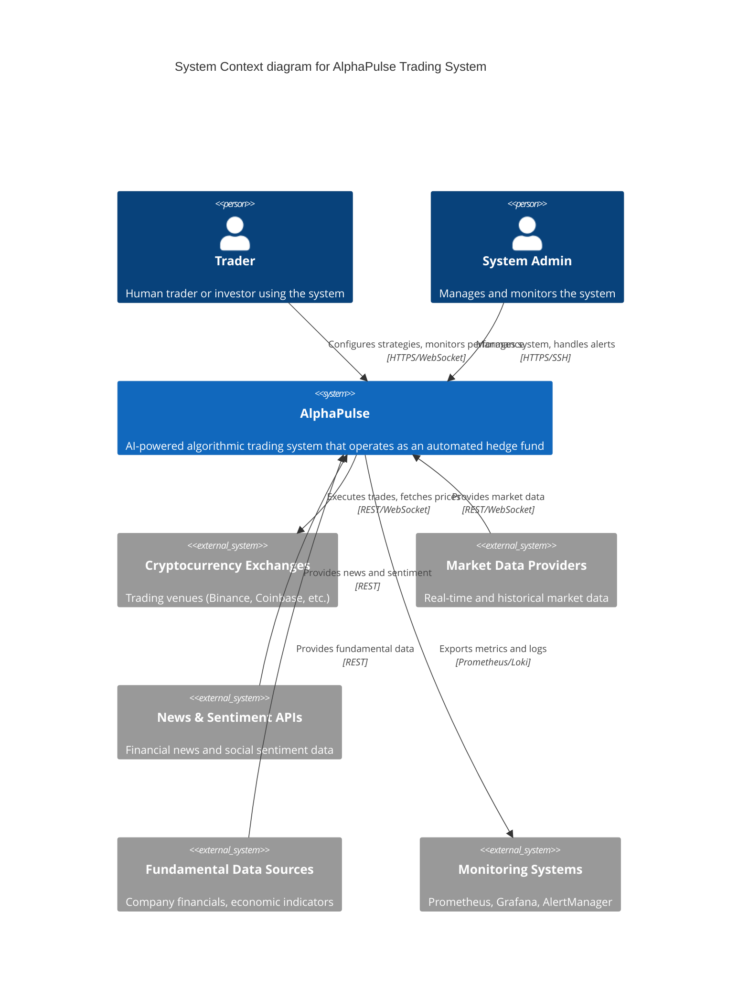

### Level 2: Container Diagram

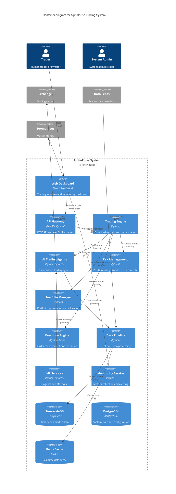

### Level 3: Component Diagrams

#### Trading Agents Component Diagram

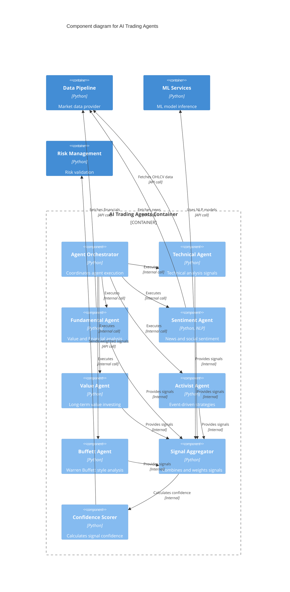

#### Risk Management Component Diagram

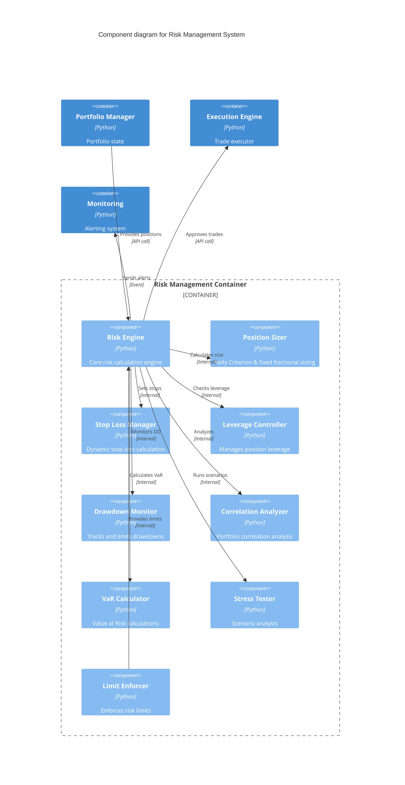

## Data Flow Diagrams

### Real-time Data Processing Flow

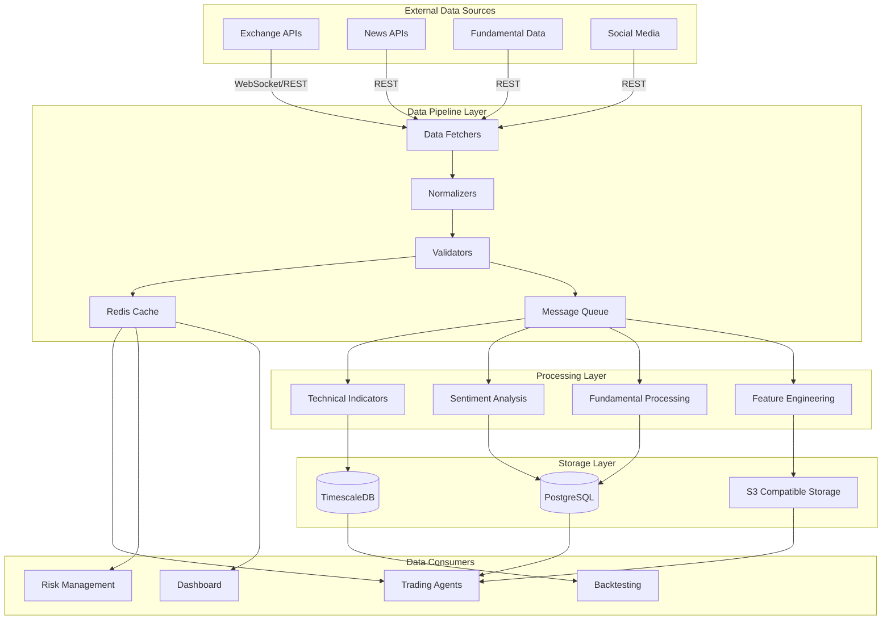

### Trading Signal Flow

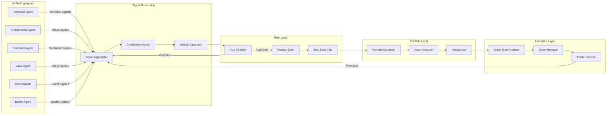

## Sequence Diagrams

### Trade Execution Sequence

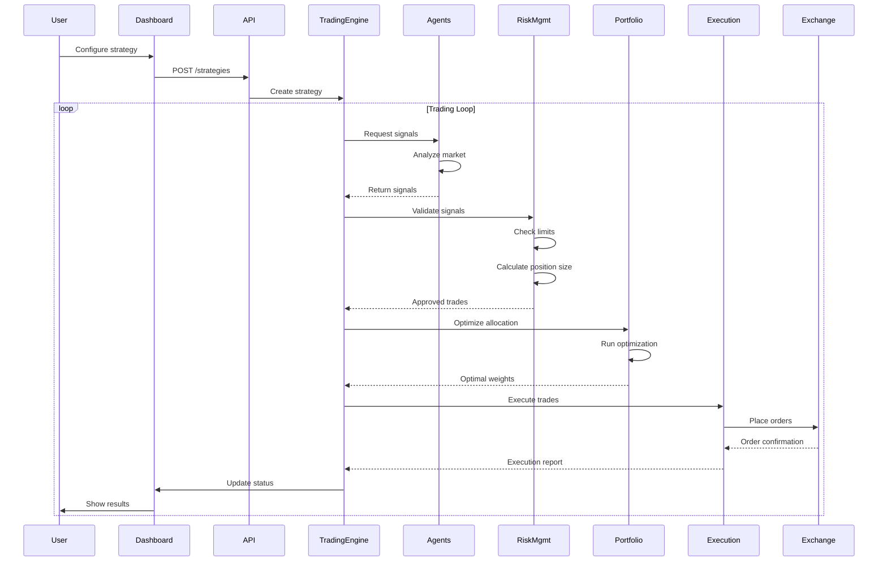

### Real-time Data Processing Sequence

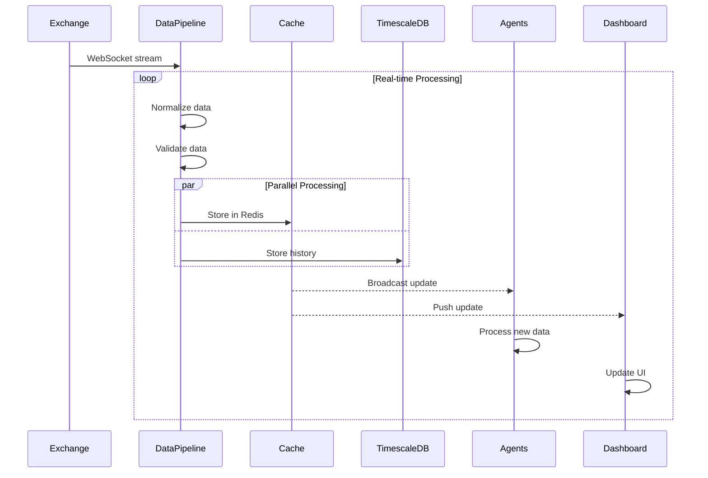

### Agent Decision Making Sequence

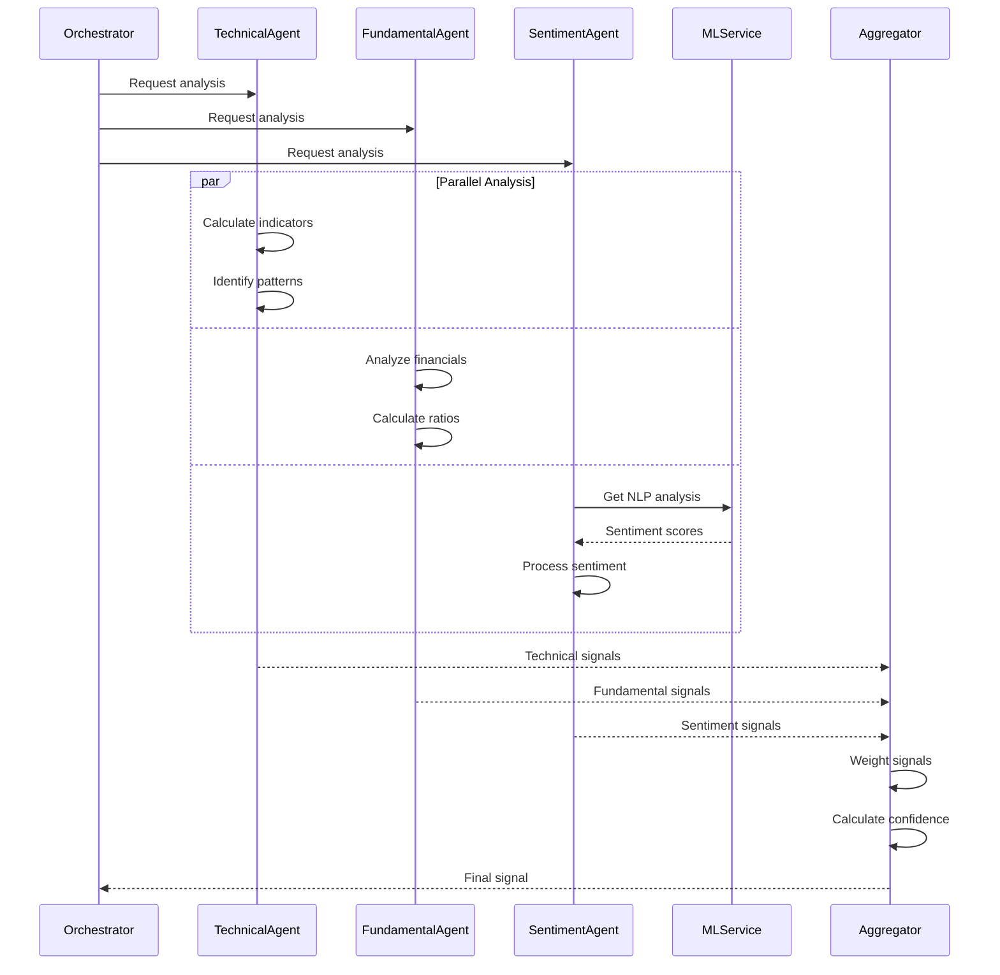

## Deployment Diagram

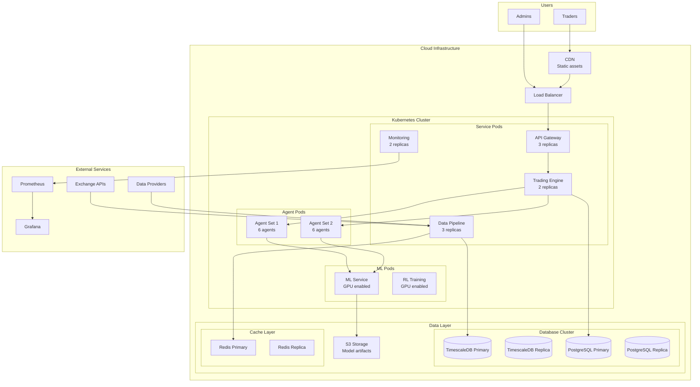

## State Diagrams

### Order Lifecycle State Machine

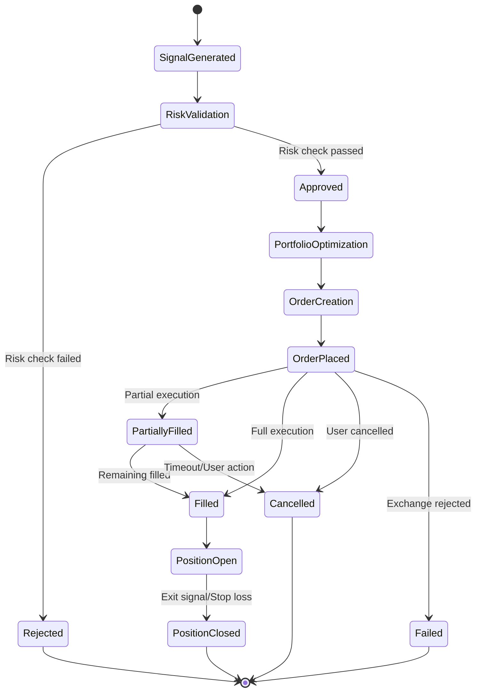

### System Health State Machine

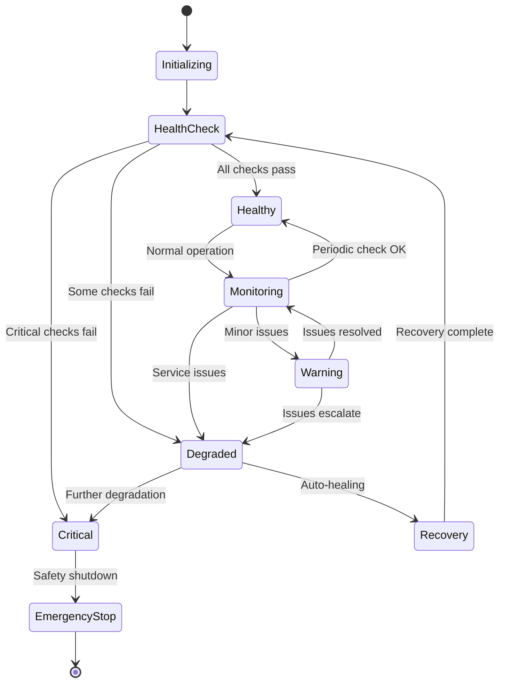

## Entity Relationship Diagram

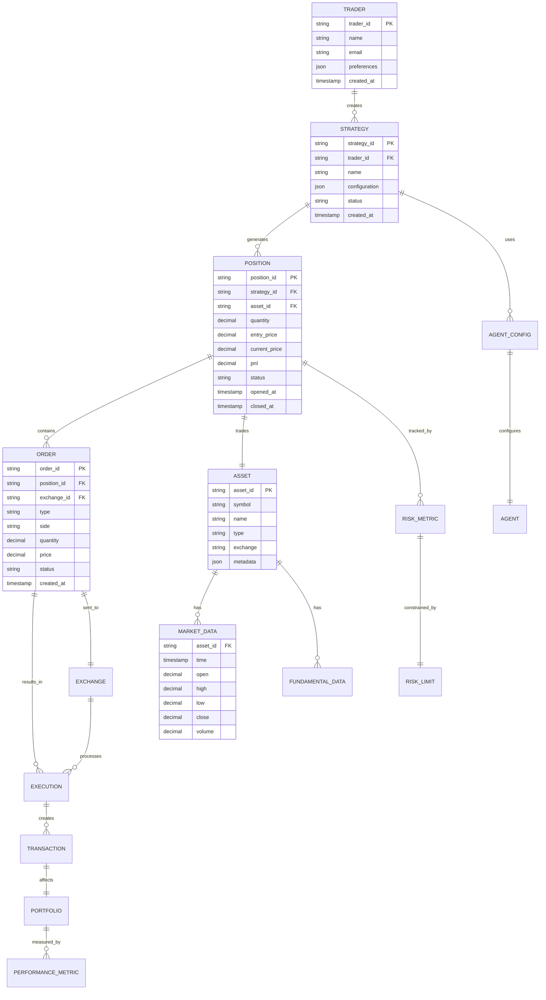

## Architecture Decision Records (ADR)

### ADR-001: Microservice vs Monolithic Architecture

**Status**: Accepted

**Context**: Need to decide between microservice and monolithic architecture for AlphaPulse.

**Decision**: Hybrid approach - monolithic core with service boundaries that can be easily extracted to microservices.

**Consequences**:
- Easier initial development and deployment
- Clear service boundaries for future scaling
- Can extract services as needed without major refactoring

### ADR-002: Time-Series Database Selection

**Status**: Accepted

**Context**: Need specialized time-series storage for market data.

**Decision**: TimescaleDB (PostgreSQL extension)

**Consequences**:
- Native PostgreSQL compatibility
- Excellent time-series performance
- Built-in compression and retention policies
- SQL interface familiar to developers

### ADR-003: Message Queue vs Direct Communication

**Status**: Accepted

**Context**: Inter-service communication pattern selection.

**Decision**: Direct API calls with Redis pub/sub for real-time events

**Consequences**:
- Lower latency for critical paths
- Simpler debugging and monitoring
- Redis provides event broadcasting when needed
- Can add message queue later if needed

## Performance Architecture

### Latency-Critical Path

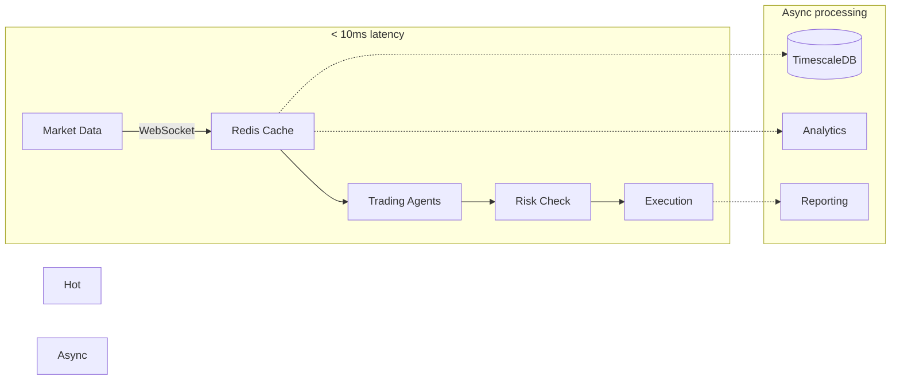

### Caching Strategy

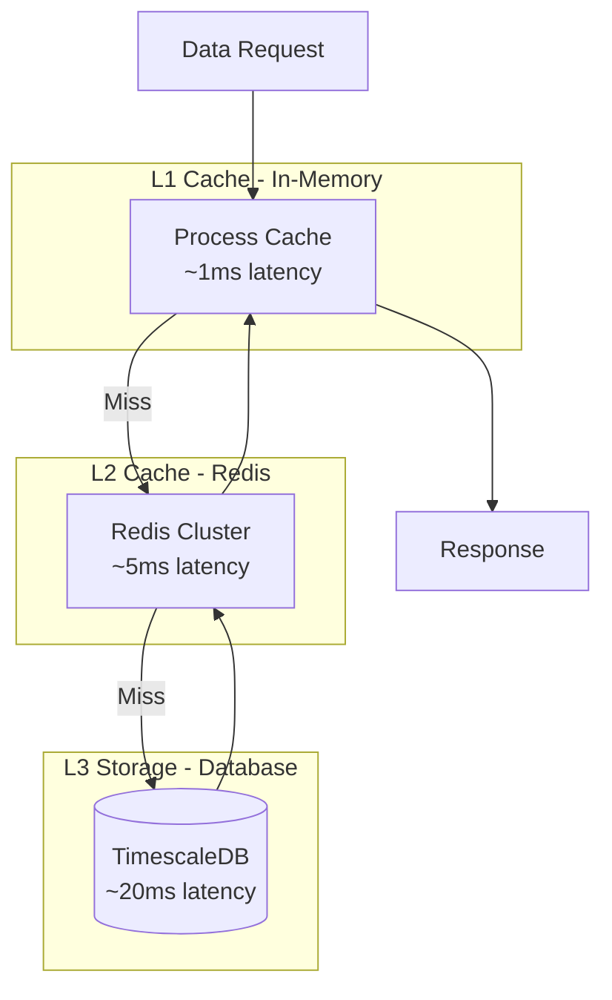

## Security Architecture

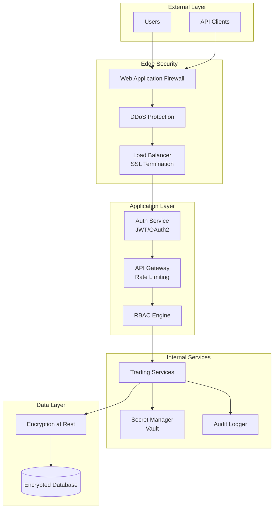

## Monitoring and Observability

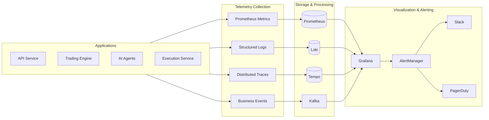

---

This document provides a comprehensive view of the AlphaPulse architecture using various diagramming techniques. The diagrams cover:

1. **C4 Model**: System context, containers, and components
2. **Data Flows**: How data moves through the system
3. **Sequences**: Step-by-step interaction flows
4. **Deployment**: Infrastructure and deployment topology
5. **State Machines**: Order and system state transitions
6. **Entity Relationships**: Database schema overview
7. **Architecture Decisions**: Key design choices
8. **Performance**: Latency-critical paths and caching
9. **Security**: Security layers and controls
10. **Monitoring**: Observability architecture

Each diagram provides a different perspective on the system, helping developers, operators, and stakeholders understand how AlphaPulse works at various levels of abstraction.