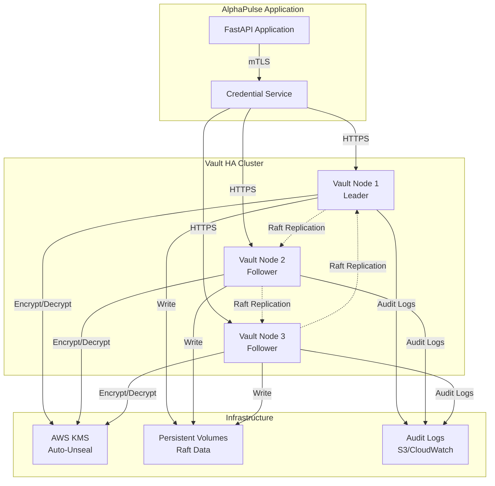

# Story 3.1: Deploy Vault HA Cluster - High-Level Design

**Epic**: EPIC-003 (Credential Management)
**Story Points**: 8
**Related**: [Discovery](../discovery/story-3.1-vault-ha-discovery.md), [ADR-003](../adr/003-credential-management-multi-tenant.md)

## Overview

Deploy a 3-node HashiCorp Vault cluster with Raft consensus, auto-unseal via cloud KMS, and audit logging. This provides the foundation for secure, highly-available credential storage for AlphaPulse's multi-tenant SaaS platform.

## Architecture

### System Context



### Deployment Architecture

**Development Environment** (Docker Compose):
```
┌─────────────────────────────────────────────────────────┐
│                    Docker Network                        │
│                                                          │
│  ┌─────────────┐  ┌─────────────┐  ┌─────────────┐    │
│  │  vault-1    │  │  vault-2    │  │  vault-3    │    │
│  │  :8200      │  │  :8202      │  │  :8204      │    │
│  │  Leader     │  │  Follower   │  │  Follower   │    │
│  └──────┬──────┘  └──────┬──────┘  └──────┬──────┘    │
│         │                 │                 │            │
│         └─────────────────┴─────────────────┘            │
│                    Raft Cluster                          │
│                                                          │
│  ┌──────────────────────────────────────────────────┐  │
│  │         Persistent Volumes (Docker Volumes)       │  │
│  │  - vault-1-data  - vault-2-data  - vault-3-data  │  │
│  └──────────────────────────────────────────────────┘  │
└─────────────────────────────────────────────────────────┘
```

**Production Environment** (Kubernetes):
```
┌──────────────────────────────────────────────────────────┐
│                  Kubernetes Cluster                       │
│                                                           │
│  ┌────────────────────────────────────────────────────┐ │
│  │              Vault StatefulSet                     │ │
│  │                                                     │ │
│  │  ┌─────────┐  ┌─────────┐  ┌─────────┐           │ │
│  │  │ vault-0 │  │ vault-1 │  │ vault-2 │           │ │
│  │  │ Leader  │  │Follower │  │Follower │           │ │
│  │  └────┬────┘  └────┬────┘  └────┬────┘           │ │
│  │       │            │            │                  │ │
│  │  ┌────┴────────────┴────────────┴────┐            │ │
│  │  │     Headless Service (Raft)       │            │ │
│  │  └───────────────────────────────────┘            │ │
│  └────────────────────────────────────────────────────┘ │
│                                                           │
│  ┌────────────────────────────────────────────────────┐ │
│  │         PersistentVolumeClaims (EBS/GCP PD)        │ │
│  │  - vault-0-data  - vault-1-data  - vault-2-data   │ │
│  └────────────────────────────────────────────────────┘ │
│                                                           │
│  ┌────────────────────────────────────────────────────┐ │
│  │         Service (LoadBalancer/Ingress)             │ │
│  │              vault.alphapulse.com                   │ │
│  └────────────────────────────────────────────────────┘ │
└──────────────────────────────────────────────────────────┘
                          │
                          ▼
                 ┌─────────────────┐
                 │    AWS KMS      │
                 │  Auto-Unseal    │
                 └─────────────────┘
```

## Component Design

### 1. Vault Server Configuration

**File**: `config/vault-node1.hcl` (similar for node2, node3)

```hcl
# Vault Node 1 Configuration

# Storage: Raft integrated storage
storage "raft" {
  path    = "/vault/data"
  node_id = "vault-1"

  # Retry join configuration (auto-discover peers)
  retry_join {
    leader_api_addr = "http://vault-1:8200"
  }
  retry_join {
    leader_api_addr = "http://vault-2:8200"
  }
  retry_join {
    leader_api_addr = "http://vault-3:8200"
  }
}

# API listener (HTTP for dev, HTTPS for prod)
listener "tcp" {
  address       = "0.0.0.0:8200"
  tls_disable   = 1  # Development only!

  # Production TLS configuration:
  # tls_disable   = 0
  # tls_cert_file = "/vault/certs/vault.crt"
  # tls_key_file  = "/vault/certs/vault.key"
  # tls_min_version = "tls13"
}

# Cluster communication listener (Raft replication)
listener "tcp" {
  address       = "0.0.0.0:8201"
  tls_disable   = 1  # Development only!
}

# Cluster addresses (unique per node)
cluster_addr  = "http://vault-1:8201"
api_addr      = "http://vault-1:8200"

# Auto-unseal with AWS KMS (production)
seal "awskms" {
  region     = "us-east-1"
  kms_key_id = "alias/alphapulse-vault-unseal"
  endpoint   = "https://kms.us-east-1.amazonaws.com"
}

# Telemetry: Prometheus metrics
telemetry {
  prometheus_retention_time = "30s"
  disable_hostname          = true
  unauthenticated_metrics_access = true  # Development only!
}

# UI (optional)
ui = true

# Logging
log_level = "info"
log_format = "json"
```

**Development Override** (no KMS required):
```hcl
# config/vault-dev-override.hcl
# Disable KMS seal for local development
disable_mlock = true

# File-based dev mode unseal
seal "file" {
  path = "/vault/unseal-key"
}
```

### 2. Docker Compose Configuration

**File**: `docker-compose.vault.yml`

```yaml
version: '3.8'

services:
  vault-1:
    image: hashicorp/vault:1.15
    container_name: alphapulse-vault-1
    hostname: vault-1
    environment:
      VAULT_ADDR: "http://0.0.0.0:8200"
      VAULT_API_ADDR: "http://vault-1:8200"
      VAULT_CLUSTER_ADDR: "http://vault-1:8201"
      VAULT_RAFT_NODE_ID: "vault-1"
      # AWS credentials for KMS (production)
      # AWS_ACCESS_KEY_ID: ${AWS_ACCESS_KEY_ID}
      # AWS_SECRET_ACCESS_KEY: ${AWS_SECRET_ACCESS_KEY}
      # AWS_REGION: us-east-1
    command: server
    volumes:
      - ./config/vault-node1.hcl:/vault/config/vault.hcl:ro
      - vault-1-data:/vault/data
      - vault-1-logs:/vault/logs
    cap_add:
      - IPC_LOCK  # Prevent memory swapping (security)
    ports:
      - "8200:8200"  # API
      - "8201:8201"  # Cluster
    networks:
      - vault-network
    healthcheck:
      test: ["CMD", "vault", "status"]
      interval: 10s
      timeout: 3s
      retries: 3
      start_period: 30s

  vault-2:
    image: hashicorp/vault:1.15
    container_name: alphapulse-vault-2
    hostname: vault-2
    environment:
      VAULT_ADDR: "http://0.0.0.0:8200"
      VAULT_API_ADDR: "http://vault-2:8200"
      VAULT_CLUSTER_ADDR: "http://vault-2:8201"
      VAULT_RAFT_NODE_ID: "vault-2"
    command: server
    volumes:
      - ./config/vault-node2.hcl:/vault/config/vault.hcl:ro
      - vault-2-data:/vault/data
      - vault-2-logs:/vault/logs
    cap_add:
      - IPC_LOCK
    ports:
      - "8202:8200"  # API (different port for local access)
    networks:
      - vault-network
    healthcheck:
      test: ["CMD", "vault", "status"]
      interval: 10s
      timeout: 3s
      retries: 3
      start_period: 30s
    depends_on:
      - vault-1

  vault-3:
    image: hashicorp/vault:1.15
    container_name: alphapulse-vault-3
    hostname: vault-3
    environment:
      VAULT_ADDR: "http://0.0.0.0:8200"
      VAULT_API_ADDR: "http://vault-3:8200"
      VAULT_CLUSTER_ADDR: "http://vault-3:8201"
      VAULT_RAFT_NODE_ID: "vault-3"
    command: server
    volumes:
      - ./config/vault-node3.hcl:/vault/config/vault.hcl:ro
      - vault-3-data:/vault/data
      - vault-3-logs:/vault/logs
    cap_add:
      - IPC_LOCK
    ports:
      - "8204:8200"  # API (different port for local access)
    networks:
      - vault-network
    healthcheck:
      test: ["CMD", "vault", "status"]
      interval: 10s
      timeout: 3s
      retries: 3
      start_period: 30s
    depends_on:
      - vault-1

volumes:
  vault-1-data:
    driver: local
  vault-2-data:
    driver: local
  vault-3-data:
    driver: local
  vault-1-logs:
    driver: local
  vault-2-logs:
    driver: local
  vault-3-logs:
    driver: local

networks:
  vault-network:
    driver: bridge
```

### 3. Initialization Script

**File**: `scripts/init-vault-cluster.sh`

```bash
#!/bin/bash
set -e

# Script to initialize Vault HA cluster
# Usage: ./scripts/init-vault-cluster.sh

VAULT_ADDR="http://localhost:8200"
VAULT_TOKEN_FILE=".vault-token"
VAULT_KEYS_FILE=".vault-keys.json"

echo "=== Initializing Vault Cluster ==="

# Check if Vault is already initialized
if vault status -address="$VAULT_ADDR" 2>&1 | grep -q "Initialized.*true"; then
  echo "✅ Vault already initialized"
  exit 0
fi

# Initialize Vault (node 1 only)
echo "Initializing Vault node 1..."
vault operator init \
  -address="$VAULT_ADDR" \
  -key-shares=5 \
  -key-threshold=3 \
  -format=json > "$VAULT_KEYS_FILE"

# Extract root token
ROOT_TOKEN=$(cat "$VAULT_KEYS_FILE" | jq -r '.root_token')
echo "$ROOT_TOKEN" > "$VAULT_TOKEN_FILE"
chmod 600 "$VAULT_TOKEN_FILE"

echo "✅ Vault initialized successfully"
echo "Root token saved to: $VAULT_TOKEN_FILE"
echo "Unseal keys saved to: $VAULT_KEYS_FILE"
echo ""
echo "⚠️  IMPORTANT: Store unseal keys in a secure location!"
echo ""

# Unseal vault-1 (if not using auto-unseal)
if ! vault status -address="$VAULT_ADDR" 2>&1 | grep -q "Sealed.*false"; then
  echo "Unsealing Vault node 1..."
  for i in 0 1 2; do
    KEY=$(cat "$VAULT_KEYS_FILE" | jq -r ".unseal_keys_b64[$i]")
    vault operator unseal -address="$VAULT_ADDR" "$KEY"
  done
  echo "✅ Vault node 1 unsealed"
fi

# Join nodes 2 and 3 to Raft cluster
export VAULT_TOKEN="$ROOT_TOKEN"

echo "Joining Vault node 2 to cluster..."
vault operator raft join \
  -address="http://localhost:8202" \
  -leader-api-addr="$VAULT_ADDR"
echo "✅ Vault node 2 joined"

echo "Joining Vault node 3 to cluster..."
vault operator raft join \
  -address="http://localhost:8204" \
  -leader-api-addr="$VAULT_ADDR"
echo "✅ Vault node 3 joined"

# Enable audit logging
echo "Enabling audit logging..."
vault audit enable -address="$VAULT_ADDR" file file_path=/vault/logs/audit.log
echo "✅ Audit logging enabled"

# Enable KV v2 secrets engine
echo "Enabling KV v2 secrets engine..."
vault secrets enable -address="$VAULT_ADDR" -path=secret kv-v2
echo "✅ KV v2 secrets engine enabled at path: secret/"

# Create initial tenant isolation policy
echo "Creating tenant isolation policy template..."
cat > /tmp/tenant-policy.hcl <<EOF
# Tenant-specific access policy
# Path: secret/data/tenants/{{identity.entity.metadata.tenant_id}}/*

path "secret/data/tenants/{{identity.entity.metadata.tenant_id}}/*" {
  capabilities = ["create", "read", "update", "delete", "list"]
}

path "secret/metadata/tenants/{{identity.entity.metadata.tenant_id}}/*" {
  capabilities = ["list", "read"]
}
EOF

vault policy write -address="$VAULT_ADDR" tenant-access /tmp/tenant-policy.hcl
echo "✅ Tenant isolation policy created"

# Display cluster status
echo ""
echo "=== Vault Cluster Status ==="
vault operator raft list-peers -address="$VAULT_ADDR"

echo ""
echo "✅ Vault cluster initialization complete!"
echo ""
echo "Next steps:"
echo "1. Store unseal keys in secure location (AWS Secrets Manager, 1Password, etc.)"
echo "2. Configure auto-unseal with AWS KMS (production)"
echo "3. Enable TLS for production deployment"
echo "4. Test failover by stopping one node"
```

### 4. Health Check Script

**File**: `scripts/vault-health-check.sh`

```bash
#!/bin/bash
set -e

# Health check script for Vault cluster
# Usage: ./scripts/vault-health-check.sh

VAULT_NODES=(
  "http://localhost:8200"
  "http://localhost:8202"
  "http://localhost:8204"
)

echo "=== Vault Cluster Health Check ==="
echo ""

ALL_HEALTHY=true

for ADDR in "${VAULT_NODES[@]}"; do
  echo "Checking $ADDR..."

  # Check if node is reachable
  if ! curl -s -f "$ADDR/v1/sys/health" > /dev/null; then
    echo "❌ Node unreachable: $ADDR"
    ALL_HEALTHY=false
    continue
  fi

  # Get detailed status
  STATUS=$(vault status -address="$ADDR" -format=json 2>/dev/null || echo "{}")

  INITIALIZED=$(echo "$STATUS" | jq -r '.initialized // false')
  SEALED=$(echo "$STATUS" | jq -r '.sealed // true')
  HA_ENABLED=$(echo "$STATUS" | jq -r '.ha_enabled // false')
  IS_LEADER=$(echo "$STATUS" | jq -r '.is_self // false')

  if [ "$INITIALIZED" = "true" ] && [ "$SEALED" = "false" ]; then
    ROLE=$([ "$IS_LEADER" = "true" ] && echo "LEADER" || echo "FOLLOWER")
    echo "✅ Node healthy: $ADDR ($ROLE)"
  else
    echo "❌ Node unhealthy: $ADDR (Initialized: $INITIALIZED, Sealed: $SEALED)"
    ALL_HEALTHY=false
  fi
done

echo ""

# Check Raft peers
if [ -n "$VAULT_TOKEN" ]; then
  echo "=== Raft Cluster Peers ==="
  vault operator raft list-peers -address="${VAULT_NODES[0]}" 2>/dev/null || echo "⚠️  Unable to list Raft peers (token required)"
  echo ""
fi

if [ "$ALL_HEALTHY" = "true" ]; then
  echo "✅ All nodes healthy"
  exit 0
else
  echo "❌ Some nodes unhealthy"
  exit 1
fi
```

### 5. Vault Client Configuration (Application)

**File**: `src/alpha_pulse/vault/client.py`

```python
"""Vault client for credential management."""

import os
from typing import Optional, Dict, Any
import hvac
from loguru import logger


class VaultClient:
    """HashiCorp Vault client wrapper."""

    def __init__(
        self,
        url: str = None,
        token: str = None,
        verify: bool = True,
        namespace: Optional[str] = None,
    ):
        """Initialize Vault client.

        Args:
            url: Vault server URL (default: VAULT_ADDR env var)
            token: Vault token (default: VAULT_TOKEN env var)
            verify: Verify TLS certificates (default: True)
            namespace: Vault namespace (Enterprise only)
        """
        self.url = url or os.getenv("VAULT_ADDR", "http://localhost:8200")
        self.token = token or os.getenv("VAULT_TOKEN")
        self.namespace = namespace

        if not self.token:
            raise ValueError("Vault token required (set VAULT_TOKEN env var)")

        self.client = hvac.Client(
            url=self.url,
            token=self.token,
            verify=verify,
            namespace=self.namespace,
        )

        if not self.client.is_authenticated():
            raise ValueError("Vault authentication failed (invalid token)")

        logger.info(f"Vault client initialized: {self.url}")

    def read_secret(self, path: str) -> Optional[Dict[str, Any]]:
        """Read secret from Vault KV v2 engine.

        Args:
            path: Secret path (e.g., 'tenants/tenant-id/exchanges/binance')

        Returns:
            Secret data dict or None if not found
        """
        try:
            response = self.client.secrets.kv.v2.read_secret_version(
                path=path,
                mount_point="secret",
            )
            return response["data"]["data"]
        except hvac.exceptions.InvalidPath:
            logger.warning(f"Secret not found: {path}")
            return None
        except Exception as e:
            logger.error(f"Error reading secret {path}: {e}")
            raise

    def write_secret(self, path: str, data: Dict[str, Any]) -> None:
        """Write secret to Vault KV v2 engine.

        Args:
            path: Secret path (e.g., 'tenants/tenant-id/exchanges/binance')
            data: Secret data dict
        """
        try:
            self.client.secrets.kv.v2.create_or_update_secret(
                path=path,
                secret=data,
                mount_point="secret",
            )
            logger.info(f"Secret written: {path}")
        except Exception as e:
            logger.error(f"Error writing secret {path}: {e}")
            raise

    def delete_secret(self, path: str) -> None:
        """Delete secret from Vault KV v2 engine.

        Args:
            path: Secret path
        """
        try:
            self.client.secrets.kv.v2.delete_metadata_and_all_versions(
                path=path,
                mount_point="secret",
            )
            logger.info(f"Secret deleted: {path}")
        except Exception as e:
            logger.error(f"Error deleting secret {path}: {e}")
            raise

    def health_check(self) -> Dict[str, Any]:
        """Check Vault server health.

        Returns:
            Health status dict with keys: initialized, sealed, standby
        """
        try:
            health = self.client.sys.read_health_status(method="GET")
            return {
                "initialized": health.get("initialized", False),
                "sealed": health.get("sealed", True),
                "standby": health.get("standby", False),
                "replication_performance_mode": health.get("replication_performance_mode"),
                "replication_dr_mode": health.get("replication_dr_mode"),
            }
        except Exception as e:
            logger.error(f"Vault health check failed: {e}")
            return {"initialized": False, "sealed": True, "standby": False}
```

## Data Model

### Vault Secret Structure

**Path Pattern**: `secret/data/tenants/{tenant_id}/exchanges/{exchange}/{credential_type}`

**Example Path**: `secret/data/tenants/00000000-0000-0000-0000-000000000001/exchanges/binance/trading`

**Secret Data**:
```json
{
  "api_key": "abcd1234...",
  "secret": "xyz789...",
  "passphrase": "optional-for-some-exchanges",
  "metadata": {
    "exchange": "binance",
    "credential_type": "trading",
    "created_at": "2025-11-09T10:00:00Z",
    "created_by": "user@example.com"
  }
}
```

### Vault Metadata (PostgreSQL)

**Table**: `tenant_credentials` (from ADR-003)

```sql
CREATE TABLE tenant_credentials (
  id UUID PRIMARY KEY DEFAULT gen_random_uuid(),
  tenant_id UUID NOT NULL REFERENCES tenants(id) ON DELETE CASCADE,
  exchange VARCHAR(50) NOT NULL,
  credential_type VARCHAR(20) NOT NULL CHECK (credential_type IN ('readonly', 'trading')),
  vault_path TEXT NOT NULL,
  status VARCHAR(20) NOT NULL DEFAULT 'active' CHECK (status IN ('active', 'rotating', 'revoked', 'expired')),
  last_validated_at TIMESTAMP,
  validation_error TEXT,
  created_at TIMESTAMP NOT NULL DEFAULT NOW(),
  updated_at TIMESTAMP NOT NULL DEFAULT NOW(),
  expires_at TIMESTAMP,
  UNIQUE(tenant_id, exchange, credential_type)
);

CREATE INDEX idx_tenant_credentials_tenant ON tenant_credentials(tenant_id);
CREATE INDEX idx_tenant_credentials_status ON tenant_credentials(status);
CREATE INDEX idx_tenant_credentials_exchange ON tenant_credentials(exchange);
```

## Security Considerations

### 1. Encryption

**At Rest**:
- Vault uses AES-256-GCM for secret encryption
- Master key encrypted by AWS KMS (auto-unseal)
- Raft storage encrypted on disk

**In Transit**:
- TLS 1.3 for all API communication (production)
- mTLS between application and Vault (optional, recommended)
- Raft replication over TLS (cluster listener)

### 2. Access Control

**Vault Policies**:
```hcl
# Application policy (AppRole/K8s ServiceAccount)
path "secret/data/tenants/*" {
  capabilities = ["read"]
}

# Admin policy (manual operations)
path "secret/*" {
  capabilities = ["create", "read", "update", "delete", "list"]
}

path "sys/health" {
  capabilities = ["read", "sudo"]
}
```

**Authentication Methods**:
- **Development**: Token-based (root token for initial setup)
- **Production**: AppRole (application service account) or Kubernetes ServiceAccount

### 3. Audit Logging

**Log Format**:
```json
{
  "time": "2025-11-09T10:15:30.123456789Z",
  "type": "response",
  "auth": {
    "client_token": "hmac-sha256:abc123...",
    "accessor": "hmac-sha256:def456...",
    "display_name": "token",
    "policies": ["default", "tenant-access"],
    "metadata": {
      "tenant_id": "00000000-0000-0000-0000-000000000001"
    }
  },
  "request": {
    "id": "uuid-123",
    "operation": "read",
    "client_token": "hmac-sha256:abc123...",
    "client_token_accessor": "hmac-sha256:def456...",
    "path": "secret/data/tenants/00000000-0000-0000-0000-000000000001/exchanges/binance/trading",
    "data": null,
    "remote_address": "10.0.1.5"
  },
  "response": {
    "data": {
      "api_key": "hmac-sha256:redacted...",
      "secret": "hmac-sha256:redacted..."
    }
  }
}
```

**Log Storage**:
- Development: File (`/vault/logs/audit.log`)
- Production: Syslog → ELK/Loki/CloudWatch
- Retention: 90 days (SOC2 compliance)

## Performance Considerations

### Latency Targets

| Operation | P50 | P99 | P999 |
|-----------|-----|-----|------|
| Read Secret (cached) | <1ms | <2ms | <5ms |
| Read Secret (Vault) | <10ms | <20ms | <50ms |
| Write Secret | <20ms | <50ms | <100ms |
| List Secrets | <50ms | <100ms | <200ms |

### Caching Strategy

**In-Memory Cache** (Application Layer):
- Cache secret values for 5 minutes
- Cache key: `vault:{path}:v{version}`
- Invalidate on write/delete operations
- LRU eviction (max 1000 entries)

**Redis Cache** (Distributed):
- TTL: 5 minutes
- Namespace: `vault:secrets:{tenant_id}:{exchange}`
- Atomic read-through pattern

### Scalability

**Raft Performance**:
- Write throughput: 1000-5000 writes/sec (leader bottleneck)
- Read throughput: 10k-100k reads/sec (followers can serve reads)
- Cluster size: 3-7 nodes (odd number for quorum)

**Application Scaling**:
- Multiple app instances share Vault cluster (stateless)
- Use caching to reduce Vault load
- Connection pooling (hvac client reuse)

## Monitoring & Alerting

### Prometheus Metrics

**Vault Metrics** (exposed on `/v1/sys/metrics`):
```
vault_core_unsealed{cluster="alphapulse"} 1
vault_raft_leader{cluster="alphapulse"} 1
vault_raft_applied_index{cluster="alphapulse"} 12345
vault_secret_kv_count{cluster="alphapulse"} 42
vault_audit_log_request_count{cluster="alphapulse"} 1000
vault_audit_log_response_count{cluster="alphapulse"} 1000
vault_core_check_token_count{cluster="alphapulse"} 500
```

**Health Check Endpoint**:
```bash
# Vault health check (unauthenticated)
curl http://localhost:8200/v1/sys/health

# Response codes:
# 200: Initialized, unsealed, active
# 429: Unsealed, standby
# 472: Disaster recovery mode
# 501: Not initialized
# 503: Sealed
```

### Alerting Rules

```yaml
# Prometheus alerting rules
groups:
  - name: vault
    rules:
      - alert: VaultSealed
        expr: vault_core_unsealed == 0
        for: 1m
        labels:
          severity: critical
        annotations:
          summary: "Vault is sealed"
          description: "Vault cluster {{ $labels.cluster }} is sealed and requires manual unseal"

      - alert: VaultNoLeader
        expr: sum(vault_raft_leader) == 0
        for: 1m
        labels:
          severity: critical
        annotations:
          summary: "Vault has no leader"
          description: "Vault cluster {{ $labels.cluster }} has no Raft leader"

      - alert: VaultHighLatency
        expr: histogram_quantile(0.99, vault_secret_kv_get_duration_seconds) > 0.05
        for: 5m
        labels:
          severity: warning
        annotations:
          summary: "Vault high latency"
          description: "Vault P99 latency is {{ $value }}s (>50ms)"
```

## Disaster Recovery

### Backup Strategy

**Raft Snapshots**:
```bash
# Take manual snapshot
vault operator raft snapshot save backup.snap

# Automated daily backups (cron job)
0 2 * * * vault operator raft snapshot save /backups/vault-$(date +\%Y\%m\%d).snap
```

**Snapshot Restoration**:
```bash
# Restore from snapshot
vault operator raft snapshot restore backup.snap
```

**Backup Storage**:
- Local: `/backups/` (7-day retention)
- Cloud: S3 bucket with versioning (90-day retention)
- Encryption: GPG-encrypted before upload

### Failure Scenarios

**Scenario 1: Single Node Failure**
- Impact: None (cluster remains operational with 2/3 nodes)
- Recovery: Replace failed node, join to cluster
- RTO: 0 seconds (automatic failover)
- RPO: 0 seconds (synchronous replication)

**Scenario 2: Leader Failure**
- Impact: <1 second write latency spike (leader election)
- Recovery: Automatic (Raft elects new leader)
- RTO: <5 seconds
- RPO: 0 seconds

**Scenario 3: Total Cluster Loss (all 3 nodes)**
- Impact: Complete outage (no credential access)
- Recovery: Restore from snapshot backup
- RTO: 15 minutes (manual intervention)
- RPO: <24 hours (daily snapshots)

**Scenario 4: KMS Unavailable (AWS KMS outage)**
- Impact: Nodes cannot auto-unseal on restart
- Recovery: Wait for KMS recovery OR manual unseal with recovery keys
- RTO: Depends on KMS SLA (typically <1 hour)
- RPO: 0 seconds (no data loss)

## Testing Strategy

### Unit Tests

**File**: `src/alpha_pulse/tests/vault/test_vault_client.py`

```python
import pytest
from unittest.mock import Mock, patch
from alpha_pulse.vault.client import VaultClient


class TestVaultClient:
    """Unit tests for VaultClient."""

    @patch("alpha_pulse.vault.client.hvac.Client")
    def test_init_success(self, mock_hvac):
        """Test successful client initialization."""
        mock_client = Mock()
        mock_client.is_authenticated.return_value = True
        mock_hvac.return_value = mock_client

        client = VaultClient(url="http://localhost:8200", token="test-token")
        assert client.url == "http://localhost:8200"
        assert client.token == "test-token"
        mock_hvac.assert_called_once()

    @patch("alpha_pulse.vault.client.hvac.Client")
    def test_init_no_token(self, mock_hvac):
        """Test client initialization fails without token."""
        with pytest.raises(ValueError, match="Vault token required"):
            VaultClient(url="http://localhost:8200", token=None)

    @patch("alpha_pulse.vault.client.hvac.Client")
    def test_read_secret_success(self, mock_hvac):
        """Test successful secret read."""
        mock_client = Mock()
        mock_client.is_authenticated.return_value = True
        mock_client.secrets.kv.v2.read_secret_version.return_value = {
            "data": {"data": {"api_key": "abc123", "secret": "xyz789"}}
        }
        mock_hvac.return_value = mock_client

        client = VaultClient(url="http://localhost:8200", token="test-token")
        data = client.read_secret("tenants/tenant-1/exchanges/binance")

        assert data == {"api_key": "abc123", "secret": "xyz789"}

    # ... more tests
```

### Integration Tests

**File**: `src/alpha_pulse/tests/vault/test_vault_integration.py`

```python
import pytest
from alpha_pulse.vault.client import VaultClient


@pytest.mark.integration
class TestVaultIntegration:
    """Integration tests with real Vault cluster."""

    @pytest.fixture
    def vault_client(self):
        """Create Vault client connected to test cluster."""
        return VaultClient(
            url="http://localhost:8200",
            token=os.getenv("VAULT_DEV_ROOT_TOKEN_ID"),
        )

    def test_write_read_delete_secret(self, vault_client):
        """Test full secret lifecycle."""
        path = "tenants/test-tenant/exchanges/binance"
        data = {"api_key": "test-key", "secret": "test-secret"}

        # Write
        vault_client.write_secret(path, data)

        # Read
        read_data = vault_client.read_secret(path)
        assert read_data == data

        # Delete
        vault_client.delete_secret(path)

        # Verify deleted
        assert vault_client.read_secret(path) is None

    def test_health_check(self, vault_client):
        """Test Vault health check."""
        health = vault_client.health_check()
        assert health["initialized"] is True
        assert health["sealed"] is False
```

### Load Tests

**File**: `tests/load/vault_load_test.py`

```python
"""Load test for Vault cluster."""
import time
from locust import User, task, between
from alpha_pulse.vault.client import VaultClient


class VaultUser(User):
    """Simulated Vault user for load testing."""

    wait_time = between(0.1, 1)  # 100ms to 1s between requests

    def on_start(self):
        """Initialize Vault client."""
        self.client = VaultClient(
            url="http://localhost:8200",
            token=os.getenv("VAULT_TOKEN"),
        )

    @task(10)  # 10x weight (90% of requests)
    def read_secret(self):
        """Read secret (hot path)."""
        start_time = time.time()
        try:
            data = self.client.read_secret("tenants/load-test/exchanges/binance")
            latency = (time.time() - start_time) * 1000
            self.environment.events.request.fire(
                request_type="vault",
                name="read_secret",
                response_time=latency,
                response_length=len(str(data)),
                exception=None,
                context={},
            )
        except Exception as e:
            latency = (time.time() - start_time) * 1000
            self.environment.events.request.fire(
                request_type="vault",
                name="read_secret",
                response_time=latency,
                response_length=0,
                exception=e,
                context={},
            )

    @task(1)  # 1x weight (10% of requests)
    def write_secret(self):
        """Write secret (cold path)."""
        start_time = time.time()
        try:
            data = {"api_key": "load-test-key", "secret": "load-test-secret"}
            self.client.write_secret("tenants/load-test/exchanges/binance", data)
            latency = (time.time() - start_time) * 1000
            self.environment.events.request.fire(
                request_type="vault",
                name="write_secret",
                response_time=latency,
                response_length=len(str(data)),
                exception=None,
                context={},
            )
        except Exception as e:
            latency = (time.time() - start_time) * 1000
            self.environment.events.request.fire(
                request_type="vault",
                name="write_secret",
                response_time=latency,
                response_length=0,
                exception=e,
                context={},
            )


# Run: locust -f tests/load/vault_load_test.py --host=http://localhost:8200 --users=100 --spawn-rate=10
```

**Load Test Targets**:
- 100 concurrent users
- 90% reads, 10% writes
- P99 latency <50ms
- Error rate <0.1%
- Duration: 5 minutes

## Deployment Steps

### Development Setup

1. **Start Vault cluster**:
   ```bash
   docker-compose -f docker-compose.vault.yml up -d
   ```

2. **Initialize cluster**:
   ```bash
   ./scripts/init-vault-cluster.sh
   ```

3. **Verify health**:
   ```bash
   ./scripts/vault-health-check.sh
   ```

4. **Export token**:
   ```bash
   export VAULT_TOKEN=$(cat .vault-token)
   ```

### Production Setup

1. **Deploy Kubernetes cluster** (if not exists):
   ```bash
   # Using Terraform/Helm
   terraform apply -var-file=production.tfvars
   ```

2. **Create KMS key**:
   ```bash
   aws kms create-key --description "AlphaPulse Vault auto-unseal"
   aws kms create-alias --alias-name alias/alphapulse-vault-unseal --target-key-id <key-id>
   ```

3. **Deploy Vault Helm chart**:
   ```bash
   helm repo add hashicorp https://helm.releases.hashicorp.com
   helm install vault hashicorp/vault -f config/vault-helm-values.yaml
   ```

4. **Initialize and unseal**:
   ```bash
   kubectl exec -it vault-0 -- vault operator init
   kubectl exec -it vault-1 -- vault operator raft join http://vault-0:8200
   kubectl exec -it vault-2 -- vault operator raft join http://vault-0:8200
   ```

## Acceptance Criteria

- [ ] 3 Vault nodes running and passing health checks
- [ ] Raft consensus established (verify with `vault operator raft list-peers`)
- [ ] Auto-unseal configured (KMS for prod, file for dev)
- [ ] Audit logging enabled and writing to persistent storage
- [ ] Single node failure test passed (kill 1 node, verify no downtime)
- [ ] Secret read P99 latency <5ms (load test)
- [ ] Secret write P99 latency <50ms (load test)
- [ ] Prometheus metrics exposed and scraped
- [ ] Backup/restore tested successfully

## Next Steps

1. **Story 3.2**: Configure Vault policies for tenant isolation
2. **Story 3.3**: Implement CredentialService with Vault client
3. **Story 3.4**: Implement credential validation logic
4. **Story 3.5**: Implement health check background job
