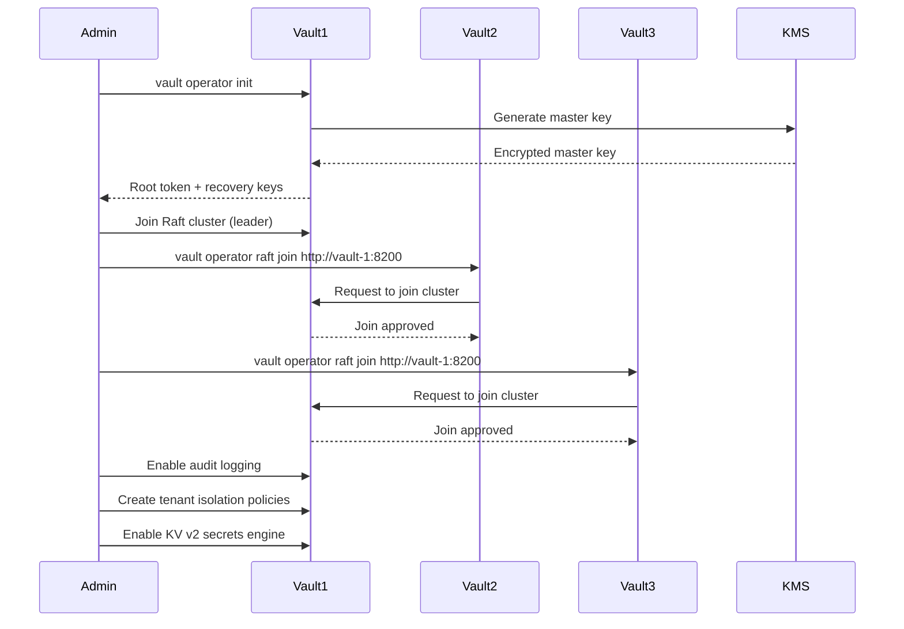

# Story 3.1: Deploy Vault HA Cluster - Discovery

**Epic**: EPIC-003 (Credential Management)
**Story Points**: 8
**Sprint**: 9 (Week 1-2)
**Related**: [ADR-003](../adr/003-credential-management-multi-tenant.md)

## Business Context

AlphaPulse requires a secure, highly-available credential management system to store tenant exchange API keys. HashiCorp Vault provides industry-standard secret management with encryption, audit logging, and fine-grained access control - critical for SOC2 compliance and financial trading operations.

**User Story**: As a platform operator, I need a production-ready Vault cluster that can survive node failures while maintaining <5ms credential retrieval latency, so that trading operations are never blocked by infrastructure issues.

## Success Criteria

- ✅ 3-node Vault cluster running with Raft consensus
- ✅ Auto-unseal configured with cloud KMS (AWS/GCP)
- ✅ Health checks return 200 OK on all nodes
- ✅ Audit logging enabled and writing to persistent storage
- ✅ Single node failure does not impact availability
- ✅ P99 latency <5ms for secret read operations

## Current State Analysis

### Existing Infrastructure

**Container Orchestration**: Docker Compose (`docker-compose.yml`)
```yaml
services:
  db:
    image: postgres:16
    ports: ["5432:5432"]

  redis:
    image: redis:7-alpine
    ports: ["6379:6379"]
```

**Deployment Environment**: Local development (Docker Compose)
- No production Kubernetes cluster (yet)
- No cloud KMS configured
- No secrets management beyond environment variables

### Existing Credential Management

**Current Implementation** (`src/alpha_pulse/exchanges/credentials/`):
- File-based encrypted JSON storage
- Fernet symmetric encryption (key from `ENCRYPTION_KEY` env var)
- Single-tenant design
- No audit logging
- Manual rotation

**Files**:
- `credential_manager.py` - File I/O and encryption
- `models.py` - Credential data models
- `storage/` - JSON files on disk

**Security Gaps**:
- ❌ Encryption key stored with application (not true separation)
- ❌ No audit trail of credential access
- ❌ No versioning or rollback capability
- ❌ File system permissions only protection

## Requirements Analysis

### Functional Requirements

**FR-1: High Availability**
- 3 Vault nodes in Raft cluster
- Quorum consensus (2/3 nodes must agree)
- Automatic leader election on failure
- Zero downtime during single node failure

**FR-2: Auto-Unseal**
- Vault sealed state requires manual unseal (5 key shards)
- Auto-unseal via cloud KMS eliminates manual unseal on restart
- Supports: AWS KMS, GCP Cloud KMS, Azure Key Vault
- Graceful degradation if KMS unavailable

**FR-3: Audit Logging**
- All secret read/write operations logged
- Logs include: timestamp, operation, path, tenant_id, IP address
- Log retention: 90 days minimum (compliance requirement)
- Log format: JSON for structured parsing

**FR-4: Secret Storage Backend**
- Raft integrated storage (no external dependency like Consul)
- Data replication across all 3 nodes
- Automatic snapshot backups every 24 hours
- Backup encryption with KMS

**FR-5: Tenant Isolation Policies**
- Path-based access control per tenant
- Policy template: `secret/tenants/{tenant_id}/*`
- Application authenticates via AppRole or Kubernetes ServiceAccount
- Token TTL: 1 hour (renewable)

### Non-Functional Requirements

**NFR-1: Performance**
- P99 latency <5ms for secret read (in-memory cache)
- P99 latency <50ms for secret write (consensus overhead)
- Throughput: 1000+ requests/second per node
- Horizontal scalability via caching layer

**NFR-2: Security**
- TLS 1.3 for all communication
- mTLS between application and Vault
- AES-256-GCM encryption at rest
- Cloud KMS for master key encryption

**NFR-3: Reliability**
- 99.99% uptime (single 9s reduction from application's 99.999%)
- RTO: 0 seconds (HA cluster maintains availability)
- RPO: 0 seconds (synchronous replication via Raft)
- Automated health checks every 30 seconds

**NFR-4: Observability**
- Prometheus metrics: vault_core_unsealed, vault_raft_leader, vault_secret_kv_count
- Health check endpoint: `GET /v1/sys/health`
- Audit logs exported to ELK/Loki/CloudWatch
- Alerting on seal status, leader election, high latency

### Constraints

**Infrastructure Constraints**:
- Development: Docker Compose (simulates HA with 3 containers)
- Production: Requires Kubernetes cluster OR 3 separate VMs
- Cloud KMS: Requires AWS/GCP/Azure account and IAM permissions

**Budget Constraints**:
- Vault OSS (open source) - free
- Cloud KMS: ~$1/month (10k requests free tier)
- Compute: 3 nodes × $10/month (small instances) = $30/month

**Time Constraints**:
- Sprint 9 (2 weeks)
- Parallel with Story 4.2-4.5 (Caching Layer - already complete)
- DevOps engineer available 50% (1 week effort)

## Technical Discovery

### Vault Deployment Architecture

**Option 1: Docker Compose (Development)**
```yaml
# docker-compose.vault.yml
services:
  vault-1:
    image: hashicorp/vault:1.15
    environment:
      VAULT_ADDR: http://0.0.0.0:8200
      VAULT_API_ADDR: http://vault-1:8200
      VAULT_CLUSTER_ADDR: http://vault-1:8201
    command: server
    volumes:
      - ./config/vault-node1.hcl:/vault/config/vault.hcl
      - vault-1-data:/vault/data
    cap_add:
      - IPC_LOCK
    ports:
      - "8200:8200"

  vault-2:
    image: hashicorp/vault:1.15
    environment:
      VAULT_ADDR: http://0.0.0.0:8200
      VAULT_API_ADDR: http://vault-2:8200
      VAULT_CLUSTER_ADDR: http://vault-2:8201
    command: server
    volumes:
      - ./config/vault-node2.hcl:/vault/config/vault.hcl
      - vault-2-data:/vault/data
    cap_add:
      - IPC_LOCK
    ports:
      - "8202:8200"

  vault-3:
    image: hashicorp/vault:1.15
    environment:
      VAULT_ADDR: http://0.0.0.0:8200
      VAULT_API_ADDR: http://vault-3:8200
      VAULT_CLUSTER_ADDR: http://vault-3:8201
    command: server
    volumes:
      - ./config/vault-node3.hcl:/vault/config/vault.hcl
      - vault-3-data:/vault/data
    cap_add:
      - IPC_LOCK
    ports:
      - "8204:8200"

volumes:
  vault-1-data:
  vault-2-data:
  vault-3-data:
```

**Option 2: Kubernetes (Production)**
```yaml
# vault-helm-values.yaml
global:
  enabled: true
  tlsDisable: false

server:
  ha:
    enabled: true
    replicas: 3
    raft:
      enabled: true
      setNodeId: true
      config: |
        ui = true
        listener "tcp" {
          tls_disable = 0
          address = "[::]:8200"
          cluster_address = "[::]:8201"
        }
        storage "raft" {
          path = "/vault/data"
        }
        seal "awskms" {
          region = "us-east-1"
          kms_key_id = "arn:aws:kms:us-east-1:123456789:key/abc-123"
        }
```

### Vault Configuration

**Node Configuration** (`vault.hcl`):
```hcl
# Storage backend: Raft integrated storage
storage "raft" {
  path    = "/vault/data"
  node_id = "node1"  # Unique per node: node1, node2, node3
}

# Listener: API endpoint
listener "tcp" {
  address       = "0.0.0.0:8200"
  tls_disable   = 1  # Development only! Production requires TLS
}

# Cluster listener: Raft replication
cluster_addr  = "http://vault-1:8201"  # Unique per node
api_addr      = "http://vault-1:8200"  # Unique per node

# Auto-unseal with AWS KMS (production)
seal "awskms" {
  region     = "us-east-1"
  kms_key_id = "alias/vault-unseal-key"
  endpoint   = "https://kms.us-east-1.amazonaws.com"
}

# Auto-unseal with GCP Cloud KMS (alternative)
# seal "gcpckms" {
#   project    = "my-gcp-project"
#   region     = "us-east1"
#   key_ring   = "vault-keyring"
#   crypto_key = "vault-key"
# }

# Telemetry: Prometheus metrics
telemetry {
  prometheus_retention_time = "30s"
  disable_hostname          = true
}

# UI (optional for development)
ui = true
```

**Development Unseal** (no KMS required):
```hcl
# Use file-based unseal for local development
seal "file" {
  path = "/vault/unseal-key"
}
```

### Vault Initialization Workflow



### Audit Logging Configuration

```hcl
# Enable file-based audit logging
vault audit enable file file_path=/vault/logs/audit.log

# Enable syslog audit logging (production)
vault audit enable syslog tag="vault" facility="AUTH"

# Audit log format (JSON)
{
  "time": "2025-11-09T10:15:30Z",
  "type": "request",
  "auth": {
    "token_type": "service",
    "metadata": {
      "tenant_id": "00000000-0000-0000-0000-000000000001"
    }
  },
  "request": {
    "operation": "read",
    "path": "secret/data/tenants/00000000-0000-0000-0000-000000000001/exchanges/binance"
  },
  "response": {
    "status": 200
  }
}
```

## Dependencies

**External Dependencies**:
- Docker / Kubernetes (container runtime)
- AWS KMS / GCP Cloud KMS (auto-unseal, production only)
- Persistent storage (volumes for Raft data)
- Network connectivity (ports 8200, 8201)

**Internal Dependencies**:
- None (foundation for Stories 3.2-3.6)

**Team Dependencies**:
- DevOps engineer (50% allocation, 1 week)
- Security team review (2 hours, Sprint 9)

## Risk Assessment

| Risk | Severity | Probability | Mitigation |
|------|----------|-------------|------------|
| Vault seal failure (all nodes down) | HIGH | LOW | Auto-unseal via KMS, automated backups |
| Split-brain scenario (network partition) | MEDIUM | LOW | Raft quorum (2/3 nodes), documented recovery procedure |
| KMS unavailable during restart | MEDIUM | MEDIUM | Graceful degradation (manual unseal), SLA monitoring |
| Configuration error (wrong Raft peers) | LOW | MEDIUM | Automated health checks, integration tests |
| Insufficient storage (audit logs fill disk) | LOW | MEDIUM | Log rotation (7-day retention), disk monitoring |

## Open Questions

**Q1: Should we use AWS KMS or GCP Cloud KMS for auto-unseal?**
- **Decision**: Start with AWS KMS (AlphaPulse already uses AWS for PostgreSQL RDS)
- **Rationale**: Reduce vendor sprawl, existing IAM integration

**Q2: What is the log retention policy for audit logs?**
- **Decision**: 90 days (SOC2 requirement)
- **Implementation**: Daily log rotation, archive to S3 with lifecycle policy

**Q3: Should Vault run on same Docker Compose network as PostgreSQL/Redis?**
- **Decision**: YES for development, NO for production
- **Rationale**: Dev: simplicity. Prod: security isolation (separate VPC/network)

**Q4: How do we handle Vault upgrades (rolling vs downtime)?**
- **Decision**: Rolling upgrade (one node at a time)
- **Process**: Upgrade follower → upgrade follower → upgrade leader (triggers re-election)

**Q5: Do we need Vault Enterprise features (HSM, multi-tenancy namespaces)?**
- **Decision**: NO for initial launch (Vault OSS sufficient)
- **Future**: Re-evaluate at 500+ tenants (namespace isolation would improve performance)

## Success Metrics

**Deployment Metrics**:
- Cluster initialization time: <5 minutes
- Node join time: <30 seconds
- Health check response time: <100ms

**Reliability Metrics**:
- Availability: 99.99% (4 nines)
- MTTR (mean time to recovery): <1 minute (automatic failover)
- Successful failover test: Kill 1 node, verify no downtime

**Performance Metrics**:
- P50 latency: <2ms (secret read)
- P99 latency: <5ms (secret read)
- Throughput: 1000+ requests/second per node

**Security Metrics**:
- 100% of secret access logged in audit trail
- 0 secrets stored in plaintext
- TLS 1.3 enforced (production)

## Next Steps

1. **Story 3.1 HLD**: Design Vault infrastructure, configuration files, health checks
2. **Story 3.1 Delivery Plan**: Implementation tasks, test plan, rollout strategy
3. **Implementation**: Deploy Vault HA cluster (Docker Compose + scripts)
4. **Story 3.2**: Configure Vault policies for tenant isolation
5. **Story 3.3**: Implement CredentialService with Vault client
