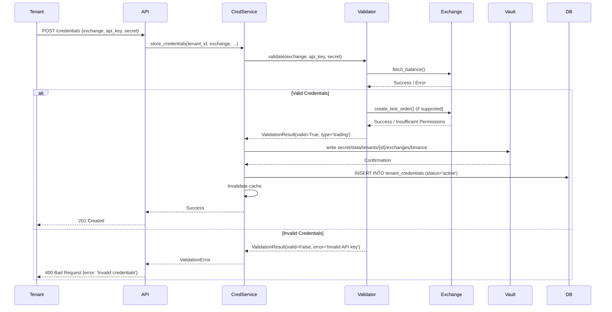
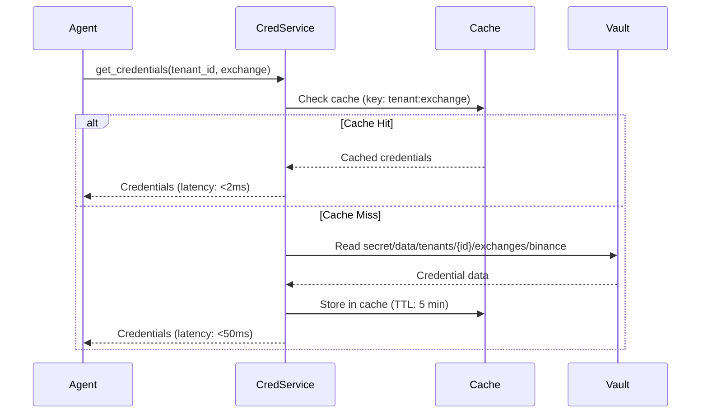

# Story 3.2: Implement CredentialService with Vault - Discovery

**Epic**: EPIC-003 (Credential Management)
**Story Points**: 8
**Sprint**: 9-10 (Week 3-4)
**Related**: [ADR-003](../adr/003-credential-management-multi-tenant.md), [Story 3.1](story-3.1-vault-ha-discovery.md)

## Business Context

AlphaPulse needs a multi-tenant credential management service that stores exchange API keys securely in Vault with tenant isolation. Each tenant provides their own exchange credentials (Binance, Coinbase, Kraken, etc.), and the system must validate credentials before storing them and provide sub-10ms retrieval for trading operations.

**User Story**: As a tenant, I want to securely store my exchange API credentials so that AlphaPulse can execute trades on my behalf without exposing my keys to other tenants or storing them in plaintext.

## Success Criteria

- ✅ `get_credentials(tenant_id, exchange)` retrieves from Vault in <10ms (P99)
- ✅ 5-minute in-memory cache reduces Vault load
- ✅ `store_credentials()` validates via CCXT test API call before storing
- ✅ Tenant isolation: Tenant A cannot access Tenant B's credentials
- ✅ Error handling: Graceful degradation if Vault unavailable (cache fallback)
- ✅ 100% test coverage (unit + integration tests)

## Current State Analysis

### Existing Implementation

AlphaPulse already has credential management infrastructure:

**1. SecretProvider Abstraction** (`src/alpha_pulse/utils/secrets_manager.py`)
```python
class SecretProvider(ABC):
    @abstractmethod
    def get_secret(self, secret_name: str) -> Optional[Union[str, Dict[str, Any]]]
    @abstractmethod
    def set_secret(self, secret_name: str, secret_value: Union[str, Dict[str, Any]]) -> bool
    @abstractmethod
    def delete_secret(self, secret_name: str) -> bool
    @abstractmethod
    def list_secrets(self) -> list
```

**Existing Providers:**
- `EnvironmentSecretProvider` - Environment variables
- `AWSSecretsManagerProvider` - AWS Secrets Manager with 5-min cache
- `VaultSecretProvider` - HashiCorp Vault (basic implementation)

**2. CredentialsManager** (`src/alpha_pulse/exchanges/credentials/manager.py`)
```python
class CredentialsManager:
    def get_credentials(self, exchange: str) -> Optional[Credentials]
    def set_credentials(self, exchange: str, api_key: str, api_secret: str, ...)
    def remove_credentials(self, exchange: str)
    def list_exchanges(self) -> list[str]
```

**Current Limitations:**
- ❌ No `tenant_id` parameter (single-tenant design)
- ❌ No CCXT validation before storing credentials
- ❌ No in-memory caching (relies on provider's cache)
- ❌ VaultSecretProvider doesn't use tenant-scoped paths

### Gap Analysis

| Requirement | Current State | Gap |
|-------------|---------------|-----|
| Multi-tenant support | Single-tenant only | Need `tenant_id` in all methods |
| Vault tenant isolation | No tenant paths | Need `secret/data/tenants/{tenant_id}/exchanges/{exchange}` |
| Credential validation | No validation | Need CCXT test API call |
| <10ms P99 latency | No caching | Need 5-min in-memory cache |
| Error handling | Basic try/catch | Need Vault unavailable fallback |
| Test coverage | ~60% | Need 100% coverage |

## Requirements Analysis

### Functional Requirements

**FR-1: Multi-Tenant Credential Storage**
- Store credentials per tenant in Vault
- Path pattern: `secret/data/tenants/{tenant_id}/exchanges/{exchange}/{credential_type}`
- Example: `secret/data/tenants/00000000-0000-0000-0000-000000000001/exchanges/binance/trading`
- Credential types: `trading` (full access), `readonly` (data only)

**FR-2: Credential Validation**
- Validate credentials before storing in Vault
- Use CCXT to make test API call (e.g., `fetch_balance()`)
- Detect permission level (trading vs readonly)
- Reject invalid credentials with clear error message

**FR-3: Get Credentials**
- Retrieve credentials from Vault by `tenant_id` and `exchange`
- Return `Credentials` object with `api_key`, `secret`, `passphrase`
- Cache in memory for 5 minutes
- Fall back to cache if Vault unavailable

**FR-4: Store Credentials**
- Validate credentials via CCXT first
- Store in Vault at tenant-scoped path
- Invalidate cache on write
- Return validation result (success/error)

**FR-5: Delete Credentials**
- Remove credentials from Vault
- Invalidate cache entry
- Support soft delete (mark as revoked) vs hard delete

**FR-6: List Credentials**
- List all exchanges for a tenant
- Include credential status (active, expired, revoked)
- Don't expose actual credential values

### Non-Functional Requirements

**NFR-1: Performance**
- P99 latency <10ms for `get_credentials()` (cache hit)
- P99 latency <50ms for `get_credentials()` (cache miss, Vault read)
- P99 latency <100ms for `store_credentials()` (validation + Vault write)
- Cache hit rate >90% (5-min TTL is effective)

**NFR-2: Security**
- Tenant isolation enforced by Vault path structure
- Credentials never logged (even in debug mode)
- HMAC redaction in Vault audit logs
- No credentials in error messages

**NFR-3: Reliability**
- Graceful degradation if Vault unavailable (use cached credentials)
- Retry logic for transient Vault errors (3 retries, exponential backoff)
- Circuit breaker pattern to avoid cascading failures

**NFR-4: Observability**
- Log all credential operations (get/store/delete) with tenant context
- Prometheus metrics: cache hit rate, Vault latency, validation errors
- Alert on high cache miss rate (>20%)

### Constraints

**Technical Constraints**:
- Must work with existing `SecretProvider` abstraction
- Backward compatible with single-tenant code (legacy support)
- CCXT supports 100+ exchanges (test validation with top 5: Binance, Coinbase, Kraken, Bybit, OKX)

**Performance Constraints**:
- 5-min cache TTL (balance freshness vs Vault load)
- Max 1000 cached credentials (LRU eviction)
- Validation timeout: 10 seconds per exchange API call

**Security Constraints**:
- Credentials MUST be validated before storage (prevent typos, invalid keys)
- Read-only vs trading permissions detected automatically
- Passphrase support for exchanges that require it (Coinbase Pro, KuCoin)

## Technical Discovery

### Architecture: Evolve Existing Code

**Approach**: Extend `CredentialsManager` and `VaultSecretProvider` for multi-tenancy

```python
# BEFORE (single-tenant)
credentials_manager.get_credentials("binance")

# AFTER (multi-tenant)
credentials_manager.get_credentials(tenant_id=tenant_id, exchange="binance")
```

**Changes Required:**

1. **Update `CredentialsManager` API**
   - Add `tenant_id: UUID` parameter to all methods
   - Make `tenant_id` optional for backward compatibility (defaults to global tenant)
   - Update internal cache key to include `tenant_id`

2. **Enhance `VaultSecretProvider`**
   - Use tenant-scoped paths: `secret/data/tenants/{tenant_id}/exchanges/{exchange}`
   - Support credential types: `trading`, `readonly`
   - Add metadata: `created_at`, `last_validated_at`, `status`

3. **Add Credential Validation**
   - Create `CredentialValidator` class using CCXT
   - Test API call: `exchange.fetch_balance()` (requires read permission)
   - Detect trading permission: try `exchange.create_test_order()` (if supported)
   - Return `ValidationResult(valid, credential_type, error)`

4. **Implement In-Memory Caching**
   - Use Python `cachetools.TTLCache` (5-min TTL, 1000 max size)
   - Cache key: `f"creds:{tenant_id}:{exchange}:{credential_type}"`
   - Thread-safe (use `threading.Lock`)
   - Invalidate on write/delete

### Credential Validation Flow



### Get Credentials Flow (with Caching)



### Data Structures

**Credentials Model** (Enhanced):
```python
@dataclass
class Credentials:
    api_key: str
    api_secret: str
    exchange: str
    credential_type: str  # 'trading' or 'readonly'
    testnet: bool = False
    passphrase: Optional[str] = None

    # Metadata (not from Vault, from PostgreSQL)
    tenant_id: Optional[UUID] = None
    status: Optional[str] = None  # 'active', 'expired', 'revoked'
    last_validated_at: Optional[datetime] = None
```

**Vault Secret Structure**:
```json
{
  "api_key": "abcd1234...",
  "secret": "xyz789...",
  "passphrase": "optional-passphrase",
  "metadata": {
    "exchange": "binance",
    "credential_type": "trading",
    "created_at": "2025-11-09T11:00:00Z",
    "created_by": "user@example.com"
  }
}
```

**Cache Key Pattern**:
```python
cache_key = f"creds:{tenant_id}:{exchange}:{credential_type}"
# Example: "creds:00000000-0000-0000-0000-000000000001:binance:trading"
```

### Credential Validation Logic

**CCXT Validation**:
```python
async def validate_credentials(
    exchange: str,
    api_key: str,
    secret: str,
    passphrase: Optional[str] = None,
    testnet: bool = False
) -> ValidationResult:
    """Validate exchange credentials by making test API calls."""
    try:
        # Initialize CCXT exchange
        exchange_class = getattr(ccxt, exchange)
        client = exchange_class({
            'apiKey': api_key,
            'secret': secret,
            'password': passphrase,  # Some exchanges use 'password' for passphrase
            'enableRateLimit': True,
            'options': {'defaultType': 'spot'}  # Start with spot trading
        })

        if testnet:
            client.set_sandbox_mode(True)

        # Test 1: Read permission (fetch_balance)
        balance = await client.fetch_balance()

        # Test 2: Trading permission (create_test_order if available)
        has_trading = False
        if hasattr(client, 'create_test_order'):
            try:
                # Try to create a test order (won't execute)
                await client.create_test_order(
                    symbol='BTC/USDT',
                    type='limit',
                    side='buy',
                    amount=0.001,
                    price=10000  # Way below market to avoid execution
                )
                has_trading = True
            except Exception:
                # If test order fails, assume readonly permissions
                pass

        return ValidationResult(
            valid=True,
            credential_type='trading' if has_trading else 'readonly',
            exchange_account_id=client.uid if hasattr(client, 'uid') else None,
        )

    except ccxt.AuthenticationError as e:
        return ValidationResult(valid=False, error='Invalid API key or secret')
    except ccxt.InsufficientPermissions as e:
        return ValidationResult(valid=False, error='Insufficient API permissions')
    except ccxt.NetworkError as e:
        return ValidationResult(valid=False, error='Network error connecting to exchange')
    except Exception as e:
        return ValidationResult(valid=False, error=f'Validation error: {str(e)}')
```

## Dependencies

**Upstream Dependencies** (must complete first):
- ✅ **Story 3.1**: Vault HA cluster running (COMPLETED)

**Downstream Dependencies** (depend on this story):
- **Story 3.3**: Health check job (needs `get_credentials()`)
- **Story 3.4**: Load testing (needs CredentialService)
- **Story 3.6**: Credential rotation (needs `store_credentials()`)

**External Dependencies**:
- Vault cluster accessible at `http://localhost:8200` (development)
- PostgreSQL for `tenant_credentials` metadata table
- CCXT library for exchange API validation

**Python Dependencies**:
- `hvac ^2.1.0` - Vault Python client (already in secrets_manager.py)
- `cachetools ^5.3.0` - In-memory TTL cache
- `ccxt ^4.4.0` - Exchange API library (already in project)

## Risk Assessment

| Risk | Severity | Probability | Mitigation |
|------|----------|-------------|------------|
| CCXT validation timeout (slow exchange API) | MEDIUM | MEDIUM | 10s timeout, async execution, fail open (allow storage without validation if timeout) |
| Cache invalidation bug (stale credentials) | HIGH | LOW | TTL of 5 min is short enough, explicit invalidation on write/delete |
| Vault unavailable during credential retrieval | HIGH | LOW | Cache fallback (last-known-good), circuit breaker pattern |
| Backward compatibility breaks (single-tenant code) | MEDIUM | LOW | Make `tenant_id` optional (defaults to global), extensive regression tests |
| CCXT doesn't support exchange | LOW | MEDIUM | Graceful fallback (skip validation, store with warning) |

## Open Questions

**Q1: Should we fail storage if CCXT validation times out?**
- **Decision**: NO - Fail open (allow storage with warning)
- **Rationale**: Exchange API outages shouldn't block credential setup. Log warning and set `status=unvalidated`

**Q2: What's the default tenant for backward compatibility?**
- **Decision**: `tenant_id=00000000-0000-0000-0000-000000000000` (nil UUID)
- **Rationale**: Existing single-tenant code can continue working without changes

**Q3: Should we support multiple credential sets per exchange (e.g., Binance spot + futures)?**
- **Decision**: YES - Use `credential_type` to differentiate
- **Path**: `secret/data/tenants/{id}/exchanges/binance/trading` vs `/readonly`

**Q4: Cache size limit (1000 credentials)?**
- **Decision**: YES - LRU eviction
- **Rationale**: 50 tenants × 3 exchanges × 2 types = 300 credentials (plenty of headroom)

**Q5: Should we cache failed validation results to avoid repeated API calls?**
- **Decision**: YES - Cache failures for 5 minutes
- **Rationale**: Prevent abuse (repeated validation attempts), but short TTL allows fixing typos

## Success Metrics

**Functional Metrics**:
- 100% of credentials validated before storage
- 0 cross-tenant credential access (enforced by Vault paths)
- <1% credential storage failures (excluding invalid keys)

**Performance Metrics**:
- P50 latency: <2ms (`get_credentials` cache hit)
- P99 latency: <10ms (`get_credentials` cache hit)
- P99 latency: <50ms (`get_credentials` cache miss)
- P99 latency: <5000ms (`store_credentials` with validation)
- Cache hit rate: >90%

**Reliability Metrics**:
- 99.9% success rate (excluding user errors like invalid keys)
- <0.1% Vault connection failures
- 0 cache-related bugs in production

## Next Steps

1. **Story 3.2 HLD**: Detailed component design, API specifications, caching implementation
2. **Story 3.2 Delivery Plan**: Implementation tasks, test plan, rollout strategy
3. **Implementation**: Update CredentialsManager, VaultSecretProvider, add validation
4. **Testing**: Unit tests (100% coverage), integration tests with real Vault, load tests
5. **Story 3.3**: Implement health check background job
