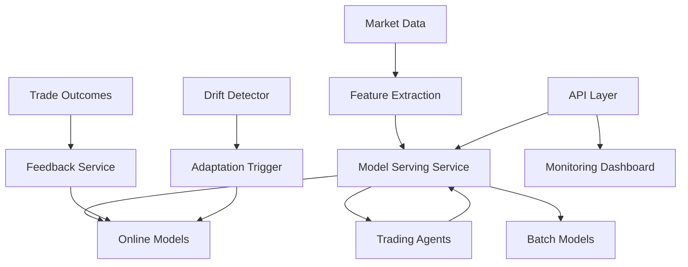

# Online Learning Integration Analysis

## Current State

### Implementation: ✅ Complete but Isolated

**Comprehensive Components:**
- **OnlineLearningService** (`/src/alpha_pulse/ml/online/online_learning_service.py`)
  - Session management and orchestration
  - Real-time batch processing
  - Model checkpointing and versioning
  - Background monitoring
  
- **Advanced Features** (`/src/alpha_pulse/ml/online/`)
  - Incremental models (SGD, Hoeffding Trees, etc.)
  - Concept drift detection
  - Adaptive learning controllers
  - Memory-efficient streaming
  - Performance validators

### Integration: ❌ 0% Connected to Trading

**Complete Isolation:**
- Trading agents use static strategies
- No model serving pipeline
- No API endpoints
- No feedback loops
- Models never updated with trading data

## Critical Integration Gaps

### 1. Model Serving Gap
**Current**: No connection between online models and trading
**Impact**:
- Models decay without updates
- Missing market regime changes
- Static predictions in dynamic markets
- No learning from outcomes

**Required Integration**:
```python
# In new model_serving_service.py
class ModelServingService:
    def __init__(self):
        self.online_service = OnlineLearningService()
        self.batch_models = {}
        self.serving_strategy = "ensemble"  # or "champion/challenger"
        
    async def get_prediction(self, features, context):
        # Get online model prediction
        if self.online_service.has_active_session(context.symbol):
            online_pred = await self.online_service.predict(
                context.session_id,
                features
            )
        else:
            online_pred = None
            
        # Get batch model prediction
        batch_pred = self.batch_models[context.symbol].predict(features)
        
        # Ensemble or select
        if self.serving_strategy == "ensemble":
            return self._ensemble_predictions(online_pred, batch_pred)
        else:
            return self._select_best_model(online_pred, batch_pred)
```

### 2. Agent Integration Gap
**Current**: Agents ignore ML predictions entirely
**Impact**:
- Rule-based only strategies
- No adaptation to market changes
- Missing pattern recognition
- Static behavior

**Required Integration**:
```python
# In base_agent.py
class MLAwareAgent(BaseAgent):
    async def analyze(self, market_data):
        # Traditional analysis
        rule_based_signal = await self._rule_based_analysis(market_data)
        
        # Get ML prediction
        ml_features = self._extract_ml_features(market_data)
        ml_prediction = await self.model_serving.get_prediction(
            ml_features,
            context={"symbol": market_data.symbol, "agent": self.name}
        )
        
        # Combine signals
        if ml_prediction.confidence > self.ml_confidence_threshold:
            combined_signal = self._combine_signals(
                rule_based_signal,
                ml_prediction,
                weights=[0.6, 0.4]  # 60% rules, 40% ML
            )
            
            # Track for online learning
            combined_signal.metadata["ml_contribution"] = ml_prediction
            
            return combined_signal
        else:
            return rule_based_signal
```

### 3. Feedback Loop Gap
**Current**: Trading outcomes never reach ML models
**Impact**:
- No learning from mistakes
- No reinforcement of success
- Models trained on historical data only
- Missing real-world performance data

**Required Integration**:
```python
# In trading_feedback_service.py
class TradingFeedbackService:
    async def process_trade_outcome(self, trade, outcome):
        # Extract features used for prediction
        original_features = trade.metadata.get("ml_features")
        ml_prediction = trade.metadata.get("ml_contribution")
        
        if original_features and ml_prediction:
            # Create training example
            training_example = {
                "features": original_features,
                "prediction": ml_prediction.value,
                "actual_outcome": outcome.pnl,
                "timestamp": outcome.timestamp
            }
            
            # Feed to online learning
            await self.online_service.update_model(
                trade.symbol,
                training_example
            )
            
            # Check for drift
            if await self._detect_prediction_drift(ml_prediction, outcome):
                await self.online_service.trigger_adaptation(
                    trade.symbol,
                    drift_type="performance"
                )
```

### 4. API Endpoint Gap
**Current**: No online learning visibility or control
**Impact**:
- Cannot monitor adaptation
- No control over learning
- Hidden model performance
- No debugging capability

**Required Endpoints**:
```python
# In new /api/routers/online_learning.py
@router.post("/sessions/start")
async def start_learning_session(request: LearningSessionRequest):
    """Start online learning for symbol"""
    session_id = await online_service.start_session(
        symbol=request.symbol,
        model_type=request.model_type,
        config=request.config
    )
    return {"session_id": session_id, "status": "started"}

@router.get("/sessions/{session_id}/metrics")
async def get_session_metrics(session_id: str):
    """Get learning session performance metrics"""
    return await online_service.get_session_metrics(session_id)

@router.post("/sessions/{session_id}/predict")
async def get_online_prediction(session_id: str, features: List[float]):
    """Get prediction from online model"""
    return await online_service.predict(session_id, features)

@router.get("/drift/status")
async def get_drift_status():
    """Check drift detection across all models"""
    return await online_service.get_drift_summary()

@router.ws("/streaming/{symbol}")
async def streaming_predictions(websocket: WebSocket, symbol: str):
    """WebSocket for real-time predictions"""
    await websocket.accept()
    async for prediction in online_service.stream_predictions(symbol):
        await websocket.send_json(prediction)
```

### 5. Automatic Adaptation Gap
**Current**: No triggers for model updates
**Impact**:
- Manual intervention required
- Delayed response to changes
- Missed adaptation opportunities
- Stale models in production

**Required Automation**:
```python
# In adaptive_model_manager.py
class AdaptiveModelManager:
    async def monitor_and_adapt(self):
        while True:
            for symbol in self.active_symbols:
                # Check performance degradation
                metrics = await self.get_model_metrics(symbol)
                
                if metrics.accuracy < self.accuracy_threshold:
                    logger.warning(f"Model accuracy degraded for {symbol}")
                    await self.trigger_online_learning(symbol)
                
                # Check concept drift
                drift_score = await self.drift_detector.check_drift(symbol)
                if drift_score > self.drift_threshold:
                    logger.warning(f"Concept drift detected for {symbol}")
                    await self.adapt_model(symbol)
                
                # Check regime change
                if await self.regime_changed(symbol):
                    logger.info(f"Regime change for {symbol}, adapting...")
                    await self.retrain_with_new_regime(symbol)
            
            await asyncio.sleep(300)  # Check every 5 minutes
```

## Business Impact

### Current State (Static Models)
- **Model Decay**: -2-5% accuracy per month
- **Regime Blindness**: Surprise losses in new regimes
- **No Adaptation**: Manual retraining only
- **Missed Patterns**: Static rules miss new patterns

### Potential State (Online Learning)
- **Continuous Improvement**: Models stay current
- **Rapid Adaptation**: 2-3 day response to changes
- **Pattern Discovery**: Find new profitable patterns
- **Regime Awareness**: Automatic regime adaptation

### Annual Value
- **Prevented Model Decay**: $500K-1M
- **Faster Adaptation**: $300-600K from quick response
- **New Pattern Capture**: $200-400K
- **Total**: $1-2M annually

## Integration Architecture



## Implementation Roadmap

### Phase 1: Model Serving (3 days)
1. Create unified model serving service
2. Connect online learning to serving
3. Implement prediction routing

### Phase 2: Agent Integration (2 days)
1. Modify agents to use ML predictions
2. Add feature extraction pipeline
3. Implement signal combination

### Phase 3: Feedback Loop (2 days)
1. Create outcome tracking service
2. Wire trade results to online learning
3. Implement drift-based triggers

### Phase 4: API & Monitoring (2 days)
1. Create online learning endpoints
2. Add WebSocket streaming
3. Build adaptation dashboard

## Success Metrics

1. **Model Freshness**: Average model age
2. **Adaptation Speed**: Time to detect and adapt to drift
3. **Prediction Accuracy**: Online vs batch model performance
4. **Learning Efficiency**: Samples needed for adaptation
5. **Business Impact**: P&L improvement from ML signals

## Conclusion

The online learning system is like having a learning brain that's never connected to the nervous system. It can learn but never acts on that learning. With 9 days of integration work, we can create a truly adaptive trading system that learns from every trade and continuously improves its performance, potentially adding $1-2M in annual value through better adaptation to market changes.