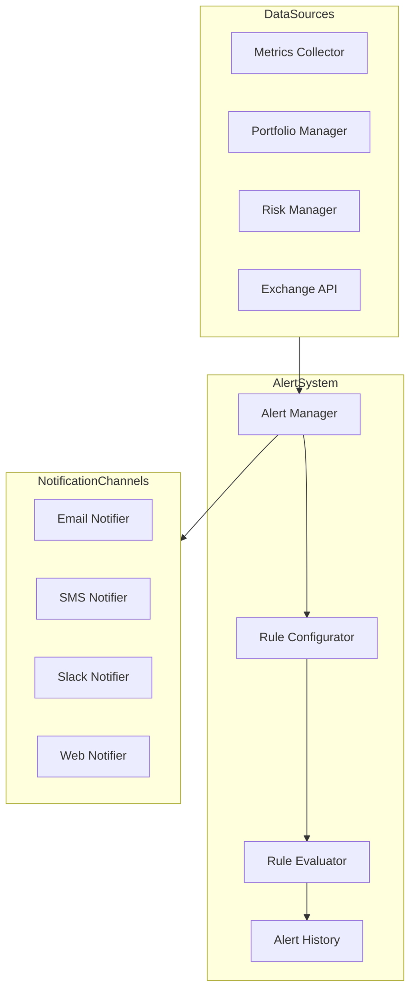

# Alerting System Design

This document outlines the design for the AI Hedge Fund Alerting System (Task 1.3).

## Architecture Overview



## Component Design

### 1. Alert Manager

The AlertManager is the central component that coordinates all alerting activities.

**Responsibilities:**
- Initialize and manage notification channels
- Load and validate alert rules
- Process incoming metrics
- Trigger rule evaluation
- Route alerts to appropriate notification channels
- Maintain alert history

**Interface:**
```python
class AlertManager:
    def __init__(self, config: dict):
        """Initialize with configuration."""
        
    async def start(self) -> None:
        """Start the alert manager."""
        
    async def stop(self) -> None:
        """Stop the alert manager."""
        
    async def process_metrics(self, metrics: dict) -> List[Alert]:
        """Process metrics and generate alerts if needed."""
        
    async def add_rule(self, rule: AlertRule) -> None:
        """Add a new alert rule."""
        
    async def remove_rule(self, rule_id: str) -> bool:
        """Remove an alert rule."""
        
    async def acknowledge_alert(self, alert_id: str, user: str) -> bool:
        """Acknowledge an alert."""
        
    async def get_alert_history(self, 
                               start_time: datetime = None,
                               end_time: datetime = None,
                               filters: dict = None) -> List[Alert]:
        """Get alert history with optional filtering."""
```

### 2. Alert Rules

Alert rules define conditions that trigger alerts.

**Rule Structure:**
```python
class AlertRule:
    rule_id: str                 # Unique identifier
    name: str                    # Human-readable name
    description: str             # Description of the rule
    metric_name: str             # Name of the metric to monitor
    condition: str               # Condition expression (e.g., "> 0.8", "< 100")
    severity: AlertSeverity      # Severity level
    message_template: str        # Template for alert message
    channels: List[str]          # Notification channels to use
    cooldown_period: int         # Minimum time between alerts (seconds)
    enabled: bool                # Whether the rule is active
```

**Severity Levels:**
```python
class AlertSeverity(Enum):
    INFO = "info"
    WARNING = "warning"
    ERROR = "error"
    CRITICAL = "critical"
```

### 3. Alert Model

The data model for alerts.

```python
class Alert:
    alert_id: str                # Unique identifier
    rule_id: str                 # ID of the rule that triggered the alert
    metric_name: str             # Name of the metric that triggered the alert
    metric_value: Any            # Value of the metric
    timestamp: datetime          # When the alert was generated
    severity: AlertSeverity      # Severity level
    message: str                 # Alert message
    acknowledged: bool           # Whether the alert has been acknowledged
    acknowledged_by: str = None  # Who acknowledged the alert
    acknowledged_at: datetime = None  # When the alert was acknowledged
```

### 4. Notification Channels

Interfaces and implementations for different notification channels.

**Base Interface:**
```python
class NotificationChannel:
    async def initialize(self) -> None:
        """Initialize the channel."""
        
    async def send_notification(self, alert: Alert) -> bool:
        """Send notification for an alert."""
        
    async def close(self) -> None:
        """Close the channel."""
```

**Implementations:**
- `EmailNotificationChannel`
- `SMSNotificationChannel`
- `SlackNotificationChannel`
- `WebNotificationChannel`

### 5. Rule Evaluator

Evaluates metrics against rules to determine if alerts should be triggered.

```python
class RuleEvaluator:
    def __init__(self, rules: List[AlertRule]):
        """Initialize with rules."""
        
    def evaluate(self, metric_name: str, metric_value: Any) -> List[AlertRule]:
        """Evaluate a metric against applicable rules."""
        
    def parse_condition(self, condition: str) -> Callable:
        """Parse a condition string into a callable."""
```

### 6. Alert History Storage

Stores and retrieves alert history.

```python
class AlertHistoryStorage:
    async def store_alert(self, alert: Alert) -> None:
        """Store an alert in history."""
        
    async def get_alerts(self, 
                        start_time: datetime = None,
                        end_time: datetime = None,
                        filters: dict = None) -> List[Alert]:
        """Retrieve alerts with optional filtering."""
        
    async def update_alert(self, alert_id: str, updates: dict) -> bool:
        """Update an alert record."""
```

## Configuration Schema

```yaml
alerting:
  enabled: true
  check_interval: 60  # seconds
  
  # Notification channels
  channels:
    email:
      enabled: true
      smtp_server: "smtp.example.com"
      smtp_port: 587
      username: "${AP_EMAIL_USER}"
      password: "${AP_EMAIL_PASSWORD}"
      from_address: "alerts@example.com"
      recipients:
        - "user1@example.com"
        - "user2@example.com"
      
    sms:
      enabled: false
      provider: "twilio"
      account_sid: "${AP_TWILIO_SID}"
      auth_token: "${AP_TWILIO_TOKEN}"
      from_number: "+15551234567"
      to_numbers:
        - "+15557654321"
        
    slack:
      enabled: true
      webhook_url: "${AP_SLACK_WEBHOOK}"
      channel: "#alerts"
      
    web:
      enabled: true
      max_alerts: 100  # Maximum alerts to keep in memory
  
  # Alert rules
  rules:
    - rule_id: "sharpe_ratio_low"
      name: "Low Sharpe Ratio"
      description: "Alerts when the Sharpe ratio falls below threshold"
      metric_name: "sharpe_ratio"
      condition: "< 0.5"
      severity: "warning"
      message_template: "Sharpe ratio is {value}, below threshold of 0.5"
      channels: ["email", "slack", "web"]
      cooldown_period: 3600  # 1 hour
      enabled: true
      
    - rule_id: "drawdown_high"
      name: "High Drawdown"
      description: "Alerts when drawdown exceeds threshold"
      metric_name: "max_drawdown"
      condition: "> 0.1"
      severity: "error"
      message_template: "Drawdown is {value}, exceeding threshold of 10%"
      channels: ["email", "sms", "slack", "web"]
      cooldown_period: 1800  # 30 minutes
      enabled: true
```

## Folder Structure

```
src/alpha_pulse/monitoring/
├── alerting/
│   ├── __init__.py
│   ├── manager.py            # AlertManager implementation
│   ├── models.py             # Alert and AlertRule data models
│   ├── evaluator.py          # Rule evaluation logic
│   ├── history.py            # Alert history storage
│   ├── config.py             # Configuration loading and validation
│   └── channels/             # Notification channel implementations
│       ├── __init__.py
│       ├── base.py           # Base channel interface
│       ├── email.py          # Email channel
│       ├── sms.py            # SMS channel
│       ├── slack.py          # Slack channel
│       └── web.py            # Web notification channel
├── collector.py
├── config.py
└── storage/
    └── ...
```

## Integration Points

1. **With Metrics Collector**:
   - AlertManager subscribes to metrics updates
   - ProcessMetrics called for each metrics batch

2. **With API Layer**:
   - REST endpoints for alert rules management
   - REST endpoints for alert history
   - WebSocket for real-time alerts

3. **With Dashboard**:
   - Display of active alerts
   - Alert acknowledgment
   - Alert history visualization

## Implementation Approach

1. **Phase 1: Core Framework** (3-4 days)
   - Create folder structure and base interfaces
   - Implement AlertManager core
   - Implement rule parsing and evaluation
   - Implement in-memory alert storage

2. **Phase 2: Notification Channels** (3-4 days)
   - Implement email notifications
   - Implement Slack integration
   - Implement basic web notifications
   - Implement SMS notifications (if required)

3. **Phase 3: Integration** (2-3 days)
   - Integrate with metrics collector
   - Implement API endpoints
   - Add configuration loading

4. **Phase 4: Testing & Documentation** (2-3 days)
   - Write unit tests
   - Write integration tests
   - Complete documentation
   - Create usage examples

## Next Steps

1. Create the directory structure
2. Implement the base interfaces
3. Begin implementation of the AlertManager