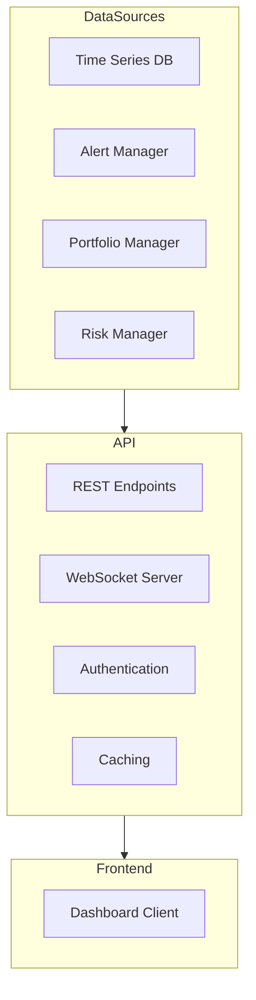

# Dashboard Backend Design

This document outlines the design for the AI Hedge Fund Dashboard Backend (Task 1.4).

## Architecture Overview



## Component Design

### 1. REST API Endpoints

The REST API provides data access for the dashboard frontend.

**Key Endpoints:**

```
GET /api/metrics/{metric_type}
- Retrieve metrics data of a specific type
- Query params: start_time, end_time, aggregation
- Returns: Time series data points

GET /api/portfolio
- Retrieve current portfolio data
- Query params: include_history (boolean)
- Returns: Portfolio composition, performance

GET /api/alerts
- Retrieve alert history
- Query params: start_time, end_time, severity, acknowledged
- Returns: Alert records

POST /api/alerts/{alert_id}/acknowledge
- Acknowledge an alert
- Body: user, comments
- Returns: Updated alert

GET /api/agents
- Retrieve agent performance data
- Query params: agent_type, start_time, end_time
- Returns: Agent metrics and signals

GET /api/trades
- Retrieve trade history
- Query params: symbol, start_time, end_time
- Returns: Trade records

GET /api/system
- Retrieve system metrics
- Query params: component, start_time, end_time
- Returns: System performance metrics
```

### 2. WebSocket Server

Provides real-time updates to the dashboard.

**Channels:**

```
/ws/metrics
- Real-time metrics updates
- Message format: {type: "metric", data: {...}}

/ws/alerts
- Real-time alert notifications
- Message format: {type: "alert", data: {...}}

/ws/trades
- Real-time trade execution updates
- Message format: {type: "trade", data: {...}}

/ws/portfolio
- Real-time portfolio updates
- Message format: {type: "portfolio", data: {...}}
```

**Protocol:**
1. Client connects to WebSocket endpoint
2. Client sends authentication message
3. Server validates credentials
4. Client subscribes to channels
5. Server pushes updates as they occur

### 3. Authentication and Authorization

**Authentication Methods:**
- JWT-based authentication
- API key authentication for external services

**User Roles:**
- Admin: Full access to all data and controls
- Operator: Access to trading data and basic controls
- Viewer: Read-only access to dashboard data
- API: Programmatic access for integrations

### 4. Caching Layer

Improves performance by caching frequently accessed data.

**Cache Types:**
- In-memory cache for high-frequency data
- Redis cache for distributed deployment
- Time-based cache invalidation

**Caching Strategy:**
- Cache common queries with short TTL (1-5 minutes)
- Cache historical data with longer TTL (1 hour)
- Bypass cache for real-time data

### 5. Data Access Layer

Abstracts database access and provides a consistent interface.

```python
class MetricsDataAccessor:
    async def get_metrics(self, 
                         metric_type: str, 
                         start_time: datetime,
                         end_time: datetime,
                         aggregation: str = None) -> List[Dict]:
        """Get metrics data."""
        
    async def get_latest_metrics(self, metric_type: str) -> Dict:
        """Get latest metrics."""
        
class AlertDataAccessor:
    async def get_alerts(self,
                        start_time: datetime = None,
                        end_time: datetime = None,
                        filters: Dict = None) -> List[Dict]:
        """Get alert history."""
        
    async def acknowledge_alert(self, alert_id: str, user: str) -> Dict:
        """Acknowledge an alert."""
        
class PortfolioDataAccessor:
    async def get_portfolio(self, include_history: bool = False) -> Dict:
        """Get current portfolio data."""
        
class TradeDataAccessor:
    async def get_trades(self,
                        symbol: str = None,
                        start_time: datetime = None,
                        end_time: datetime = None) -> List[Dict]:
        """Get trade history."""
```

## API Implementation

### FastAPI Implementation

```python
from fastapi import FastAPI, WebSocket, Depends, HTTPException, Query
from fastapi.security import OAuth2PasswordBearer, APIKeyHeader
from datetime import datetime, timedelta
from typing import List, Dict, Optional

app = FastAPI(title="AI Hedge Fund Dashboard API")
oauth2_scheme = OAuth2PasswordBearer(tokenUrl="token")
api_key_header = APIKeyHeader(name="X-API-Key")

# Dependency for authentication
async def get_current_user(token: str = Depends(oauth2_scheme)):
    user = await authenticate_token(token)
    if not user:
        raise HTTPException(status_code=401, detail="Invalid authentication")
    return user

# Alternative API key authentication
async def get_api_client(api_key: str = Depends(api_key_header)):
    client = await authenticate_api_key(api_key)
    if not client:
        raise HTTPException(status_code=401, detail="Invalid API key")
    return client

# REST API for metrics data
@app.get("/api/metrics/{metric_type}", response_model=List[Dict])
async def get_metrics(
    metric_type: str, 
    start_time: datetime = Query(None),
    end_time: datetime = Query(None),
    aggregation: Optional[str] = Query(None),
    current_user: Dict = Depends(get_current_user)
):
    """Get metrics data for dashboard."""
    # Check permissions
    if not has_permission(current_user, "view_metrics"):
        raise HTTPException(status_code=403, detail="Not authorized")
        
    # Use default time range if not specified
    if not start_time:
        start_time = datetime.now() - timedelta(days=1)
    if not end_time:
        end_time = datetime.now()
    
    # Get data from cache or database
    cache_key = f"metrics:{metric_type}:{start_time}:{end_time}:{aggregation}"
    cached_data = await cache.get(cache_key)
    
    if cached_data:
        return cached_data
        
    # Query database
    data = await metrics_accessor.get_metrics(metric_type, start_time, end_time, aggregation)
    
    # Cache results
    await cache.set(cache_key, data, expiry=300)  # 5 minute cache
    
    return data

# Portfolio data endpoint
@app.get("/api/portfolio", response_model=Dict)
async def get_portfolio(
    include_history: bool = Query(False),
    current_user: Dict = Depends(get_current_user)
):
    """Get current portfolio data."""
    if not has_permission(current_user, "view_portfolio"):
        raise HTTPException(status_code=403, detail="Not authorized")
        
    return await portfolio_accessor.get_portfolio(include_history)

# Alert history endpoint
@app.get("/api/alerts", response_model=List[Dict])
async def get_alerts(
    start_time: Optional[datetime] = Query(None),
    end_time: Optional[datetime] = Query(None),
    severity: Optional[str] = Query(None),
    acknowledged: Optional[bool] = Query(None),
    current_user: Dict = Depends(get_current_user)
):
    """Get alert history."""
    if not has_permission(current_user, "view_alerts"):
        raise HTTPException(status_code=403, detail="Not authorized")
        
    filters = {}
    if severity:
        filters["severity"] = severity
    if acknowledged is not None:
        filters["acknowledged"] = acknowledged
        
    return await alert_accessor.get_alerts(start_time, end_time, filters)

# Acknowledge alert endpoint
@app.post("/api/alerts/{alert_id}/acknowledge", response_model=Dict)
async def acknowledge_alert(
    alert_id: str,
    current_user: Dict = Depends(get_current_user)
):
    """Acknowledge an alert."""
    if not has_permission(current_user, "acknowledge_alerts"):
        raise HTTPException(status_code=403, detail="Not authorized")
        
    return await alert_accessor.acknowledge_alert(alert_id, current_user["username"])

# WebSocket for real-time updates
@app.websocket("/ws/metrics")
async def metrics_websocket(websocket: WebSocket):
    await websocket.accept()
    
    try:
        # Authenticate user
        auth_message = await websocket.receive_json()
        user = await authenticate_token(auth_message.get("token"))
        if not user:
            await websocket.close(code=1008, reason="Invalid authentication")
            return
            
        # Check permissions
        if not has_permission(user, "view_metrics"):
            await websocket.close(code=1008, reason="Not authorized")
            return
            
        # Subscribe to metrics updates
        subscription = await metrics_subscription.subscribe(
            user=user,
            metric_types=auth_message.get("metric_types", ["all"])
        )
        
        # Send real-time updates
        while True:
            update = await subscription.get_update()
            await websocket.send_json(update)
    except WebSocketDisconnect:
        # Handle disconnect
        if subscription:
            await subscription.unsubscribe()
```

## Configuration Schema

```yaml
dashboard_api:
  host: "0.0.0.0"
  port: 8080
  
  # Authentication
  auth:
    jwt_secret: "${AP_JWT_SECRET}"
    token_expiry: 3600  # seconds
    api_keys_enabled: true
    
  # Rate limiting
  rate_limit:
    enabled: true
    requests_per_minute: 120
    
  # CORS settings
  cors:
    allowed_origins:
      - "http://localhost:3000"
      - "https://dashboard.example.com"
    allow_credentials: true
    
  # Caching
  cache:
    type: "redis"  # "memory", "redis"
    redis_url: "${AP_REDIS_URL}"
    default_ttl: 300  # seconds
    
  # Logging
  logging:
    level: "info"
    format: "json"
    
  # WebSocket
  websocket:
    max_connections: 1000
    ping_interval: 30  # seconds
```

## Folder Structure

```
src/alpha_pulse/api/
├── __init__.py
├── main.py               # FastAPI application setup
├── dependencies.py       # Auth and other dependencies
├── config.py             # API configuration
├── middleware.py         # CORS, rate limiting, etc.
├── cache/                # Caching implementations
│   ├── __init__.py
│   ├── memory.py
│   └── redis.py
├── routers/              # API route modules
│   ├── __init__.py
│   ├── metrics.py        # Metrics endpoints
│   ├── portfolio.py      # Portfolio endpoints
│   ├── alerts.py         # Alerts endpoints
│   ├── trades.py         # Trade endpoints
│   └── system.py         # System endpoints
├── websockets/           # WebSocket implementations
│   ├── __init__.py
│   ├── manager.py        # Connection management
│   ├── auth.py           # WebSocket authentication
│   └── subscription.py   # Subscription management
└── data/                 # Data access implementations
    ├── __init__.py
    ├── metrics.py        # Metrics data access
    ├── portfolio.py      # Portfolio data access
    ├── alerts.py         # Alerts data access
    └── trades.py         # Trade data access
```

## Integration Points

1. **With Time Series Database**:
   - Query historical metrics data
   - Store new metrics

2. **With Alert Manager**:
   - Retrieve alert history
   - Receive real-time alert notifications
   - Acknowledge alerts

3. **With Portfolio Manager**:
   - Get current portfolio state
   - Receive portfolio updates

4. **With Dashboard Frontend**:
   - Provide data through REST API
   - Push real-time updates through WebSockets

## Implementation Approach

1. **Phase 1: Core API Framework** (2-3 days)
   - Set up FastAPI application
   - Implement authentication and authorization
   - Create basic endpoint structure

2. **Phase 2: Data Access Layer** (2 days)
   - Implement data accessors for each component
   - Connect to time series database
   - Implement caching

3. **Phase 3: WebSocket Implementation** (2 days)
   - Create WebSocket handlers
   - Implement subscription management
   - Build real-time update mechanism

4. **Phase 4: Testing & Documentation** (1-2 days)
   - Write unit tests
   - Write API documentation
   - Create Swagger UI
   - Performance testing

## Next Steps

1. Create the directory structure
2. Implement authentication and authorization
3. Build the first set of endpoints (metrics)
4. Create the WebSocket foundation