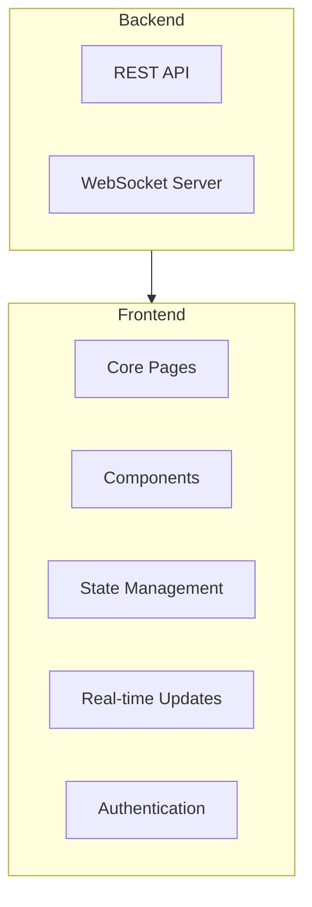
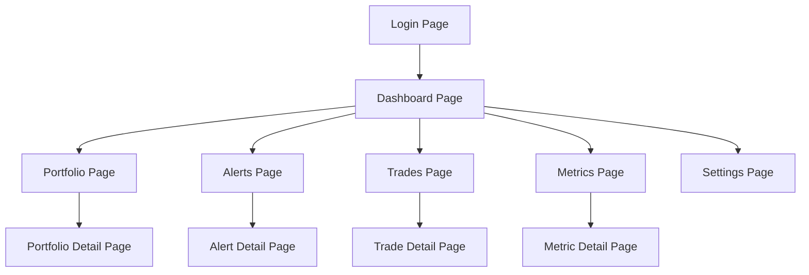
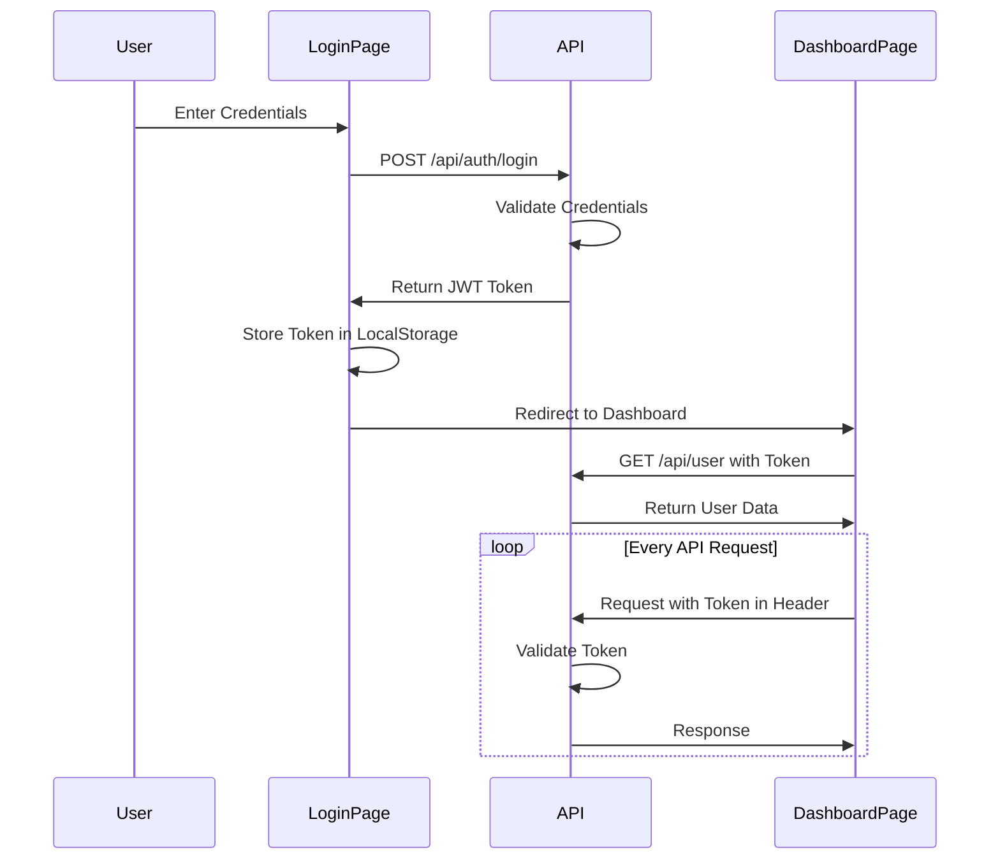

# Dashboard Frontend Design

This document outlines the design for the AI Hedge Fund Dashboard Frontend (Task 1.5).

## Architecture Overview



## Technologies and Libraries

- **React**: Core UI library
- **TypeScript**: Type-safe JavaScript
- **React Router**: Page routing
- **Redux Toolkit**: State management
- **Recharts/Chart.js**: Data visualization
- **Tailwind CSS**: Styling
- **Axios**: HTTP client
- **Socket.io-client**: WebSocket client
- **React Query**: Data fetching and caching

## Component Design

### Core Pages



### Key Components

1. **Dashboard Layout**
   - Navigation bar
   - Sidebar
   - Main content area
   - Status bar
   - User menu

2. **Metric Cards**
   - Title
   - Current value
   - Trend indicator
   - Time period selector
   - Expandable for details

3. **Portfolio View**
   - Asset allocation chart
   - Asset table with details
   - Performance metrics
   - Historical performance chart

4. **Alert Panel**
   - Alert list with severity indicators
   - Filtering options
   - Acknowledgment controls
   - Alert details modal

5. **Trade History**
   - Trade table with filtering
   - Trade details
   - Execution metrics
   - Timeline visualization

6. **Charts and Visualizations**
   - Time series charts
   - Pie/donut charts for allocations
   - Heat maps for correlations
   - Candlestick charts for price data

## State Management

### Redux Store Structure

```javascript
{
  auth: {
    user: {},
    isAuthenticated: false,
    loading: false,
    error: null
  },
  dashboard: {
    timeRange: '1d',
    refreshRate: 60000,
    layout: 'default'
  },
  metrics: {
    performance: {
      data: [],
      loading: false,
      error: null,
      lastUpdated: null
    },
    risk: {
      data: [],
      loading: false,
      error: null,
      lastUpdated: null
    },
    // Other metric types...
  },
  portfolio: {
    current: {},
    history: [],
    loading: false,
    error: null
  },
  alerts: {
    active: [],
    history: [],
    loading: false,
    error: null
  },
  trades: {
    recent: [],
    history: [],
    loading: false,
    error: null
  },
  ui: {
    sidebarOpen: true,
    darkMode: false,
    activeFilters: {},
    notifications: []
  }
}
```

### React Query Setup

```typescript
// Setup for React Query data fetching
const queryClient = new QueryClient({
  defaultOptions: {
    queries: {
      refetchOnWindowFocus: false,
      refetchOnMount: true,
      refetchOnReconnect: true,
      retry: 1,
      staleTime: 60000,
    },
  },
});

// Example query hook
function useMetrics(type, timeRange) {
  return useQuery(
    ['metrics', type, timeRange],
    () => fetchMetrics(type, timeRange),
    {
      keepPreviousData: true,
      refetchInterval: 60000, // Refetch every minute
    }
  );
}
```

## Real-time Updates

### WebSocket Integration

```typescript
function useWebSocketUpdates(channels) {
  const dispatch = useDispatch();
  const { user } = useSelector(state => state.auth);
  
  useEffect(() => {
    if (!user) return;
    
    // Connect to WebSocket server
    const socket = io(API_WS_URL, {
      auth: {
        token: user.token
      }
    });
    
    // Subscribe to channels
    socket.emit('subscribe', { channels });
    
    // Handle updates
    socket.on('metric_update', (data) => {
      dispatch(updateMetric(data));
    });
    
    socket.on('alert', (data) => {
      dispatch(addAlert(data));
      dispatch(showNotification({
        type: 'alert',
        severity: data.severity,
        message: data.message
      }));
    });
    
    socket.on('trade_update', (data) => {
      dispatch(updateTrades(data));
    });
    
    socket.on('portfolio_update', (data) => {
      dispatch(updatePortfolio(data));
    });
    
    return () => {
      socket.emit('unsubscribe', { channels });
      socket.disconnect();
    };
  }, [user, channels, dispatch]);
}
```

## UI Design Elements

### Style Guide

- **Color Palette**
  - Primary: #1E40AF (Blue)
  - Secondary: #6B7280 (Gray)
  - Success: #10B981 (Green)
  - Warning: #F59E0B (Yellow)
  - Danger: #EF4444 (Red)
  - Background: #F9FAFB (Light Gray)
  - Text: #111827 (Dark Gray)

- **Typography**
  - Primary Font: Inter
  - Headings: 24px/20px/18px/16px
  - Body: 14px
  - Small: 12px
  - Line Height: 1.5

- **Spacing**
  - Base Unit: 4px
  - Standard Padding: 16px
  - Component Spacing: 24px
  - Section Spacing: 40px

- **Shadows**
  - Light: 0 1px 2px rgba(0, 0, 0, 0.05)
  - Medium: 0 4px 6px rgba(0, 0, 0, 0.1)
  - Heavy: 0 10px 15px rgba(0, 0, 0, 0.1)

### Responsive Breakpoints

- Mobile: < 640px
- Tablet: 640px - 1024px
- Desktop: 1024px - 1440px
- Large: > 1440px

## Page Designs

### Dashboard Home

The main dashboard will feature a grid layout of cards displaying key metrics:

```
+---------------------------------------+
|         Header & Navigation           |
+---------------------------------------+
| +-------+ +-------+ +-------+ +-----+ |
| |Sharpe | |Max    | |Current| |Trade| |
| |Ratio  | |Drawdown| |Value | |Count| |
| +-------+ +-------+ +-------+ +-----+ |
| +-------------+ +-------------------+ |
| |Performance  | |     Allocation    | |
| |Chart        | |     Pie Chart     | |
| |             | |                   | |
| +-------------+ +-------------------+ |
| +-------------+ +-------------------+ |
| |Recent Alerts| |   Recent Trades   | |
| |             | |                   | |
| +-------------+ +-------------------+ |
+---------------------------------------+
```

### Portfolio View

The portfolio view will show current holdings and performance:

```
+---------------------------------------+
|         Header & Navigation           |
+---------------------------------------+
| Portfolio: $X,XXX,XXX | Return: XX%   |
+---------------------------------------+
| +-------------+ +-------------------+ |
| |Performance  | |     Allocation    | |
| |Chart        | |     By Asset      | |
| |             | |                   | |
| +-------------+ +-------------------+ |
| +---------------------------------------+
| |            Asset Table               |
| | Symbol | Qty | Value | Allocation | P/L |
| |--------|-----|-------|------------|-----|
| | BTC    | X.X | $XXX  | XX%        | XX% |
| | ETH    | X.X | $XXX  | XX%        | XX% |
| | ...    | ... | ...   | ...        | ... |
| +---------------------------------------+
+---------------------------------------+
```

### Alerts View

The alerts view will display current and historical alerts:

```
+---------------------------------------+
|         Header & Navigation           |
+---------------------------------------+
| Filters: Severity | Time | Acknowledged|
+---------------------------------------+
| +---------------------------------------+
| |            Active Alerts              |
| | Time | Severity | Message        | Ack |
| |------|----------|----------------|-----|
| | XX:XX| Critical | Low Sharpe Ratio| [ ] |
| | XX:XX| Warning  | High Exposure   | [ ] |
| | ...  | ...      | ...             | ... |
| +---------------------------------------+
| +---------------------------------------+
| |            Alert History              |
| | Time | Severity | Message        | Ack |
| |------|----------|----------------|-----|
| | XX:XX| Critical | API Error      | [✓] |
| | XX:XX| Warning  | Position Size  | [✓] |
| | ...  | ...      | ...             | ... |
| +---------------------------------------+
+---------------------------------------+
```

## Authentication Flow



## Data Fetching Strategy

1. **Initial Load**:
   - Fetch essential data on page load
   - Show loading indicators
   - Prioritize key metrics

2. **Lazy Loading**:
   - Load detailed data on demand
   - Implement pagination for large datasets
   - Use infinite scrolling where appropriate

3. **Caching**:
   - Cache responses with React Query
   - Set appropriate stale times
   - Revalidate data at proper intervals

4. **Real-time Updates**:
   - Subscribe to WebSocket channels
   - Update Redux store with new data
   - Optimistic UI updates for user actions

## Folder Structure

```
dashboard/
├── public/                # Static assets
├── src/
│   ├── api/               # API client and functions
│   │   ├── index.ts
│   │   ├── metrics.ts
│   │   ├── portfolio.ts
│   │   ├── alerts.ts
│   │   └── trades.ts
│   ├── assets/            # Images, fonts, etc.
│   ├── components/        # Reusable components
│   │   ├── common/        # Generic UI components
│   │   ├── charts/        # Chart components
│   │   ├── dashboard/     # Dashboard-specific components
│   │   ├── alerts/        # Alert components
│   │   ├── portfolio/     # Portfolio components
│   │   └── trades/        # Trade components
│   ├── hooks/             # Custom React hooks
│   │   ├── useMetrics.ts
│   │   ├── useWebSocket.ts
│   │   └── useAuth.ts
│   ├── pages/             # Page components
│   │   ├── Login.tsx
│   │   ├── Dashboard.tsx
│   │   ├── Portfolio.tsx
│   │   ├── Alerts.tsx
│   │   ├── Trades.tsx
│   │   └── Settings.tsx
│   ├── store/             # Redux store
│   │   ├── index.ts
│   │   ├── authSlice.ts
│   │   ├── metricsSlice.ts
│   │   ├── portfolioSlice.ts
│   │   ├── alertsSlice.ts
│   │   ├── tradesSlice.ts
│   │   └── uiSlice.ts
│   ├── utils/             # Utility functions
│   │   ├── format.ts
│   │   ├── calculate.ts
│   │   └── validation.ts
│   ├── App.tsx            # Application root
│   ├── index.tsx          # Entry point
│   └── types.ts           # TypeScript types
├── package.json
├── tsconfig.json
└── tailwind.config.js
```

## Performance Considerations

1. **Code Splitting**:
   - Split code by route
   - Lazy load components
   - Use dynamic imports

2. **Rendering Optimization**:
   - Memoize expensive components
   - Use virtualization for long lists
   - Optimize re-renders with React.memo

3. **Data Handling**:
   - Implement efficient data structures
   - Paginate large datasets
   - Use appropriate cache TTL

4. **Assets**:
   - Optimize images
   - Use SVG for icons
   - Implement font loading strategies

## Accessibility Considerations

- Semantic HTML structure
- Keyboard navigation support
- ARIA attributes for complex widgets
- Color contrast compliance
- Screen reader compatibility

## Implementation Approach

1. **Phase 1: Foundation** (3-4 days)
   - Project setup and configuration
   - Core layout components
   - Authentication flow
   - API client implementation
   - State management setup

2. **Phase 2: Main Views** (4-5 days)
   - Dashboard home implementation
   - Portfolio view
   - Alerts view
   - Trade history view
   - Common components

3. **Phase 3: Real-time Features** (2-3 days)
   - WebSocket integration
   - Real-time updates
   - Notifications system
   - Optimistic UI updates

4. **Phase 4: Refinement** (3-4 days)
   - Responsive design implementation
   - Performance optimization
   - Accessibility improvements
   - Automated testing

## Next Steps

1. Initialize the React project with TypeScript
2. Set up routing and state management
3. Implement authentication flow
4. Create core layout components
5. Begin implementing dashboard views