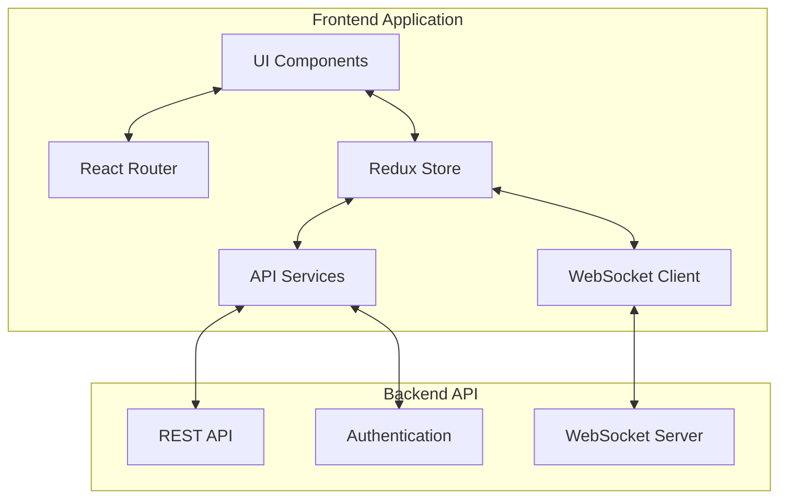
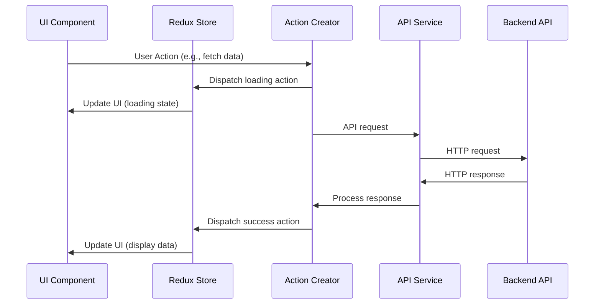
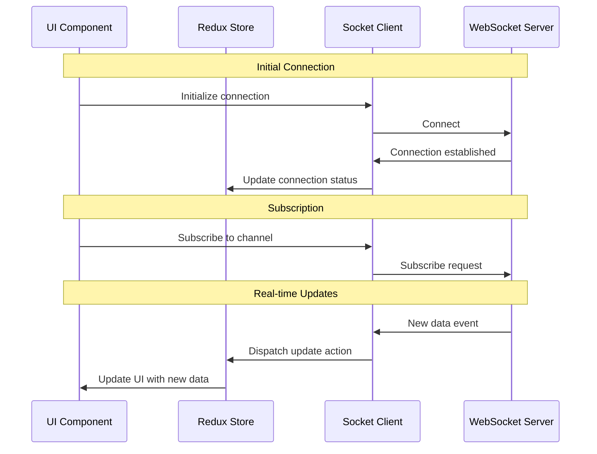

# Dashboard Frontend Implementation Plan

## Overview

The Dashboard Frontend will provide a modern, interactive user interface for monitoring and interacting with the AI Hedge Fund system. It will visualize critical metrics, alerts, portfolio performance, and trading activities through an intuitive React-based web application.

## 1. Architecture

### Technology Stack

The frontend will be built using the following technologies:

- **React** - UI component library
- **TypeScript** - Type-safe JavaScript
- **Redux** + **Redux Toolkit** - State management
- **React Router** - Navigation
- **Axios** - API communication
- **Socket.IO Client** - WebSocket communication
- **Chart.js** / **D3.js** - Data visualization
- **Material UI** - Component library
- **Jest** / **React Testing Library** - Testing

### High-Level Architecture



## 2. Core Features

### User Authentication
- Login/logout functionality
- JWT token management
- Session persistence
- Role-based access control

### Dashboard Home
- Overview of key metrics
- System status indicators
- Recent alerts summary
- Portfolio value chart
- Recent trades list

### Portfolio Management
- Portfolio composition visualization
- Asset allocation charts
- Performance metrics
- Historical performance graphs
- Position details

### Trading Activity
- Trade history with filtering
- Trade performance metrics
- Execution details
- Signal source information

### Alerts Management
- Active alerts list
- Alert acknowledgment
- Alert history with filtering
- Alert statistics and trends

### System Monitoring
- Resource utilization metrics
- Agent performance metrics
- Pipeline status
- System health indicators

### Settings and Configuration
- User preferences
- Alert configuration
- Display settings
- API key management

## 3. Component Structure

```
dashboard/
├── src/
│   ├── assets/              # Static assets
│   ├── components/          # Reusable UI components
│   │   ├── alerts/          # Alert-related components
│   │   ├── charts/          # Visualization components
│   │   ├── common/          # Common UI elements
│   │   ├── layout/          # Layout components
│   │   ├── portfolio/       # Portfolio components
│   │   └── trading/         # Trading components
│   ├── hooks/               # Custom React hooks
│   ├── pages/               # Page components
│   │   ├── dashboard/       # Dashboard page
│   │   ├── alerts/          # Alerts page
│   │   ├── portfolio/       # Portfolio page
│   │   ├── trading/         # Trading page
│   │   ├── system/          # System monitoring page
│   │   └── settings/        # Settings page
│   ├── services/            # API and data services
│   │   ├── api/             # REST API clients
│   │   ├── socket/          # WebSocket clients
│   │   └── auth/            # Authentication services
│   ├── store/               # Redux store configuration
│   │   ├── slices/          # Redux slices
│   │   ├── selectors/       # Redux selectors
│   │   └── middleware/      # Redux middleware
│   ├── types/               # TypeScript type definitions
│   ├── utils/               # Utility functions
│   ├── App.tsx              # Root component
│   ├── index.tsx            # Entry point
│   └── routes.tsx           # Application routes
├── public/                  # Public assets
├── .eslintrc.js             # ESLint configuration
├── .prettierrc              # Prettier configuration
├── package.json             # Dependencies
├── tsconfig.json            # TypeScript configuration
└── jest.config.js           # Testing configuration
```

## 4. Data Flow

### REST API Integration



### WebSocket Integration



## 5. UI Design Guidelines

### Visual Hierarchy
- Critical alerts and metrics should have highest visibility
- Use color intensity to indicate importance
- Group related information
- Progressive disclosure for complex data

### Color Scheme
- Primary: #3f51b5 (Indigo)
- Secondary: #f50057 (Pink)
- Success: #4caf50 (Green)
- Warning: #ff9800 (Orange)
- Error: #f44336 (Red)
- Background: #f5f5f5 (Light Grey)
- Text: #212121 (Dark Grey)

### Responsive Design
- Desktop-first approach with responsive adaptations
- Breakpoints at 1200px, 992px, 768px, and 576px
- Collapsible sidebars on smaller screens
- Simplified charts on mobile devices

## 6. Implementation Phases

### Phase 1: Project Setup and Core Infrastructure
- Initialize React project with TypeScript
- Set up routing and navigation
- Configure Redux store
- Implement authentication services
- Create layout components
- Establish API service patterns

### Phase 2: Dashboard Page and Core Components
- Implement dashboard page layout
- Create metric summary components
- Build initial charts and visualizations
- Implement system status indicators
- Develop alert summary component

### Phase 3: Portfolio and Trading Pages
- Build portfolio visualization components
- Implement asset allocation charts
- Create trade history table with filtering
- Develop position details view
- Implement performance metrics display

### Phase 4: Alerts and System Monitoring
- Create alerts management interface
- Build alert acknowledgment workflow
- Implement system monitoring dashboards
- Develop metric trend visualizations
- Create resource utilization displays

### Phase 5: Real-time Updates and WebSocket Integration
- Implement WebSocket connection management
- Create real-time data subscription system
- Build live-updating components
- Implement notification system
- Optimize performance for real-time updates

### Phase 6: Testing, Optimization and Deployment
- Write unit tests for components
- Perform integration testing
- Optimize bundle size and performance
- Configure production build
- Prepare deployment scripts

## 7. Integrations with Backend API

### REST API Endpoints

The frontend will connect to the following backend API endpoints:

- **Authentication**
  - `POST /api/v1/auth/login`
  - `POST /api/v1/auth/refresh`
  - `POST /api/v1/auth/logout`

- **Metrics**
  - `GET /api/v1/metrics/{metric_type}`
  - `GET /api/v1/metrics/{metric_type}/latest`

- **Alerts**
  - `GET /api/v1/alerts`
  - `POST /api/v1/alerts/{alert_id}/acknowledge`

- **Portfolio**
  - `GET /api/v1/portfolio`
  - `GET /api/v1/portfolio/history`
  - `GET /api/v1/portfolio/positions`

- **Trades**
  - `GET /api/v1/trades`
  - `GET /api/v1/trades/{trade_id}`

- **System**
  - `GET /api/v1/system`
  - `GET /api/v1/system/status`

### WebSocket Channels

The frontend will subscribe to the following WebSocket channels:

- `metrics`: Real-time metric updates
- `alerts`: Real-time alert notifications
- `portfolio`: Real-time portfolio updates
- `trades`: Real-time trade notifications
- `system`: Real-time system status updates

## 8. Testing Strategy

### Unit Testing
- Test individual components in isolation
- Mock dependencies and API calls
- Test Redux reducers and selectors
- Verify component rendering and behavior

### Integration Testing
- Test interactions between components
- Verify data flow through the application
- Test API service integration
- Test WebSocket connection and updates

### End-to-End Testing
- Test critical user workflows
- Verify authentication and navigation
- Test data visualization accuracy
- Test responsive behavior

## 9. Performance Considerations

### Rendering Optimization
- Use React.memo for expensive components
- Implement virtualized lists for large datasets
- Optimize chart rendering
- Use code splitting for route-based components

### Network Optimization
- Implement request caching
- Use optimistic UI updates
- Batch API requests when possible
- Throttle WebSocket updates for high-frequency data

### State Management
- Normalize Redux store structure
- Use selectors for derived data
- Implement middleware for side effects
- Optimize store updates

## 10. Security Considerations

### Authentication
- Secure token storage
- Automatic token refresh
- Session timeout handling
- CSRF protection

### Data Protection
- Sanitize user inputs
- Protect sensitive data in the UI
- Implement proper error handling
- Use HTTPS for all communication

## 11. Accessibility

- Implement keyboard navigation
- Use semantic HTML
- Provide alternative text for images and charts
- Ensure sufficient color contrast
- Support screen readers

## 12. Timeline and Milestones

| Phase | Duration | Deliverables |
|-------|----------|--------------|
| 1: Project Setup | 1 week | Project scaffold, routing, authentication |
| 2: Dashboard Page | 2 weeks | Core dashboard components and visualizations |
| 3: Portfolio and Trading | 2 weeks | Portfolio and trading interface components |
| 4: Alerts and Monitoring | 2 weeks | Alert management and system monitoring |
| 5: Real-time Updates | 1 week | WebSocket integration and live updates |
| 6: Testing and Deployment | 2 weeks | Comprehensive tests and production build |

**Total Estimated Time**: 10 weeks

## 13. Risk Assessment

| Risk | Impact | Likelihood | Mitigation |
|------|--------|------------|------------|
| API changes | High | Medium | Implement API client layer with versioning |
| Performance issues with real-time data | High | Medium | Implement throttling and selective updates |
| Browser compatibility issues | Medium | Low | Use polyfills and cross-browser testing |
| Complex visualization bugs | Medium | Medium | Incremental testing and fallback renderers |
| Mobile responsiveness challenges | Medium | Medium | Mobile-first development approach |

## 14. Next Steps

1. Initialize project and repository setup
2. Configure build system and development environment
3. Create basic component library
4. Implement authentication flow
5. Develop dashboard layout and navigation
6. Begin implementation of Phase 1 components