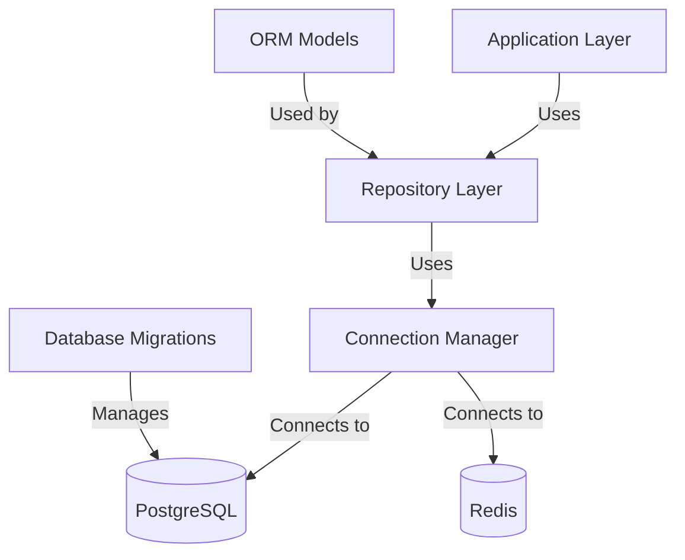

# Database Access Layer Design

## Overview

This document outlines the architecture and implementation details for the database access layer in the AI Hedge Fund system. The database access layer provides a clean, consistent interface for all components to interact with the underlying databases.

## Architecture

The database access layer follows a repository pattern with the following components:



## Components

### 1. Connection Manager

The Connection Manager handles database connections, pooling, and transaction management.

#### Key Responsibilities:
- Initialize and manage connection pools
- Provide connection acquisition and release
- Handle transaction boundaries
- Implement connection retry logic
- Monitor connection health
- Log database operations

```python
# Example Connection Manager Implementation
class ConnectionManager:
    _instance = None
    
    @classmethod
    def get_instance(cls):
        if cls._instance is None:
            cls._instance = ConnectionManager()
        return cls._instance
    
    def __init__(self):
        self.pg_pool = None
        self.redis_client = None
        self._initialize()
    
    def _initialize(self):
        # Initialize PostgreSQL connection pool
        self.pg_pool = create_postgres_pool()
        
        # Initialize Redis client
        self.redis_client = create_redis_client()
    
    async def get_pg_connection(self):
        # Get connection from pool with retry logic
        return await self.pg_pool.acquire()
    
    async def release_pg_connection(self, connection):
        # Release connection back to pool
        await self.pg_pool.release(connection)
    
    async def get_redis_connection(self):
        # Get Redis connection
        return self.redis_client
    
    async def execute_in_transaction(self, callback):
        # Execute operations in a transaction
        async with self.pg_pool.acquire() as conn:
            async with conn.transaction():
                return await callback(conn)
```

### 2. ORM Models

ORM Models define the structure of database tables and their relationships.

#### Base Model

```python
from sqlalchemy import Column, Integer, DateTime, func
from sqlalchemy.ext.declarative import declarative_base

Base = declarative_base()

class BaseModel(Base):
    __abstract__ = True
    
    id = Column(Integer, primary_key=True)
    created_at = Column(DateTime, default=func.now())
    updated_at = Column(DateTime, default=func.now(), onupdate=func.now())
```

#### Entity Models

```python
from sqlalchemy import Column, String, ForeignKey, Numeric, Boolean, JSON
from sqlalchemy.orm import relationship

class User(BaseModel):
    __tablename__ = 'users'
    
    username = Column(String(50), unique=True, nullable=False)
    password_hash = Column(String(255), nullable=False)
    email = Column(String(255), unique=True, nullable=False)
    role = Column(String(20), nullable=False)
    last_login = Column(DateTime)
    
    api_keys = relationship("ApiKey", back_populates="user")

class ApiKey(BaseModel):
    __tablename__ = 'api_keys'
    
    user_id = Column(Integer, ForeignKey('users.id'), nullable=False)
    api_key = Column(String(255), unique=True, nullable=False)
    name = Column(String(100), nullable=False)
    permissions = Column(JSON, nullable=False, default=[])
    expires_at = Column(DateTime)
    last_used = Column(DateTime)
    
    user = relationship("User", back_populates="api_keys")

class Portfolio(BaseModel):
    __tablename__ = 'portfolios'
    
    name = Column(String(100), nullable=False)
    description = Column(String)
    
    positions = relationship("Position", back_populates="portfolio")
    trades = relationship("Trade", back_populates="portfolio")

class Position(BaseModel):
    __tablename__ = 'positions'
    
    portfolio_id = Column(Integer, ForeignKey('portfolios.id'), nullable=False)
    symbol = Column(String(20), nullable=False)
    quantity = Column(Numeric(18, 8), nullable=False)
    entry_price = Column(Numeric(18, 8), nullable=False)
    current_price = Column(Numeric(18, 8))
    
    portfolio = relationship("Portfolio", back_populates="positions")

class Trade(BaseModel):
    __tablename__ = 'trades'
    
    portfolio_id = Column(Integer, ForeignKey('portfolios.id'), nullable=False)
    symbol = Column(String(20), nullable=False)
    side = Column(String(10), nullable=False)
    quantity = Column(Numeric(18, 8), nullable=False)
    price = Column(Numeric(18, 8), nullable=False)
    fees = Column(Numeric(18, 8))
    order_type = Column(String(20), nullable=False)
    status = Column(String(20), nullable=False)
    executed_at = Column(DateTime, nullable=False, default=func.now())
    external_id = Column(String(100))
    
    portfolio = relationship("Portfolio", back_populates="trades")

class Alert(BaseModel):
    __tablename__ = 'alerts'
    
    title = Column(String(200), nullable=False)
    message = Column(String, nullable=False)
    severity = Column(String(20), nullable=False)
    source = Column(String(50), nullable=False)
    tags = Column(JSON, nullable=False, default=[])
    acknowledged = Column(Boolean, nullable=False, default=False)
    acknowledged_by = Column(String(50))
    acknowledged_at = Column(DateTime)
```

### 3. Repository Classes

Repository classes provide a high-level API for database operations.

```python
class Repository:
    """Base repository class with common operations."""
    
    def __init__(self, model_class):
        self.model_class = model_class
        self.conn_manager = ConnectionManager.get_instance()
    
    async def find_by_id(self, id):
        async with self.conn_manager.get_pg_connection() as conn:
            query = f"SELECT * FROM {self.model_class.__tablename__} WHERE id = $1"
            return await conn.fetchrow(query, id)
    
    async def find_all(self, limit=100, offset=0):
        async with self.conn_manager.get_pg_connection() as conn:
            query = f"SELECT * FROM {self.model_class.__tablename__} LIMIT $1 OFFSET $2"
            return await conn.fetch(query, limit, offset)
    
    async def create(self, **data):
        async with self.conn_manager.get_pg_connection() as conn:
            # Dynamically build the INSERT query based on data
            columns = ", ".join(data.keys())
            placeholders = ", ".join(f"${i+1}" for i in range(len(data)))
            values = list(data.values())
            
            query = f"""
                INSERT INTO {self.model_class.__tablename__} ({columns})
                VALUES ({placeholders})
                RETURNING *
            """
            return await conn.fetchrow(query, *values)
    
    async def update(self, id, **data):
        async with self.conn_manager.get_pg_connection() as conn:
            # Dynamically build the UPDATE query based on data
            set_clause = ", ".join(f"{k} = ${i+2}" for i, k in enumerate(data.keys()))
            values = list(data.values())
            
            query = f"""
                UPDATE {self.model_class.__tablename__}
                SET {set_clause}
                WHERE id = $1
                RETURNING *
            """
            return await conn.fetchrow(query, id, *values)
    
    async def delete(self, id):
        async with self.conn_manager.get_pg_connection() as conn:
            query = f"DELETE FROM {self.model_class.__tablename__} WHERE id = $1 RETURNING id"
            return await conn.fetchrow(query, id)
```

### 4. Time-Series Data Access

Specialized repositories for time-series data access.

```python
class MetricsRepository:
    """Repository for metrics time-series data."""
    
    def __init__(self):
        self.conn_manager = ConnectionManager.get_instance()
    
    async def insert_metric(self, metric_name, value, labels=None, timestamp=None):
        async with self.conn_manager.get_pg_connection() as conn:
            query = """
                INSERT INTO alphapulse.metrics (time, metric_name, value, labels)
                VALUES ($1, $2, $3, $4)
            """
            labels = labels or {}
            timestamp = timestamp or datetime.now()
            await conn.execute(query, timestamp, metric_name, value, json.dumps(labels))
    
    async def get_metrics(self, metric_name, start_time, end_time, limit=1000):
        async with self.conn_manager.get_pg_connection() as conn:
            query = """
                SELECT time, value, labels
                FROM alphapulse.metrics
                WHERE metric_name = $1 AND time BETWEEN $2 AND $3
                ORDER BY time DESC
                LIMIT $4
            """
            return await conn.fetch(query, metric_name, start_time, end_time, limit)
    
    async def get_latest_metric(self, metric_name):
        async with self.conn_manager.get_pg_connection() as conn:
            query = """
                SELECT time, value, labels
                FROM alphapulse.metrics
                WHERE metric_name = $1
                ORDER BY time DESC
                LIMIT 1
            """
            return await conn.fetchrow(query, metric_name)
```

### 5. Redis Operations

Utilities for Redis operations.

```python
class RedisStore:
    """Utility class for Redis operations."""
    
    def __init__(self):
        self.conn_manager = ConnectionManager.get_instance()
    
    async def set_cache(self, key, value, ttl_seconds=300):
        redis = await self.conn_manager.get_redis_connection()
        serialized = json.dumps(value)
        await redis.set(key, serialized, ex=ttl_seconds)
    
    async def get_cache(self, key):
        redis = await self.conn_manager.get_redis_connection()
        data = await redis.get(key)
        if data:
            return json.loads(data)
        return None
    
    async def delete_cache(self, key):
        redis = await self.conn_manager.get_redis_connection()
        await redis.delete(key)
    
    async def publish(self, channel, message):
        redis = await self.conn_manager.get_redis_connection()
        serialized = json.dumps(message)
        await redis.publish(channel, serialized)
    
    async def subscribe(self, channel):
        redis = await self.conn_manager.get_redis_connection()
        pubsub = redis.pubsub()
        await pubsub.subscribe(channel)
        return pubsub
```

## Database Migration Strategy

Database migrations are managed with Alembic, a lightweight database migration tool that works with SQLAlchemy.

### Migration Workflow

1. Initialize Alembic in the project
2. Generate migration scripts for schema changes
3. Apply migrations automatically during deployment
4. Track migration history in the database

### Example Alembic Configuration

```python
# alembic/env.py
from alembic import context
from sqlalchemy import engine_from_config, pool

# Import all models
from alpha_pulse.data_pipeline.database.models import BaseModel

# Configure Alembic
config = context.config
target_metadata = BaseModel.metadata

# Set up engine
def run_migrations_online():
    connectable = engine_from_config(
        config.get_section(config.config_ini_section),
        prefix="sqlalchemy.",
        poolclass=pool.NullPool,
    )

    with connectable.connect() as connection:
        context.configure(
            connection=connection,
            target_metadata=target_metadata
        )

        with context.begin_transaction():
            context.run_migrations()
```

## Best Practices for Database Access

1. **Use Transactions**: Wrap related operations in transactions to ensure data consistency.
2. **Connection Pooling**: Reuse database connections through connection pooling.
3. **Prepared Statements**: Use prepared statements to prevent SQL injection.
4. **Error Handling**: Implement proper error handling and retry logic.
5. **Pagination**: Use pagination for large result sets.
6. **Caching**: Cache frequently accessed data in Redis.
7. **Indexes**: Create appropriate indexes for query optimization.
8. **Batch Operations**: Use batch operations for bulk inserts/updates.

## Error Handling and Retry Mechanisms

### Database Error Handling

```python
async def execute_with_retry(operation, max_retries=3, retry_delay=1):
    """Execute a database operation with retry logic."""
    retries = 0
    last_error = None
    
    while retries < max_retries:
        try:
            return await operation()
        except (ConnectionError, TimeoutError) as e:
            retries += 1
            last_error = e
            if retries < max_retries:
                await asyncio.sleep(retry_delay * (2 ** (retries - 1)))  # Exponential backoff
    
    # Log the failure after all retries
    logger.error(f"Database operation failed after {max_retries} retries: {last_error}")
    raise last_error
```

## Usage Examples

### Create a New User

```python
async def create_user(username, email, password, role):
    # Hash the password
    password_hash = hash_password(password)
    
    # Use the repository
    user_repo = Repository(User)
    
    # Create the user with retry
    user = await execute_with_retry(
        lambda: user_repo.create(
            username=username,
            email=email,
            password_hash=password_hash,
            role=role
        )
    )
    
    return user
```

### Get Portfolio with Positions

```python
async def get_portfolio_with_positions(portfolio_id):
    async with ConnectionManager.get_instance().get_pg_connection() as conn:
        # Get portfolio
        portfolio_query = """
            SELECT id, name, description, created_at, updated_at
            FROM portfolios
            WHERE id = $1
        """
        portfolio = await conn.fetchrow(portfolio_query, portfolio_id)
        
        if not portfolio:
            return None
        
        # Get positions
        positions_query = """
            SELECT id, symbol, quantity, entry_price, current_price, updated_at
            FROM positions
            WHERE portfolio_id = $1
        """
        positions = await conn.fetch(positions_query, portfolio_id)
        
        # Build response
        result = dict(portfolio)
        result['positions'] = [dict(position) for position in positions]
        return result
```

### Insert Time-Series Metrics

```python
async def insert_portfolio_metrics(portfolio_id, portfolio_value, timestamp=None):
    metrics_repo = MetricsRepository()
    
    # Insert the metric
    await metrics_repo.insert_metric(
        metric_name="portfolio_value",
        value=portfolio_value,
        labels={"portfolio_id": str(portfolio_id)},
        timestamp=timestamp
    )
```

### Use Redis for Caching

```python
async def get_cached_portfolio(portfolio_id):
    redis_store = RedisStore()
    cache_key = f"portfolio:{portfolio_id}"
    
    # Try to get from cache
    cached_data = await redis_store.get_cache(cache_key)
    if cached_data:
        return cached_data
    
    # If not in cache, get from database
    portfolio = await get_portfolio_with_positions(portfolio_id)
    
    # Store in cache for future requests
    if portfolio:
        await redis_store.set_cache(cache_key, portfolio, ttl_seconds=300)
    
    return portfolio