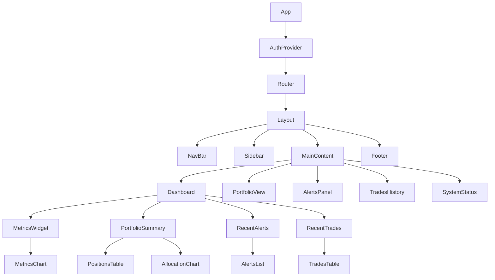
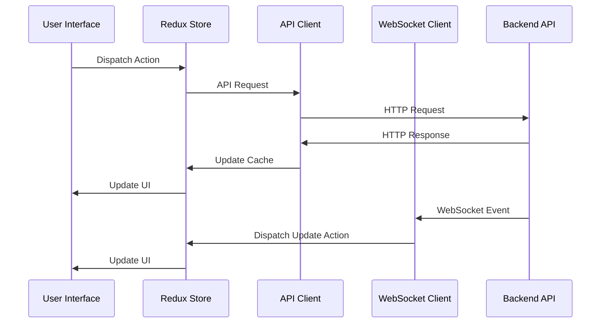
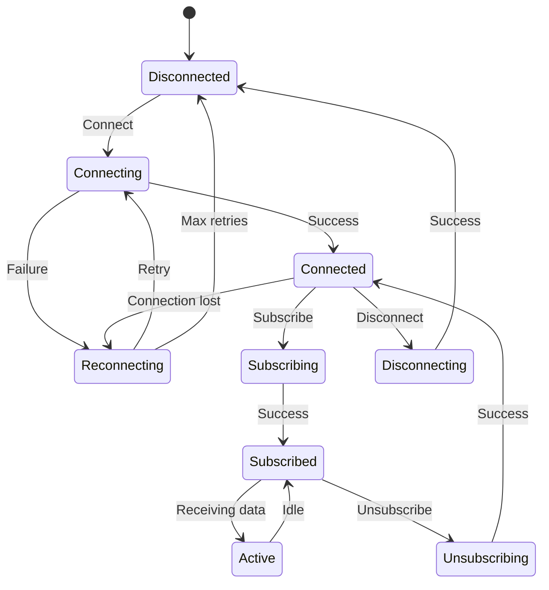

# Dashboard Frontend Architecture

This document outlines the architecture for the AI Hedge Fund Dashboard Frontend. The frontend will provide a responsive, real-time interface for monitoring and managing the trading system.

## 1. Technology Stack

### Core Technologies
- **Framework**: React with TypeScript
- **State Management**: Redux Toolkit with RTK Query for API caching
- **Routing**: React Router v6
- **Styling**: Tailwind CSS with custom theme
- **Component Library**: Headless UI with custom styled components
- **Real-time Updates**: WebSocket connection with reconnection logic
- **Testing**: Jest, React Testing Library, and Cypress
- **Build Tools**: Vite for fast development and builds

### Key Libraries
- **Charts**: D3.js with react-vis for complex visualizations
- **Tables**: TanStack Table (React Table v8) for data grids
- **Forms**: React Hook Form with Zod validation
- **Date/Time**: date-fns for date manipulation
- **Internationalization**: react-i18next for multi-language support
- **Notifications**: react-toastify for toast notifications

## 2. Application Architecture

### High-Level Architecture

```mermaid
flowchart TB
    subgraph Authentication
        Login
        AuthProvider
        PrivateRoute
    end
    
    subgraph API Layer
        APIClient
        WebSocketClient
        DataCache
    end
    
    subgraph State Management
        Redux[Redux Store]
        Slices[Feature Slices]
        Selectors
    end
    
    subgraph UI Components
        Layout
        DashboardWidgets
        DataVisualization
        Tables
        Forms
    end
    
    Authentication --> API Layer
    API Layer --> State Management
    State Management --> UI Components
```

### Component Hierarchy



## 3. State Management

### Redux Store Structure

```
store/
├── index.ts                 # Store configuration
├── middleware/              # Custom middleware
├── api/                     # RTK Query API definitions
│   ├── metricsApi.ts        # Metrics endpoints
│   ├── alertsApi.ts         # Alerts endpoints
│   ├── portfolioApi.ts      # Portfolio endpoints
│   ├── tradesApi.ts         # Trades endpoints
│   └── systemApi.ts         # System endpoints
├── slices/                  # Redux slices
│   ├── authSlice.ts         # Authentication state
│   ├── uiSlice.ts           # UI state (theme, sidebar, etc.)
│   ├── websocketSlice.ts    # WebSocket connection state
│   └── notificationsSlice.ts # Notifications state
└── selectors/               # Memoized selectors
```

### Data Flow



## 4. Feature Modules

### Authentication Module
- Login/Logout functionality
- Token management (storage, refresh, expiry)
- Role-based access control
- Protected routes

### Dashboard Module
- Overview of key metrics
- Portfolio summary
- Recent alerts
- Recent trades
- Custom widget configuration

### Portfolio Module
- Detailed portfolio view
- Position details
- Allocation visualization
- Performance metrics
- Historical performance

### Alerts Module
- Real-time alerts display
- Alert filtering and searching
- Alert acknowledgment
- Alert history

### Trading Module
- Trade history
- Trade details
- Trade filtering and searching
- Trade performance analysis

### System Module
- System health metrics
- Server status
- Performance monitoring
- Resource utilization

## 5. Real-time Updates Architecture

### WebSocket Connection Management



### Data Subscription

Each WebSocket connection will subscribe to specific data channels:
- Metrics channel for real-time metrics updates
- Alerts channel for real-time alerts
- Portfolio channel for portfolio updates
- Trades channel for trade notifications

## 6. UI Component Library

### Core Components
- **Layout Components**: Page layout, Sidebar, Header, Footer
- **Data Display**: Cards, Tables, Charts, Statistics
- **Inputs**: Forms, Buttons, Selectors, Date Pickers
- **Feedback**: Alerts, Toasts, Modals, Loaders
- **Navigation**: Tabs, Breadcrumbs, Pagination

### Chart Components
- Line Charts for time series data
- Bar Charts for comparisons
- Pie/Donut Charts for allocations
- Candlestick Charts for price data
- Heatmaps for correlation matrices

### Table Components
- Sortable and filterable tables
- Expandable rows for detail views
- Virtualized tables for large datasets
- CSV/Excel export functionality

## 7. Responsive Design

The dashboard will be fully responsive with three main breakpoints:
- Desktop (1280px and above)
- Tablet (768px to 1279px)
- Mobile (below 768px)

Mobile views will use simplified layouts with collapsible sections and prioritized information display.

## 8. Performance Optimization

### Strategies
- Code splitting for route-based chunking
- Lazy loading of components
- Memoization of expensive calculations
- Virtualization for long lists and tables
- Efficient WebSocket message processing
- Service Worker for caching static assets

### Monitoring
- Lighthouse performance metrics tracking
- Core Web Vitals monitoring
- Custom performance measurements
- Error and crash reporting

## 9. Testing Strategy

### Unit Testing
- Component testing with React Testing Library
- State management testing
- Utility function testing

### Integration Testing
- Feature workflow testing
- API integration testing
- WebSocket connection testing

### End-to-End Testing
- Critical user flows with Cypress
- Cross-browser testing
- Mobile responsiveness testing

## 10. Deployment Architecture

### Build Pipeline
- Development, Testing, and Production environments
- CI/CD integration with GitHub Actions
- Automated testing before deployment
- Versioning and release management

### Hosting Options
- Static hosting on CDN (CloudFront, Netlify, Vercel)
- Docker container for complete environment
- Environment configuration via environment variables

### Performance Monitoring
- Real User Monitoring (RUM)
- Error tracking with Sentry
- Analytics for feature usage