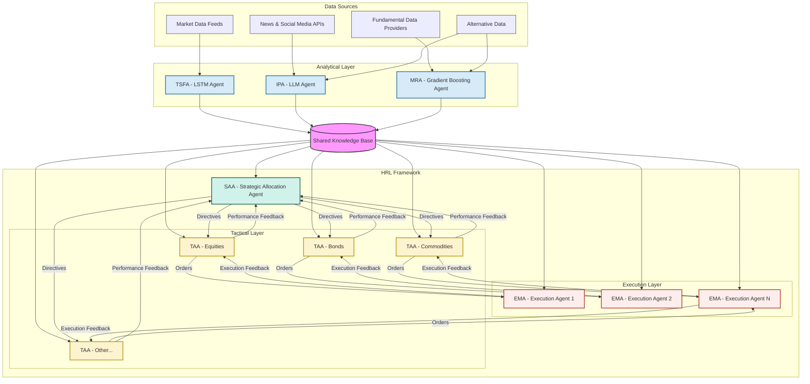
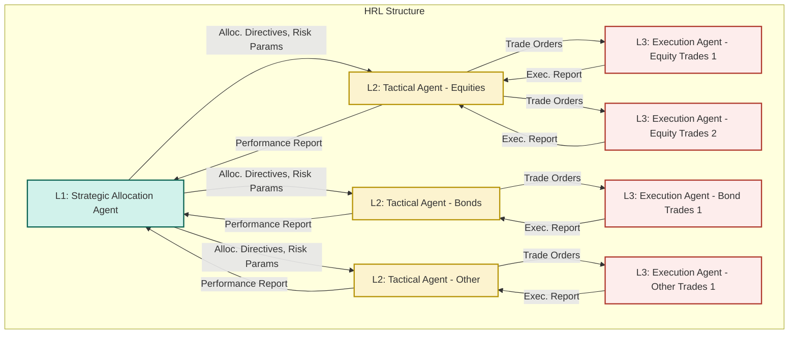

# An Advanced Multi-Agent Hierarchical Reinforcement Learning System for Sophisticated Market Analysis and Automated Trading Execution

**Author:** Alessio Rocchi
**Email:** alessio@aigenconsult.com

## 1. Abstract

This paper proposes an innovative, advanced multi-agent trading system designed for sophisticated market analysis and automated trading execution, with a strong emphasis on hierarchical decision-making and integrated risk management. The system's architecture integrates diverse machine learning methodologies: an LSTM-based agent for time-series forecasting of asset prices and volatility; a Large Language Model (LLM) agent for processing and interpreting financial news, social media sentiment, and economic reports to derive market insights; and a Gradient Boosting agent for identifying market regimes and predicting discrete events based on technical and fundamental features. These analytical agents provide crucial intelligence to a hierarchical reinforcement learning (HRL) framework. The HRL component features a top-level strategic RL agent determining overall capital allocation, dynamic risk exposure, and long-term portfolio strategy; mid-level tactical RL agents focusing on asset class or sector-specific strategies within defined risk parameters; and low-level execution RL agents optimizing trade execution and responding to micro-market dynamics while managing execution-specific risks. This synergistic integration, supported by advanced risk control mechanisms and rigorous backtesting protocols, aims to create a robust, adaptive, and highly autonomous trading system capable of navigating complex financial markets. The anticipated contributions include enhanced predictive accuracy through multi-modal data fusion, improved strategic and tactical decision-making via hierarchical task decomposition, deeply integrated and adaptive risk management, and optimized trade execution, ultimately leading to superior and sustainable risk-adjusted returns.

## 2. Introduction

Algorithmic trading has fundamentally transformed financial markets, enabling high-speed execution and the systematic implementation of complex trading strategies. However, modern markets present significant challenges, including high volatility, non-stationarity, information overload from diverse sources, and the intricate interplay of micro and macro-economic factors. Traditional algorithmic trading systems often struggle to adapt to these dynamic conditions, effectively synthesize the vast amounts of structured and unstructured data available, and robustly manage multifaceted risks.

This paper introduces a novel multi-agent system leveraging a Hierarchical Reinforcement Learning (HRL) framework to address these challenges comprehensively. The core rationale for this approach lies in its ability to:
1.  **Decompose Complexity:** Break down the multifaceted problem of trading into manageable sub-problems, each handled by specialized agents operating at different strategic, tactical, and execution levels.
2.  **Integrate Diverse Intelligence:** Combine the strengths of different machine learning paradigms – time-series forecasting (LSTM), natural language understanding (LLM), and pattern recognition in structured data (Gradient Boosting) – to create a holistic and nuanced market view.
3.  **Learn Adaptive Strategies with Integrated Risk Control:** Employ reinforcement learning to enable agents to learn and adapt their strategies based on market feedback and interactions, optimizing for long-term objectives while operating within a sophisticated, multi-layered risk management framework.
4.  **Facilitate Scalability, Modularity, and Rigorous Validation:** Allow for easier development, testing, and upgrading of individual components, and support comprehensive backtesting and simulation to ensure system robustness.

The objectives of this paper are to:
*   Propose a detailed architecture for an advanced multi-agent HRL trading system, emphasizing its hierarchical structure and inter-agent coordination.
*   Describe the roles and interactions of specialized analytical and decision-making agents.
*   Outline a high-level mathematical formulation for the system's components, including its risk management layers.
*   Discuss practical implementation concepts, including data sourcing, technology stack, robust backtesting strategies, and deployment considerations.
*   Explore potential challenges, recent advancements in related systems, and promising future research directions.

This work aims to provide a detailed blueprint for a next-generation trading system capable of sophisticated market analysis, dynamic risk management, and autonomous, intelligent trading execution, building upon existing research and highlighting pathways for continued innovation.

## 3. Related Work

The proposed system draws inspiration from several research areas:

*   **Multi-Agent Systems (MAS) in Finance:** MAS have been explored for simulating market dynamics, understanding agent interactions, and developing collaborative trading strategies. Works by Tesfatsion (Agent-based Computational Economics) and research in agent-based modeling of financial markets provide foundational concepts. The idea of specialized agents collaborating towards a common goal is central to our proposal.

*   **LSTM for Time-Series Forecasting:** Long Short-Term Memory (LSTM) networks, a type of Recurrent Neural Network (RNN), have demonstrated significant success in modeling sequential data, including financial time series. Studies by Fischer and Krauss (2018) on deep learning for stock price prediction, and various applications in volatility forecasting, highlight LSTMs' capability to capture temporal dependencies and non-linear patterns in market data.

*   **LLMs for Financial NLP:** Large Language Models (LLMs) like BERT, GPT, and their derivatives have revolutionized Natural Language Processing. Their application in finance includes sentiment analysis of news and social media (e.g., Ding et al., 2015, on using deep learning for event-driven stock prediction), information extraction from financial reports, and generating market summaries. These models can process vast amounts of textual data to uncover insights relevant to market movements.

*   **Gradient Boosting Machines in Trading:** Gradient Boosting algorithms (e.g., XGBoost, LightGBM, CatBoost) are powerful ensemble learning methods widely used for classification and regression tasks on structured data. In finance, they have been applied for predicting market direction, identifying trading signals based on technical and fundamental indicators, and classifying market regimes (e.g., Gu, Kelly, and Xiu, 2020, on empirical asset pricing via machine learning).

*   **Hierarchical Reinforcement Learning (HRL):** HRL addresses the challenge of learning in complex environments with sparse rewards by decomposing tasks into hierarchies of sub-tasks or sub-goals. Seminal works by Sutton, Precup, and Singh (on options framework) and Dietterich (MAXQ value function decomposition) laid the groundwork. In finance, HRL has been proposed for portfolio management where high-level agents set asset allocation goals and lower-level agents handle execution (e.g., research by Deng et al., 2017, on HRL for financial portfolio management). Our system extends this by integrating diverse analytical inputs into a multi-level HRL decision structure.

*   **Recent Integrated Systems:** More recent work on hierarchical policies and multi‑agent RL (e.g., Option‑Critic [9], FeUdal Networks [10], HIRO [11], MADDPG [12]) demonstrates practical progress orchestrating decisions across time scales and agents, showing how hierarchical decomposition and multi‑agent coordination can improve exploration and learning stability in complex environments.

While individual components have been researched, the synergistic integration of specialized LSTM, LLM, and Gradient Boosting analytical agents into a comprehensive, multi-layered HRL framework for trading, as proposed herein, represents a novel approach aimed at achieving a higher degree of autonomy and market adaptability, building upon these foundational and emerging concepts.

## 4. Proposed System Architecture

The proposed system is a multi-agent architecture composed of specialized analytical agents and a Hierarchical Reinforcement Learning (HRL) framework for decision-making and execution.

### 4.1 Analytical Agents

These agents are responsible for processing specific types of data and generating predictive insights.

*   **A1: LSTM-based Time-Series Forecasting Agent (TSFA)**
    *   **Role:** Predicts future asset prices, price ranges, and volatility measures.
    *   **Responsibilities:** Ingest historical and real-time market data (OHLCV, order book snapshots if available), preprocess time-series data, train and maintain LSTM models.
    *   **Input Data:** Historical and streaming price/volume data for various assets, relevant economic indicators with temporal characteristics.
    *   **Internal Model Logic (Conceptual):** Employs deep LSTM networks (potentially with attention mechanisms) to capture temporal dependencies. May use variants like stacked LSTMs, Bi-LSTMs, or encoder-decoder architectures for sequence-to-sequence predictions.
    *   **Output Signals:** Forecasted price series (e.g., next N periods), predicted volatility (e.g., GARCH-like forecasts from LSTM residuals or direct volatility prediction), confidence intervals for predictions.

*   **A2: LLM-based Information Processing Agent (IPA)**
    *   **Role:** Extracts actionable insights from unstructured textual data.
    *   **Responsibilities:** Monitor and process financial news articles, social media feeds (e.g., Twitter, Reddit), company filings, economic reports, and analyst commentaries.
    *   **Input Data:** Real-time streams of textual data from various sources (News APIs, social media APIs, SEC EDGAR, etc.).
    *   **Internal Model Logic (Conceptual):** Utilizes pre-trained LLMs fine-tuned for financial domain tasks such as sentiment analysis (positive, negative, neutral market/asset sentiment), named entity recognition (identifying companies, people, events), event extraction (e.g., earnings announcements, M&A news, regulatory changes), topic modeling, and question answering against financial documents.
    *   **Output Signals:** Structured sentiment scores (per asset, sector, market), summaries of key news events, identified risk factors or opportunities from text, relevance scores of information to specific assets.

*   **A3: Gradient Boosting Market Regime Agent (MRA)**
    *   **Role:** Identifies current market regimes and predicts discrete market events.
    *   **Responsibilities:** Analyze a broad set of technical indicators, fundamental data, and outputs from TSFA and IPA to classify market conditions.
    *   **Input Data:** Historical and real-time technical indicators (e.g., moving averages, RSI, MACD, ADX), fundamental data (e.g., P/E ratios, interest rates, inflation), volatility measures from TSFA, sentiment scores from IPA.
    *   **Internal Model Logic (Conceptual):** Employs Gradient Boosting Machines (e.g., XGBoost, LightGBM) trained to classify market states (e.g., bull trend, bear trend, consolidation, high volatility, low volatility) or predict probabilities of specific events (e.g., likelihood of a market correction, probability of a sector rotation).
    *   **Output Signals:** Current market regime classification (e.g., "Bullish-HighVol"), probability distributions for future regimes, predictions of discrete events (e.g., "High probability of short squeeze for asset X").

### 4.2 Hierarchical Reinforcement Learning (HRL) Framework

The HRL framework consists of multiple layers of RL agents, each operating at different temporal and strategic scales.

*   **HRL-L1: Strategic Allocation Agent (SAA)**
    *   **Role:** Top-level agent determining overall capital allocation across broad asset classes or market segments, setting long-term portfolio strategy, and managing overall risk exposure.
    *   **Goal:** Maximize long-term risk-adjusted portfolio return.
    *   **Input Data:** Macroeconomic indicators, long-term forecasts from TSFA, broad market sentiment from IPA, market regime classifications from MRA, current overall portfolio composition and performance.
    *   **Actions:** Define target allocation percentages for different asset classes (e.g., 60% equities, 30% bonds, 10% commodities), set overall portfolio risk limits (e.g., maximum VaR, target volatility), adjust strategic beta exposures.
    *   **Output Signals:** High-level allocation directives and risk parameters passed to HRL-L2 agents. Operates on a longer time horizon (e.g., weekly, monthly).

*   **HRL-L2: Tactical Asset Agents (TAA) (Multiple Instances)**
    *   **Role:** Mid-level agents, each focusing on a specific asset class (e.g., US Equities TAA, Fixed Income TAA) or sector (e.g., Technology Sector TAA). They implement the SAA's directives by selecting specific assets or sub-strategies within their domain.
    *   **Goal:** Maximize risk-adjusted return within their assigned domain, subject to SAA's constraints.
    *   **Input Data:** SAA directives, asset-specific forecasts from TSFA, asset/sector-specific sentiment from IPA, relevant event predictions from MRA, current holdings and performance within their domain.
    *   **Actions:** Select specific assets to invest in, determine position sizing for individual assets, choose sub-strategies (e.g., momentum, value within equities), set tactical risk limits for their sub-portfolio.
    *   **Output Signals:** Target positions or trading signals for specific assets passed to HRL-L3 agents. Operates on a medium time horizon (e.g., daily, weekly).

*   **HRL-L3: Execution & Micro-Response Agents (EMA) (Multiple Instances)**
    *   **Role:** Low-level agents responsible for optimizing trade execution for specific orders received from TAAs and responding to short-term micro-market dynamics.
    *   **Goal:** Minimize transaction costs (slippage, commissions) and market impact while achieving target execution prices; react to immediate market opportunities or risks.
    *   **Input Data:** TAA orders (asset, quantity, direction, target price/time), real-time order book data, tick data, short-term volatility forecasts from TSFA, immediate market event flags from MRA.
    *   **Actions:** Break down large orders into smaller pieces, choose order types (limit, market, TWAP, VWAP), dynamically adjust order parameters based on market liquidity and momentum, execute hedging actions.
    *   **Output Signals:** Executed trades, updates on order status. Operates on a very short time horizon (e.g., seconds, minutes).

### 4.3 Inter-Agent Communication and Coordination

*   **Shared Knowledge Base (SKB):** A centralized repository (e.g., a distributed database or a specialized data fabric) where analytical agents publish their outputs (forecasts, sentiment scores, regime classifications) with timestamps and confidence levels. HRL agents subscribe to relevant information from the SKB.
*   **Message Passing Protocols:** Directives from higher-level HRL agents to lower-level agents are passed via a defined messaging system (e.g., using message queues like Kafka or gRPC calls). This ensures clear command flow and feedback.
*   **Feedback Loops:** Performance metrics and execution results from lower-level EMAs are fed back to TAAs, and TAA performance is fed back to the SAA, allowing for continuous learning and adaptation across the hierarchy.

### 4.4 System Diagrams (Mermaid)


**Figure 1: Overall Multi-Agent System Architecture and Data Flow.** This diagram illustrates the complete system architecture, showing the analytical agents (top), hierarchical RL framework (middle), and data sources (bottom). The Shared Knowledge Base (SKB) serves as the central information repository connecting all components.


**Figure 2: Structure of Hierarchical RL Agents and Command/Feedback Flow.** This diagram focuses on the hierarchical relationship between the three levels of RL agents, showing how directives flow down from strategic to tactical to execution levels, while performance feedback flows upward.

## 5. Mathematical Formulation (High-Level)

This section provides a conceptual mathematical framework for the agents and the HRL system.

### 5.1 Analytical Agents' Objectives

*   **LSTM-based Time-Series Forecasting Agent (TSFA):**
    Let $y_t$ be the true price/volatility at time $t$, and $\hat{y}_t(\theta_{LSTM})$ be the LSTM's prediction with parameters $\theta_{LSTM}$. The objective is to minimize a loss function, e.g., Mean Squared Error (MSE):

```math
L_{LSTM}(\theta_{LSTM}) = \frac{1}{T} \sum_{t=1}^{T} (y_t - \hat{y}_t(\theta_{LSTM}))^2
```

*   **LLM-based Information Processing Agent (IPA):**
    For sentiment analysis, let $s_i$ be the true sentiment (e.g., positive, negative, neutral) of document $i$, and $\hat{s}_i(\theta_{LLM})$ be the LLM's predicted sentiment. The objective is to maximize accuracy or minimize cross-entropy loss:

```math
L_{LLM}(\theta_{LLM}) = -\frac{1}{N} \sum_{i=1}^{N} \sum_{c \in C} s_{i,c} \log(\hat{s}_{i,c}(\theta_{LLM}))
```

For information extraction, the objective might be maximizing F1-score for identifying relevant entities or events.

*   **Gradient Boosting Market Regime Agent (MRA):**
    Let $r_j$ be the true market regime for observation $j$, and $\hat{r}_j(\theta_{GB})$ be the Gradient Boosting model's prediction. For classification, the objective could be maximizing accuracy or F1-score, or minimizing a loss function like log-loss.

```math
L_{GB}(\theta_{GB}) = \text{LossFunction}(r, \hat{r}(\theta_{GB}))
```

### 5.2 Hierarchical Reinforcement Learning (HRL) Framework

We model each level as a semi-Markov Decision Process (SMDP). An option $o=\langle I,\pi_o,\beta_o\rangle$ has initiation set $I$, intra-option policy $\pi_o(a\mid s)$, and termination $\beta_o(s)\in[0,1]$. Because markets are only partially observable, the problem is a POMDP; consequently, policies are typically recurrent or belief-state based (e.g., LSTM encoders over observations), with discount $\gamma\in(0,1)$ [8].

*   **State Space ($S_k$):** For level $k$, includes SKB features, positions, cash, and directives from level $k-1$, all time-aligned to avoid look-ahead.
*   **Action Space ($A_k$):** Primitive actions for EMAs (order parameters) or options/sub-goals for agents at level $k+1$.
*   **Reward Function ($R_k$):**
    *   **HRL-L3 (EMAs, execution quality):** Use implementation shortfall (IS) vs. arrival price plus explicit costs and market-impact penalty. Let $q$ be signed executed quantity, $\operatorname{VWAP}_{exec}$ the execution VWAP, and $P_{arr}$ the arrival price. Then [18]

```math
\operatorname{IS} = \operatorname{sgn}(q)\,\frac{\operatorname{VWAP}_{exec}-P_{arr}}{P_{arr}}
```

and the reward per episode/trade window can be

```math
R_{EMA} = -\operatorname{IS} - c_{fees} - \eta\,\text{Impact}(|q|) + \kappa\,\text{PriceImprovement}
```

with $\text{Impact}(|q|)$ a temporary/permanent impact model and $\kappa\ge 0$.

    *   **HRL-L2 (TAAs, sub-portfolio performance):** Reward on excess return vs. benchmark, penalizing risk and turnover under SAA directives:

```math
R_{TAA} = r_{sub} - r_{bench} - \lambda\,\mathcal{R}_{sub} - \eta\,\text{Turnover}
```

where $\mathcal{R}_{sub}$ can be variance, tracking error, or CVaR.

    *   **HRL-L1 (SAA, portfolio objective):** Risk-adjusted growth with constraint adherence:

```math
R_{SAA} = r_P - \rho\,\mathcal{R}_P - \sum_j \mu_j\,\mathbb{1}[\text{constraint}_j\ \text{violated}]
```

The objective for each level is to learn $\pi_k^*$ maximizing discounted return:

```math
\pi_k^* = \arg\max_{\pi_k} \mathbb{E}\Big[\sum_{t=0}^{\infty} \gamma^t R_{k,t+1} \mid S_{k,0}, \pi_k\Big].
```

Using policy gradients (e.g., PPO/A2C [17]) or HRL variants (Option-Critic [9], FeUdal [10], HIRO [11]), the option-value Bellman relation is

```math
Q_k(s,o) = \mathbb{E}\Big[\sum_{t=0}^{\tau-1}\gamma^t R_{k,t+1} + \gamma^{\tau}\max_{o'} Q_k(s',o')\,\Big|\,s_0=s, o\Big],
```

with random option duration $\tau$.

### 5.3 Overall System Objective

We formalize the L1 objective via a utility with explicit constraints. Two common choices are mean–variance and CVaR minimization:

1) Mean–variance utility [22]

```math
\max_{w\in\mathcal{W}}\ U(w) = \mathbb{E}[R_P(w)] - \lambda_U\,\mathrm{Var}[R_P(w)]
```

subject to budget, leverage, and exposure limits in $\mathcal{W}$.

2) CVaR–based risk control (Rockafellar–Uryasev) [16]

```math
\min_{w,\,\alpha}\ \alpha + \frac{1}{1-\beta}\,\mathbb{E}\big[(L_P(w)-\alpha)_+\big]
```

where $L_P$ is portfolio loss, $\beta\in(0,1)$ the confidence level, with the same portfolio constraints. The HRL layers coordinate to approximate these objectives online under changing regimes.

In practice we include turnover and transaction-cost penalties, and hard constraints are enforced by risk overlays (Section 6; see also Appendix A).

### 5.4 Notes on Targets and Observability

To reduce non-stationarity and leakage, supervised targets favor returns (e.g., log-returns) and realized volatility rather than raw prices; the overall decision process is POMDP, handled via recurrent encoders or belief states [8].

### 5.5 Advanced Risk Management Integration

Effective risk management is paramount and is deeply embedded within the system's architecture and operational logic, extending beyond simple limit setting. It encompasses a multi-faceted strategy:

*   **Hierarchical Risk Control and Allocation:**
    *   The **Strategic Allocation Agent (SAA)**, as the highest-level controller (HLC), establishes overall portfolio-level risk parameters, such as maximum drawdown, Value-at-Risk (VaR) constraints, and target volatility. It may also enforce dynamic position limits based on sector, asset class, or inter-asset correlations to manage concentration risk.
    *   **Tactical Asset Agents (TAAs)** operate as mid-level controllers, adhering to the SAA's directives and managing risk within their allocated sub-portfolios. They translate strategic risk postures into tactical asset selection and sizing.
    *   **Execution & Micro-Response Agents (EMAs)**, as low-level controllers (LLCs), focus on minimizing execution risk, such as slippage and market impact, by optimizing trade execution strategies and adjusting order parameters in real-time (cf. [14], [15], [19]).

*   **Risk-Aware Reward Structures:**
    *   The reward functions for all RL agents at each hierarchical level are explicitly designed to penalize excessive risk-taking. This is often achieved by incorporating risk-adjusted performance metrics (Sharpe/Sortino) or risk measures (e.g., CVaR) directly into the reward signal (cf. Rockafellar–Uryasev; risk‑sensitive RL).
    *   Constraints can be formally added to the RL optimization problem, for example, ensuring that the portfolio's VaR remains below a predefined maximum:
    
```math
|\text{VaR}_\beta(\text{Portfolio})| \leq \text{VaR}_{max}
```

*   **Adaptation to Market Conditions:**
    *   The system is designed for adaptability through techniques such as phased training protocols, where agents are jointly trained across simulated bull and bear market scenarios to improve robustness to different market regimes.
    *   Multi-timeframe coordination, where higher-tier agents provide guidance based on aggregated market signals, helps lower-tier agents filter noise and make more stable decisions.

*   **Dedicated Portfolio Safeguards and Resilience:**
    *   The architecture can incorporate modular risk layers, potentially including specialized agents for tasks like real-time volatility forecasting (e.g., an "Early Alert Module") or dynamic downside protection strategies (e.g., a "Safety Action Module").
    *   Resilience is further enhanced through multi-agent knowledge sharing, where insights regarding liquidity crunches or heightened volatility in one part of the portfolio can be communicated to inform stress testing or pre-emptive actions in others [dl.acm.org/doi/10.1145/3677052.3698688].
    *   Automated circuit breaker mechanisms can be implemented, triggered by real-time VaR calculations or other critical risk indicators from dedicated monitoring agents, leading to systematic position unwinding or hedging actions if predefined thresholds are breached.

This comprehensive approach aims to create a system that not only seeks profit but actively and intelligently manages risk across all operational facets.

## 6. Practical Implementation Concepts

*   **Data Sources:**
    *   **Market Data:** Real-time and historical data from exchanges (e.g., via FIX protocol, WebSocket APIs from brokers like Interactive Brokers, Alpaca) or data vendors (e.g., Refinitiv, Bloomberg, Polygon.io, IEX Cloud).
    *   **News & Sentiment:** APIs from news providers (e.g., Reuters, Dow Jones News API, NewsAPI.org), social media platforms (Twitter API), financial forums.
    *   **Fundamental Data:** Providers like FactSet, S&P Capital IQ, or public sources like SEC EDGAR.
    *   **Alternative Data:** Satellite imagery, credit card transaction data, shipping data, etc., from specialized providers.

*   **Technology Stack (High-Level):**
    *   **Programming Language:** Python (dominant for ML/RL due to its extensive libraries).
    *   **ML/DL Libraries:** TensorFlow, PyTorch for LSTM, LLM, and RL model development. Scikit-learn, XGBoost, LightGBM for Gradient Boosting.
    *   **RL Libraries:** Ray RLlib, Stable Baselines3, TF-Agents.
    *   **NLP Libraries:** Hugging Face Transformers for LLMs.
    *   **Data Processing & Storage:** Pandas, NumPy, Dask for large datasets. SQL/NoSQL databases (e.g., PostgreSQL, MongoDB, TimescaleDB) for storing market data, model outputs, and trade logs.
    *   **Messaging & Streaming:** Apache Kafka or RabbitMQ for inter-agent communication and data streams.
    *   **Distributed Computing:** Ray, Dask, or Spark for distributed training and data processing if needed.
    *   **Containerization & Orchestration:** Docker, Kubernetes for deployment and scaling.

### 6.1 Data Integrity, Time Alignment, and Leakage Prevention

*   **Event-time alignment:** All SKB features must be computed with data available strictly up to time $t^{-}$ with explicit data lags; track ingestion timestamps and vendor delays.
*   **No look-ahead:** Enforce watermarking/as-of joins; forbid usage of post-$t$ revisions (e.g., fundamentals restatements) during training and inference.
*   **Survivorship-bias free:** Use delisted constituents; apply corporate actions (splits, dividends) and adjust historical series consistently.
*   **Multi-source synchronization:** Normalize timezones, calendars, and late-arrival handling (drop/impute with flags). De-duplicate and cluster near-duplicate news.
*   **Feature lineage:** Versioned feature store with provenance, reproducible snapshots, and schema evolution.

### 6.2 Execution Modeling and Market Impact

*   **Order book effects:** Include spread, queue position, partial fills, and cancel/replace behavior; model order types (limit/market/iceberg) and TIF constraints.
*   **Impact model:** A simple parametric cost for a trade of size $|q|$ versus average daily volume (ADV):

```math
\text{Impact}(q) = a\,\operatorname{sgn}(q)\,\Big(\frac{|q|}{\mathrm{ADV}}\Big)^b,\quad a>0,\ b\in(0,1].
```

*   **Execution price model:**

```math
P_{exec} = P_{mid} + \tfrac{1}{2}\,\text{spread}\,\operatorname{sgn}(q) + \operatorname{sgn}(q)\,\text{Impact}(|q|) + \varepsilon.
```

*   **Benchmarks:** Evaluate EMAs against Implementation Shortfall and VWAP/TWAP; report slippage, fill rate, and queue-jump penalties.

*   **Backtesting and Simulation Strategy:** A rigorous backtesting and simulation strategy is crucial for validating the HRL trading system.
    *   **High-Fidelity Environment:** Develop an event-driven backtesting engine that accurately simulates order execution (considering order types, matching logic), transaction costs (commissions, fees), slippage (based on order size and liquidity), and potential market impact of trades. The simulation should account for the hierarchical nature, where high-level agents dictate long-term strategy and low-level agents handle execution (cf. [14], [15]).
    *   **Comprehensive Historical Data:** Utilize extensive historical market data (tick data if possible for execution simulation) covering diverse market regimes (bull, bear, volatile, stable) to evaluate strategy robustness.
    *   **Simulation of Multi-Agent Dynamics:**
        *   The simulation must model the interactions between agents, including information sharing mechanisms (e.g., via the Shared Knowledge Base) and the potential for coordinated actions.
        *   When market impact is negligible at the modeled scale, offline simulation using historical trajectories is acceptable; otherwise, include impact and feedback effects in the environment model.
        *   Incorporate realistic communication delays and asynchronous updates between agents.
    *   **Learning and Adaptation Simulation:**
        *   Employ experience replay mechanisms where agents can store and reuse past experiences (state, action, reward, next_state tuples) to improve learning efficiency (cf. Prioritized Experience Replay [13]).
        *   Ensure the simulation allows for a proper balance between exploration (agents trying new actions) and exploitation (agents using known profitable strategies), which is critical for adapting to changing market dynamics.

### 6.3 Training, Evaluation, and Credit Assignment

*   **Algorithms:** PPO/A2C [17] with options [9] or HIRO [11]/MAXQ [6] for temporal abstraction; recurrent policies for POMDPs [8].
*   **Advantage decomposition:** Attribute returns to levels via hierarchical critics or value decomposition; include intrinsic rewards only where measurable.
*   **Off-policy evaluation:** Use weighted importance sampling or doubly robust estimators to assess policies from historical data.
*   **Walk-forward validation:** Rolling-origin evaluation across regimes; early stopping on risk-adjusted metrics (e.g., Sharpe, CVaR).
*   **Hyperparameter governance:** Fix seeds, log configs, and manage exploration schedules per level.

### 6.4 Risk Management Overlays and Constraints

*   **Hard limits:** Max gross/net exposure, per-asset/sector caps, liquidity and concentration limits, and maximum leverage.
*   **Risk limits:** Real-time VaR/CVaR and drawdown monitors with multi-tier circuit breakers and kill switches.
*   **Compliance:** Short-sale rules (locates/HTB), margin requirements by asset class, trade surveillance, and audit trails.
*   **Turnover/cost control:** Penalize high turnover; include borrow fees and financing costs in PnL.
    *   **Rigorous Validation Techniques:**
        *   Employ walk-forward optimization and rigorous out-of-sample testing to prevent overfitting and assess generalization capabilities.
        *   Perform sensitivity analysis on key system parameters, model assumptions, and hyperparameter settings.
        *   Use Monte Carlo simulations to assess performance robustness under a wide range of potential market scenarios and tail events.
    *   **Performance Metrics:** Beyond cumulative returns, track a comprehensive suite of metrics including Sharpe ratio, Sortino ratio, maximum drawdown, Calmar ratio, trade statistics (win/loss rate, average profit/loss), and agent-specific performance indicators.
    *   **Computational Considerations:** For computationally intensive simulations, especially with high-frequency data or many agents, explore optimization techniques like parallel processing or simplified state/action representations where appropriate.

*   **Deployment, Monitoring, and Adaptation:**
    *   **Phased Deployment:** Start with paper trading, then move to live trading with small capital.
    *   **Continuous Monitoring:** Track model performance, prediction accuracy, agent behavior, system health, and risk exposure in real-time using dashboards (e.g., Grafana, Kibana).
    *   **Drift Detection:** Implement mechanisms to detect concept drift in market data or model performance degradation.
    *   **Online Learning & Retraining:** Periodically retrain analytical models and RL agents with new data. The HRL framework should allow for online fine-tuning or adaptation of policies.
    *   **Kill Switches & Failsafes:** Implement robust risk management overlays and manual override capabilities.

## 7. Potential Challenges and Future Research Directions
*   **Model Interpretability and Explainability (XAI):** Understanding why the HRL agents make certain strategic or tactical decisions is crucial for trust and debugging, especially with complex deep learning components. Research in XAI for RL is ongoing.
*   **Non-Stationarity and Adaptability:** Financial markets are constantly evolving. Ensuring the system remains adaptive and robust to regime changes and rapid market fluctuations is a major, persistent challenge. Continual learning and adaptive model components are key.
*   **Computational Complexity:** Training and running a large-scale multi-agent system with deep learning models can be computationally intensive, requiring significant hardware resources.
*   **Data Quality and Availability:** Access to high-quality, clean, and synchronized data from diverse sources is critical and can be costly.
*   **Reward Function Design for HRL:** Crafting appropriate reward functions for each level of the hierarchy that align with the overall system goal without leading to unintended behaviors is complex.
*   **Credit Assignment in HRL:** Determining which agent or which action at which level contributed to an overall outcome (profit or loss) is a persistent challenge in HRL.
*   **Multi-Agent Coordination and Scalability:** Ensuring efficient, low-latency communication and effective coordination between numerous agents as the system scales remains a significant hurdle.
*   **Comprehensive Risk Management:** Integrating robust, adaptive, and verifiable risk management protocols across all hierarchical levels, especially in balancing profitability with risk containment and regulatory adherence.
*   **Future Research:**
    *   Incorporating causal inference to better understand market relationships.
    *   Developing more sophisticated meta-learning approaches for faster adaptation to new market conditions or assets.
    *   Exploring the use of graph neural networks (GNNs) to model inter-asset relationships or information flow.
    *   Advanced techniques for multi-agent coordination, emergent behavior analysis, and ensuring overall system stability.
    *   Enhanced integration of advanced AI models, particularly LLMs, for nuanced decision support, improved agent interaction, and dynamic strategy adjustments.
    *   Rigorous methods for ensuring the scalability, stability, and robustness of such complex systems in live, dynamic market environments.
    *   Integrating quantum computing concepts for specific optimization tasks (long-term).


## 8. Conclusion

This paper has proposed a novel and comprehensive multi-agent trading system architecture centered around a Hierarchical Reinforcement Learning framework, informed by specialized analytical agents leveraging LSTM, LLM, and Gradient Boosting methodologies. By decomposing the complex trading problem into a hierarchy of manageable tasks and integrating diverse sources of market intelligence, the system aims to achieve a new level of sophistication in automated trading. The proposed architecture offers potential for enhanced predictive power, adaptive strategic decision-making, and optimized execution, ultimately targeting superior risk-adjusted returns. While significant challenges in implementation and research remain, this framework provides a robust conceptual blueprint for developing next-generation intelligent trading systems capable of navigating the intricacies of modern financial markets.

## 9. References

1. Fischer, T., & Krauss, C. (2018). Deep learning with long short-term memory networks for financial market predictions. European Journal of Operational Research, 270(2), 654-669.

2. Ding, X., Zhang, Y., Liu, T., & Duan, J. (2015). Deep learning for event-driven stock prediction. In Proceedings of the 24th International Joint Conference on Artificial Intelligence (IJCAI), 2327-2333.

3. Gu, S., Kelly, B., & Xiu, D. (2020). Empirical asset pricing via machine learning. The Review of Financial Studies, 33(5), 2223-2273.

4. Deng, Y., Bao, F., Kong, Y., Ren, Z., & Dai, Q. (2017). Deep direct reinforcement learning for financial signal representation and trading. IEEE Transactions on Neural Networks and Learning Systems, 28(3), 653-664.

5. Sutton, R. S., Precup, D., & Singh, S. (1999). Between MDPs and semi-MDPs: A framework for temporal abstraction in reinforcement learning. Artificial Intelligence, 112(1-2), 181-211.

6. Dietterich, T. G. (2000). Hierarchical reinforcement learning with the MAXQ value function decomposition. Journal of Artificial Intelligence Research, 13, 227-303.

7. Tesfatsion, L. (2006). Agent-based computational economics: A constructive approach to economic theory. Handbook of Computational Economics, 2, 831-880.

8. Sutton, R. S., & Barto, A. G. (2018). Reinforcement Learning: An Introduction (2nd ed.). MIT Press.

9. Bacon, P.-L., Harb, J., & Precup, D. (2017). The Option-Critic Architecture. AAAI.

10. Vezhnevets, A. S., et al. (2017). FeUdal Networks for hierarchical reinforcement learning. ICML.

11. Nachum, O., Gu, S., Lee, H., & Levine, S. (2018). Data-Efficient Hierarchical Reinforcement Learning. NeurIPS (HIRO).

12. Lowe, R., et al. (2017). Multi-Agent Actor-Critic for Mixed Cooperative-Competitive Environments. NeurIPS (MADDPG).

13. Schaul, T., Quan, J., Antonoglou, I., & Silver, D. (2016). Prioritized Experience Replay. ICLR.

14. Almgren, R., & Chriss, N. (2001). Optimal execution of portfolio transactions. Journal of Risk, 3(2), 5–39.

15. Cartea, Á., Jaimungal, S., & Penalva, J. (2015). Algorithmic and High-Frequency Trading. Cambridge University Press.

16. Rockafellar, R. T., & Uryasev, S. (2000). Optimization of Conditional Value-at-Risk. Journal of Risk, 2(3), 21–41.

17. Schulman, J., Wolski, F., Dhariwal, P., Radford, A., & Klimov, O. (2017). Proximal Policy Optimization Algorithms. arXiv:1707.06347.

18. Perold, A. F. (1988). The implementation shortfall: Paper versus reality. Journal of Portfolio Management, 14(3), 4–9.

19. Gatheral, J. (2010). No-dynamic-arbitrage and market impact. Quantitative Finance, 10(7), 749–759.

20. Bailey, D., Borwein, J., López de Prado, M., & Zhu, Q. J. (2014). Pseudo-Mathematics and Financial Charlatanism: The Effects of Backtest Overfitting on Out-of-Sample Performance. Notices of the AMS, 61(5), 458–471.

21. López de Prado, M. (2018). Advances in Financial Machine Learning. Wiley.

22. Markowitz, H. (1952). Portfolio Selection. Journal of Finance, 7(1), 77–91.

---

## Appendix A: Formal Risk Objectives, CVaR Estimation, and Constraints

### A.1 Empirical VaR/CVaR Estimation

Given a sample of portfolio losses over a horizon, $\{L_i\}_{i=1}^N$, the empirical $\beta$-VaR and CVaR are:

```math
\mathrm{VaR}_\beta = \inf\{\ell\in\mathbb{R}: \tfrac{1}{N}\sum_{i=1}^N \mathbb{1}[L_i\le \ell] \ge \beta\},\quad \beta\in(0,1).
```

Let $\mathcal{I}_\beta=\{i: L_i > \mathrm{VaR}_\beta\}$ be the tail set. Then the empirical CVaR is

```math
\mathrm{CVaR}_\beta = \frac{1}{|\mathcal{I}_\beta|}\sum_{i\in\mathcal{I}_\beta} L_i.
```

The Rockafellar–Uryasev objective admits the sample approximation

```math
\min_{w,\,\alpha}\ \alpha + \frac{1}{(1-\beta)N}\sum_{i=1}^N (L_i(w)-\alpha)_+\quad\text{s.t.}\ w\in\mathcal{W}.\quad\text{[16]}
```

### A.2 Mean–Variance with Transaction Costs

Let $w$ be target weights and $w^{\text{prev}}$ previous weights. With return vector $r$, covariance $\Sigma$, and linear cost $\lambda_T\|w-w^{\text{prev}}\|_1$:

```math
\max_{w\in\mathcal{W}}\ \mathbb{E}[w^\top r] - \lambda_U\, w^\top\Sigma w - \lambda_T\,\|w-w^{\text{prev}}\|_1.\quad\text{[22]}
```

### A.3 Portfolio Feasible Set and Risk Overlays

Define the feasible set $\mathcal{W}$ via hard constraints:

```math
\begin{aligned}
&\mathbf{1}^\top w = 1,\quad \|w\|_1 \le 1+\text{leverage}_{\max},\\
&w_{min}\le w \le w_{max},\\
&A_{group}\,w \le b_{group}\quad (\text{sector/asset-class caps}),\\
&|q_j| \le c_j\,\mathrm{ADV}_j,\quad \text{(liquidity caps)},\\
&\mathrm{VaR}_\beta(w) \le \mathrm{VaR}_{\max},\quad \mathrm{DD}_{\max}(w) \le d_{\max}.
\end{aligned}
```

Turnover constraints can be imposed as $\|w-w^{\text{prev}}\|_1 \le \tau_{\max}$. These constraints are enforced by the L1 risk layer and propagated as directives and penalties to L2/L3 agents.

### A.4 Numerical Example: Empirical VaR and CVaR

Let daily losses be $L=\{0.1\%,\ 0.3\%,\ 0.2\%,\ 1.5\%,\ 0.4\%,\ 3.0\%,\ 0.6\%,\ 0.9\%,\ 0.7\%,\ 2.5\%\}$ (positive values = losses). For $\beta=0.95$, VaR$_{0.95}$ lies between the 9th and 10th order statistic; sorting $L$ yields:

```text
Order: 0.1, 0.2, 0.3, 0.4, 0.6, 0.7, 0.9, 1.5, 2.5, 3.0 (%).
```

With $N=10$, VaR$_{0.95}\approx 2.5\%$. The tail is $\{3.0\%\}$ (values strictly greater than VaR) and thus

```math
\mathrm{CVaR}_{0.95} = 3.0\%.
```

This illustrates the empirical estimate; in production, consider longer windows, exponential weights, or parametric/semi‑parametric models under heavy tails [16, 21].

### A.5 Example of Portfolio Constraints (Matrices)

Assume 5 assets in 3 sectors: $S_1=\{1,2\}$, $S_2=\{3\}$, $S_3=\{4,5\}$. Constraints:

```text
Budget:        \mathbf{1}^T w = 1
Leverage:      ||w||_1 <= 1.5
Per-asset:     -0.1 <= w_i <= 0.3
Sector caps:   w_{S_1} <= 0.40, w_{S_2} <= 0.30, w_{S_3} <= 0.50
Liquidity:     |q_i| <= 0.05 * ADV_i
```

The group matrix and limit vector are

```math
A_{group} = \begin{bmatrix}
1 & 1 & 0 & 0 & 0\\
0 & 0 & 1 & 0 & 0\\
0 & 0 & 0 & 1 & 1
\end{bmatrix},\quad b_{group} = \begin{bmatrix}0.40\\0.30\\0.50\end{bmatrix}.
```

These constraints define $\mathcal{W}$ (Sec. 5.3) and are enforced in L1 optimization and propagated as directives/penalties to L2/L3.

## Appendix B: Execution Benchmarks and Metrics

Consider an order of size $Q$ executed in fills $(p_k, q_k)$ at times $t_k$ with arrival price $P_{arr}$.

```math
\mathrm{VWAP}_{exec} = \frac{\sum_k p_k\,q_k}{\sum_k q_k},\quad \mathrm{TWAP}_{[t_0,t_1]} = \frac{1}{t_1-t_0}\int_{t_0}^{t_1} P_t\,dt.
```

Implementation Shortfall (Perold, 1988) in return terms:

```math
\mathrm{IS} = \operatorname{sgn}(Q)\,\frac{\mathrm{VWAP}_{exec}-P_{arr}}{P_{arr}}.
```

Additional metrics: slippage $= \mathrm{VWAP}_{exec}-\mathrm{VWAP}_{mkt}$, fill rate $= \sum_k q_k/|Q|$, price improvement vs. midpoint, queue-jump penalties, and cancel/replace counts. These feed L3 rewards and TCA.

### B.1 Numerical Example: Implementation Shortfall and Slippage

Assume a buy order with $Q=10{,}000$ shares, arrival price $P_{arr}=100$. Executions in three fills: $(p_1=100.10, q_1=3{,}000)$, $(p_2=100.20, q_2=4{,}000)$, $(p_3=100.05, q_3=3{,}000)$.

```math
\mathrm{VWAP}_{exec} = \frac{100.10\cdot 3000 + 100.20\cdot 4000 + 100.05\cdot 3000}{10{,}000} = 100.125.
```

Implementation Shortfall (return terms):

```math
\mathrm{IS} = +\frac{100.125-100}{100} = 0.125\%.
```

If the market VWAP over the window is $\mathrm{VWAP}_{mkt}=100.09$, the slippage vs. market is $100.125-100.09=0.035$ (3.5 bps), while price improvement vs. midpoint depends on the mid available at fill times. These metrics feed the L3 reward (Sec. 5.2) [18].

### B.2 TCA Metrics Summary (Backtest)

| Metric | Definition | Notes |
|---|---|---|
| Implementation Shortfall | sgn(Q) · (VWAP_exec − P_arr)/P_arr | Per trade/window [18] |
| Slippage vs VWAP | VWAP_exec − VWAP_mkt | In currency or bps |
| Fill Rate | Σ q_k / |Q| | Per order and aggregated |
| Price Improvement | Exec price vs midpoint | Positive if better than mid |
| Queue-Jump Penalty | Model-specific cost | For aggressive cancels/reposts |
| Cancel/Replace Count | Number of C/R | Proxy for book churn |
| Participation Rate | |Q| / Volume_window | Liquidity usage |
| Turnover | Σ |Δw| | Portfolio-level cost proxy |
| Cost per Share | Total cost / shares | Includes fees and taxes |
 
## Appendix C: Almgren–Chriss Execution Model (L3)

Consider a discrete horizon $t=0,\ldots,T$ and a buy order of size $X_0>0$ to execute. The unaffected price dynamics are

```math
P_{t+1} = P_t + \sigma\,\epsilon_{t+1},\quad \epsilon_{t+1}\sim\mathcal{N}(0,1),
```

while the temporary (per‑share) impact of a trade with rate $v_t$ is $g(v_t)=\eta\,v_t$ and the cumulative permanent impact is $h(\sum_{s\le t} v_s)=\kappa_p\,\sum_{s\le t} v_s$. Let $x_t$ be the residual quantity (with $x_0=X_0$, $x_T=0$) and $v_t=-(x_{t+1}-x_t)$ the execution rate.

The total stochastic cost (relative to the initial price) is approximately

```math
C = \sum_{t=0}^{T-1} \big( \underbrace{\eta\,v_t^2}_{\text{temporary impact}} + \underbrace{\kappa_p\,x_t\,v_t}_{\text{permanent impact}} \big) + \sum_{t=0}^{T-1} x_t\,\sigma\,\epsilon_{t+1},
```

with $\mathbb{E}[C] = \sum_t (\eta v_t^2 + \kappa_p x_t v_t)$ and $\mathrm{Var}(C)=\sigma^2\sum_t x_t^2$. The Almgren–Chriss mean–variance objective minimizes

```math
J = \mathbb{E}[C] + \phi\,\mathrm{Var}(C) = \sum_{t=0}^{T-1} (\eta v_t^2 + \kappa_p x_t v_t) + \phi\,\sigma^2\sum_{t=0}^{T-1} x_t^2,
```

with risk aversion $\phi\ge 0$. The optimal trajectory is deterministic and satisfies the linear difference equation

```math
x_{t+1} - 2\,\theta\,x_t + x_{t-1} = 0,\quad \theta = 1 + \frac{\kappa_p}{2\eta} + \frac{\phi\,\sigma^2}{\eta},
```

with boundary conditions $x_0=X_0$, $x_T=0$. The resulting liquidation is spread over time (more front‑loaded for smaller $\eta$ or larger $\phi$). In continuous time, the profile becomes exponential. This provides an L3 benchmark: the reward can penalize deviations from the predicted optimal cost and from Implementation Shortfall [14, 15].

Practical extensions: nonlinear impact $g(v)=k\,|v|^\alpha\,\mathrm{sgn}(v)$ with $\alpha\in(0,1]$ (cf. no‑dynamic‑arbitrage and empirical impact curves) [19]; spread and queue position as additive costs; TIF constraints and ADV limits. The EMA can approximate the optimal policy with RL by choosing $v_t$ given book state and operational limits.

### C.1 Numerical Example: Optimal Schedule and Cost/Risk

Parameters: $X_0=100{,}000$, $T=5$, $\sigma=0.5$, $\eta=10^{-6}$.

Case A (temporary impact only, $\kappa_p=0$, $\phi=0$): minimizing $\sum_t \eta v_t^2$ with $\sum_t v_t=X_0$ yields $v_t=X_0/T=20{,}000$ (uniform). Expected cost:

```math
\mathbb{E}[C_A] = \eta\,\sum_{t=0}^{4} v_t^2 = 10^{-6}\cdot 5 \cdot (20{,}000)^2 = 2000.
```

Cost variance (price risk) with $x=(100{,}000,\ 80{,}000,\ 60{,}000,\ 40{,}000,\ 20{,}000)$:

```math
\mathrm{Var}(C_A) = \sigma^2\sum_t x_t^2 = 0.25\cdot(1.0+0.64+0.36+0.16+0.04)\cdot 10^{10} \approx 5.5\times 10^9.
```

Case B (positive permanent impact, $\kappa_p=0.5\cdot 10^{-6}$, $\phi=0$): $\theta = 1 + \tfrac{\kappa_p}{2\eta} = 1.25$. The optimal trajectory solves $x_{t+1}-2\theta x_t + x_{t-1}=0$ with $x_0=100{,}000$, $x_5=0$ and has the form $x_t = A\,r_1^t + B\,r_2^t$, $r_{1,2}=\theta\pm\sqrt{\theta^2-1}=(2.0,\ 0.5)$. From $A= -X_0\,r_2^T/(r_1^T+r_2^T)$, $B= X_0\,r_1^T/(r_1^T+r_2^T)$ follows

```text
x \approx (100{,}000,\ 49{,}756.5,\ 24{,}585.8,\ 11{,}707.9,\ 4{,}683.7,\ 0),
v = x_t - x_{t+1} \approx (50{,}243.5,\ 25{,}170.8,\ 12{,}877.9,\ 7{,}024.2,\ 4{,}683.7).
```

Expected cost:

```math
\mathbb{E}[C_B] = \sum_t (\eta v_t^2 + \kappa_p x_t v_t) \approx 3395 + 3348 \approx 6743.
```

Cost variance:

```math
\mathrm{Var}(C_B) = \sigma^2\sum_t x_t^2 \approx 0.25\cdot 1.324\times 10^{10} \approx 3.31\times 10^9.
```

Observations: the front‑loaded profile reduces cost variance relative to uniform, at the expense of higher expected cost given $\kappa_p>0$. With $\phi>0$ a similar effect occurs (more aggressive at the start); smaller parameters produce near‑uniform profiles [14, 15, 19].

### C.2 ASCII Visualization: Uniform vs Almgren–Chriss

Timeline ($T=5$). Bars proportional to $v_t$. U = uniform; AC = optimal ($\kappa_p=0.5\cdot 10^{-6}$, $\phi=0$).

```text
t:      0        1        2        3        4
U v_t:  ████████ ████████ ████████ ████████ ████████  (~20k)
AC v_t: ██████████████ ███████ █████ ███ ███          (~50k,25k,12.9k,7.0k,4.7k)

x_t (residuo)
U:      100k -> 80k -> 60k -> 40k -> 20k -> 0
AC:     100k -> 49.8k -> 24.6k -> 11.7k -> 4.7k -> 0
```

### C.3 Pseudocode: Discrete AC Schedule

```python
def almgren_chriss_schedule(X0, T, sigma, eta, kappa_p=0.0, phi=0.0):
    # Returns x_t, v_t for t=0..T-1
    theta = 1.0 + kappa_p / (2.0 * eta) + (phi * sigma * sigma) / eta
    # characteristic roots r1>=1, r2=1/r1
    r1 = theta + (theta * theta - 1.0) ** 0.5
    r2 = theta - (theta * theta - 1.0) ** 0.5
    denom = (r1 ** T + r2 ** T)
    A = -X0 * (r2 ** T) / denom
    B =  X0 * (r1 ** T) / denom
    x = [A * (r1 ** t) + B * (r2 ** t) for t in range(T+1)]
    v = [x[t] - x[t+1] for t in range(T)]
    return x, v
```
