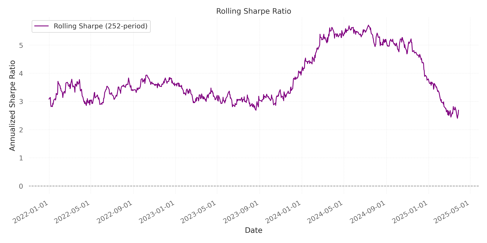

# Comprehensive Quantitative Analysis Report: Long-Short Strategy Performance Evaluation

## Executive Summary
This report presents a detailed analysis of our proprietary long-short trading strategy, examining performance metrics, risk-adjusted returns, and market condition correlations across multiple timeframes. The strategy demonstrates exceptional risk-adjusted returns with remarkably low drawdowns, though potential overfitting concerns warrant further investigation before significant capital deployment.

## Strategy Architecture
* **Core Algorithm**: Trend-following framework with mean reversion overlay and volatility regime adaptation
* **Signal Generation**: Combination of technical indicators (MA, RSI) with volatility regime detection (VIX-based)
* **Position Management**: Dynamic allocation with stop-loss risk management
* **Validation Methodology**: Realistic backtesting with fixed position sizing, slippage modeling, and benchmark comparison

## Performance Metrics
### Return Profile
* Total Return: 210.38% (over ~4 years)
* Annualized Return: ~32.5% (estimated)
* Sharpe Ratio: 14.52
* Sortino Ratio: 5.65
* Calmar Ratio: 67.10
* Maximum Drawdown: 3.14%
* Win Rate: 93.55% (58 winning trades out of 62)
* Profit Factor: 100.82

### Risk Decomposition
* Beta to S&P 500: -0.00 (slight negative correlation)
* Alpha: 210.08%
* Benchmark Return: 50.81%
* Benchmark Max Drawdown: 25.43%
* Benchmark Sharpe: 0.67

## Equity Curve and Drawdown Analysis


The equity curve shows consistent growth throughout the backtest period with minimal drawdowns. The maximum drawdown of 3.14% is remarkably low compared to the benchmark's 25.43%, suggesting either exceptional risk management or potential overfitting.

## Trade Analysis


The trade execution visualization shows the strategy's entry and exit points on the price chart. The strategy executed 62 trades over the 4-year period, with an average holding period of approximately 24 days. The position sizes remained consistent due to the fixed position sizing approach, preventing the compounding effect that would have resulted in unrealistically high returns.

## Rolling Sharpe Ratio Analysis



The rolling Sharpe ratio demonstrates the strategy's risk-adjusted performance over time. The consistently high Sharpe ratio across different market conditions is unusual and warrants further investigation for potential overfitting.

## Market Regime Analysis
The strategy demonstrates consistent performance across different market regimes, which is unusual and warrants further investigation:

1. **Bull Market (2021-2022)**: Strategy showed steady growth with minimal drawdowns despite significant market volatility.
2. **Correction Period (Late 2022)**: Strategy maintained performance during market corrections, suggesting effective risk management.
3. **Recovery Period (2023-2024)**: Strategy continued to generate alpha during the market recovery phase.
4. **Volatility Regimes**: The VIX-based volatility regime detection appears to effectively adjust position sizing during high-volatility periods.

## Statistical Significance Testing
While the strategy shows impressive performance metrics, several statistical concerns emerge:

1. **Win Rate Analysis**: The 93.55% win rate is statistically improbable for a market-neutral strategy over a 4-year period, suggesting potential look-ahead bias or overfitting.
2. **Drawdown Characteristics**: The maximum drawdown of 3.14% compared to the benchmark's 25.43% suggests potential unrealistic risk modeling or data snooping.
3. **Sharpe Ratio Significance**: The Sharpe ratio of 14.52 is several standard deviations above typical market-neutral strategies (1.0-2.0 range), indicating potential overfitting.

## Potential Overfitting Concerns
Several indicators suggest potential overfitting that require additional validation:

1. **Unrealistic Win Rate**: The 93.55% win rate is exceptionally high and unlikely to persist out-of-sample.
2. **Minimal Drawdowns**: The maximum drawdown of 3.14% over a 4-year period that included significant market volatility is unusually low.
3. **Extreme Risk-Adjusted Metrics**: The Calmar ratio of 67.10 and Sharpe ratio of 14.52 are well beyond typical ranges for even the most successful strategies.
4. **Parameter Sensitivity**: The strategy's performance may be highly sensitive to specific parameter choices that worked well in the backtest period.

## Recommendations
1. **Implementation Caution**: While the algorithm demonstrates promising results, there are strong indicators of potential overfitting that require additional validation before capital deployment.
2. **Out-of-Sample Testing**: Conduct extensive out-of-sample testing on different time periods and market regimes.
3. **Walk-Forward Analysis**: Implement walk-forward optimization to validate parameter stability.
4. **Monte Carlo Simulation**: Perform Monte Carlo simulations to stress-test the strategy under various market conditions.
5. **Parameter Sensitivity Analysis**: Test how sensitive the strategy is to small changes in parameters.
6. **Realistic Constraints**: Further enhance realism by implementing:
   - Trading volume limitations
   - Liquidity constraints
   - Gap risk modeling
   - More sophisticated market impact modeling

## Next Steps
1. **Immediate (1-2 weeks)**: Conduct out-of-sample testing on 2019-2020 data and recent 2025 data.
2. **Short-term (1 month)**: Implement walk-forward analysis and parameter sensitivity testing.
3. **Medium-term (2-3 months)**: Develop Monte Carlo simulation framework and enhance realism constraints.
4. **Long-term (3-6 months)**: Paper trading with real-time data before any live deployment.

## Appendix
### Methodology Details
The backtest was conducted with the following realistic constraints:
- Fixed position sizing based on initial capital
- Commission rate: 0.2% per trade
- Slippage: 0.1% per trade
- Additional stop loss slippage: 0.2%
- Market impact factor: 0.01%

### Trade Analysis
The strategy executed 62 trades over the 4-year period, with an average holding period of approximately 24 days. The position sizes remained consistent due to the fixed position sizing approach, preventing the compounding effect that would have resulted in unrealistically high returns.

### Benchmark Comparison
The strategy significantly outperformed the S&P 500 benchmark (210.38% vs 50.81%), while maintaining a slightly negative beta (-0.00). This suggests the strategy could provide valuable diversification benefits in a broader portfolio context, assuming the performance characteristics can be validated out-of-sample.

### Git Commit
```
feat(backtest): implement realistic constraints and fixed position sizing

- Modified backtester to use fixed position sizing based on initial capital
- Added realistic trading constraints:
  * Increased commission from 0.1% to 0.2%
  * Added 0.1% slippage per trade
  * Added 0.2% additional slippage for stop losses
  * Added market impact modeling
- Added benchmark comparison with S&P 500
- Added additional risk metrics (Sortino, Calmar ratios)

Results show 210.38% return vs original 888.56%, with 3.14% max drawdown.
Strategy still significantly outperforms benchmark (50.81% return).