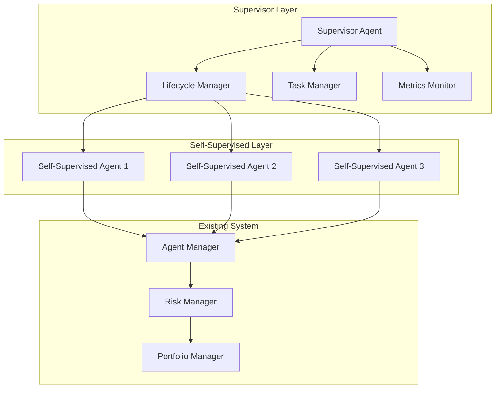

# Supervisor Agent Implementation Plan

## 1. Overview

This document outlines the implementation plan for introducing a Supervisor Agent that orchestrates multiple Self-Supervised Agents in the AlphaPulse system.

## 2. Architecture Changes

### 2.1 New Components



### 2.2 Component Responsibilities

#### Supervisor Agent
- Manages lifecycle of Self-Supervised Agents
- Delegates high-level tasks
- Monitors agent performance and health
- Coordinates inter-agent communication
- Implements recovery strategies

#### Lifecycle Manager
- Handles agent initialization
- Manages agent states (active/inactive)
- Implements graceful shutdown
- Handles agent recovery

#### Task Manager
- Maintains task queue
- Assigns tasks to appropriate agents
- Tracks task completion
- Handles task dependencies

#### Metrics Monitor
- Collects agent performance metrics
- Monitors system health
- Triggers alerts on anomalies
- Provides performance insights

## 3. Implementation Details

### 3.1 New Interfaces

```python
class ISelfSupervisedAgent(ITradeAgent):
    """Extended interface for self-supervised agents"""
    
    @abstractmethod
    async def self_evaluate(self) -> Dict[str, float]:
        """Evaluate agent's own performance"""
        pass
        
    @abstractmethod
    async def optimize(self) -> None:
        """Self-optimize based on performance metrics"""
        pass
        
    @abstractmethod
    async def get_health_status(self) -> Dict[str, Any]:
        """Report agent's health metrics"""
        pass
```

### 3.2 Core Classes

```python
class SupervisorAgent:
    """Main supervisor agent implementation"""
    
    def __init__(self):
        self.lifecycle_manager = LifecycleManager()
        self.task_manager = TaskManager()
        self.metrics_monitor = MetricsMonitor()
        
    async def initialize(self):
        """Initialize supervisor components"""
        pass
        
    async def delegate_task(self, task: Task):
        """Delegate task to appropriate agent"""
        pass
        
    async def monitor_agents(self):
        """Monitor agent health and performance"""
        pass
```

### 3.3 Integration Points

1. Agent Factory Extension
```python
class AgentFactory:
    @classmethod
    async def create_self_supervised_agent(
        cls,
        agent_type: str,
        config: Dict[str, Any]
    ) -> ISelfSupervisedAgent:
        pass
```

2. Agent Manager Integration
```python
class AgentManager:
    async def register_supervisor(
        self,
        supervisor: SupervisorAgent
    ) -> None:
        pass
```

## 4. Implementation Phases

### Phase 1: Core Infrastructure
1. Create new interfaces and base classes
2. Implement SupervisorAgent core functionality
3. Add lifecycle management capabilities

### Phase 2: Self-Supervised Agents
1. Extend existing agents with self-supervision
2. Implement optimization strategies
3. Add health monitoring

### Phase 3: Task Management
1. Implement task delegation system
2. Add task prioritization
3. Create task dependency resolution

### Phase 4: Monitoring & Optimization
1. Implement metrics collection
2. Add performance analysis
3. Create optimization triggers

### Phase 5: Integration & Testing
1. Integrate with existing AgentManager
2. Add comprehensive test suite
3. Perform system validation

## 5. Testing Strategy

### 5.1 Unit Tests
- Test each component in isolation
- Verify self-supervision logic
- Validate task delegation

### 5.2 Integration Tests
- Test supervisor-agent communication
- Verify metric collection
- Validate system recovery

### 5.3 System Tests
- End-to-end workflow testing
- Performance impact assessment
- Stress testing

## 6. Migration Strategy

1. Parallel Operation
   - Run new system alongside existing
   - Compare performance metrics
   - Validate behavior matches

2. Gradual Transition
   - Migrate agents one at a time
   - Monitor system stability
   - Roll back capability

3. Full Deployment
   - Switch to new system
   - Monitor performance
   - Document changes

## 7. Success Metrics

1. System Performance
   - Reduced signal latency
   - Improved agent coordination
   - Better resource utilization

2. Trading Performance
   - Improved signal quality
   - Better risk management
   - Higher returns

3. Operational Metrics
   - Reduced system errors
   - Faster recovery time
   - Better scalability

## 8. Future Enhancements

1. Advanced Features
   - Dynamic agent creation
   - Adaptive task routing
   - Predictive optimization

2. Scalability
   - Distributed supervision
   - Agent clustering
   - Load balancing

3. Monitoring
   - Advanced analytics
   - Real-time dashboards
   - Predictive maintenance