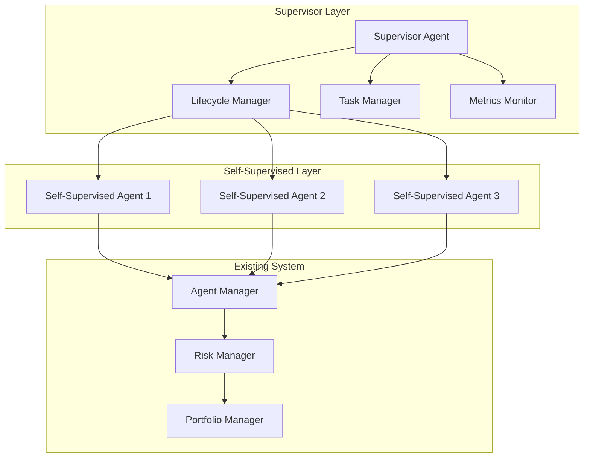

# Supervisor Agent System

## Overview

The Supervisor Agent system introduces self-supervised capabilities to AlphaPulse's trading agents. It provides a framework for managing agent lifecycles, monitoring performance, and enabling autonomous optimization.

## Architecture



## Components

### 1. Supervisor Agent
- Singleton instance managing all self-supervised agents
- Coordinates lifecycle, tasks, and metrics monitoring
- Provides high-level supervision functionality

### 2. Lifecycle Manager
- Handles agent initialization and shutdown
- Manages agent states and recovery
- Coordinates agent restarts when needed

### 3. Task Manager
- Creates and assigns tasks to agents
- Manages task priorities and execution
- Tracks task completion and results

### 4. Metrics Monitor
- Collects agent performance metrics
- Detects anomalies in agent behavior
- Provides system health insights

## Usage

### Basic Example

```python
from alpha_pulse.agents.supervisor import SupervisorAgent, AgentFactory

async def main():
    # Get supervisor instance
    supervisor = SupervisorAgent.instance()
    await supervisor.start()
    
    try:
        # Register an agent
        config = {
            "type": "technical",
            "optimization_threshold": 0.7
        }
        agent = await supervisor.register_agent("tech_agent_1", config)
        
        # Monitor health
        health = await supervisor.get_agent_status("tech_agent_1")
        print(f"Agent health: {health}")
        
    finally:
        await supervisor.stop()
```

### Upgrading Existing Agents

```python
from alpha_pulse.agents.supervisor import AgentFactory

# Upgrade existing agent to self-supervised
config = {
    "type": "technical",
    "optimization_threshold": 0.7
}
new_agent = await AgentFactory.upgrade_to_self_supervised(
    existing_agent,
    config
)
```

## Implementation Status

### Completed (Phase 1)
- ✅ Core interfaces and base classes
- ✅ Supervisor agent implementation
- ✅ Lifecycle management
- ✅ Task delegation system
- ✅ Metrics monitoring
- ✅ Basic self-supervised agents
- ✅ Test suite

### Next Steps (Phase 2)
- 🔄 Extend existing agents with self-supervision
- 🔄 Implement optimization strategies
- 🔄 Add health monitoring
- 🔄 Integration with existing agent manager

### Future Enhancements (Phase 3+)
- 📋 Advanced optimization algorithms
- 📋 Machine learning-based monitoring
- 📋 Distributed supervision
- 📋 Real-time performance analytics

## Testing

Run the test suite:

```bash
pytest src/alpha_pulse/tests/test_supervisor.py -v
```

## Adding New Agent Types

1. Create a new agent class:
```python
class CustomSelfSupervisedAgent(BaseSelfSupervisedAgent):
    async def optimize(self) -> None:
        await super().optimize()
        # Add custom optimization logic
```

2. Register with factory:
```python
AgentFactory.register_agent_type("custom", CustomSelfSupervisedAgent)
```

## Best Practices

1. Agent Implementation
   - Implement proper error handling
   - Add comprehensive logging
   - Include performance metrics
   - Document optimization strategies

2. Supervision
   - Monitor agent health regularly
   - Set appropriate thresholds
   - Handle recovery gracefully
   - Track performance trends

3. Integration
   - Preserve existing functionality
   - Maintain backward compatibility
   - Follow established patterns
   - Document changes clearly

## Contributing

When adding features:
1. Follow existing patterns and interfaces
2. Add appropriate tests
3. Update documentation
4. Consider backward compatibility

## License

Same as AlphaPulse project