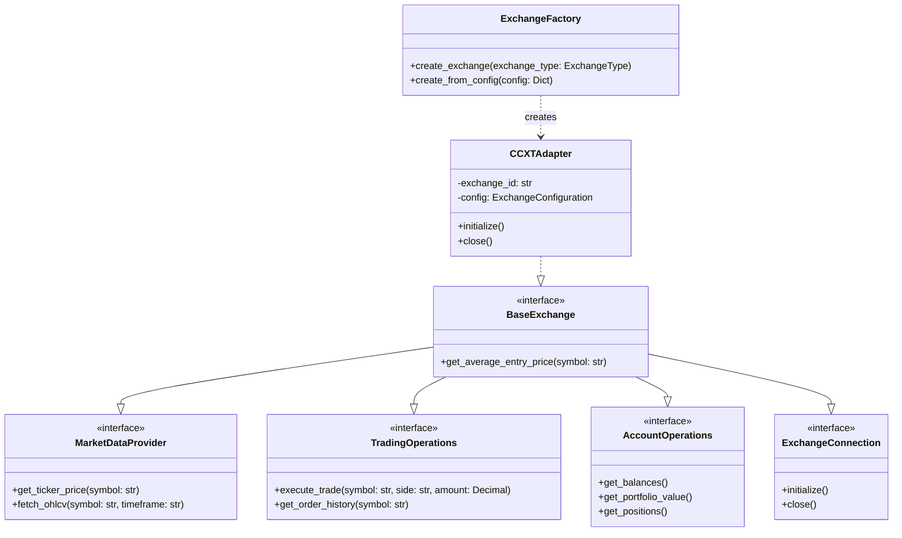

# Exchange Module

This module provides a flexible and extensible system for interacting with cryptocurrency exchanges.

## Architecture



## Components

### Base Exchange Interface

The `BaseExchange` interface defines the contract for exchange implementations, combining market data, trading, and account operations.

### CCXT Adapter

The `CCXTAdapter` provides a concrete implementation using the CCXT library, adapting its interface to match our exchange interfaces.

### Exchange Factory

The `ExchangeFactory` handles the creation of exchange instances, managing configuration and initialization.

## Usage

```python
from alpha_pulse.exchanges import ExchangeFactory, ExchangeType

# Create exchange instance
exchange = ExchangeFactory.create_exchange(
    exchange_type=ExchangeType.BINANCE,
    api_key="your-api-key",
    api_secret="your-api-secret",
    testnet=True
)

# Use exchange
async with exchange:
    # Get account balances
    balances = await exchange.get_balances()
    
    # Execute trade
    order = await exchange.execute_trade(
        symbol="BTC/USDT",
        side="buy",
        amount=0.1
    )