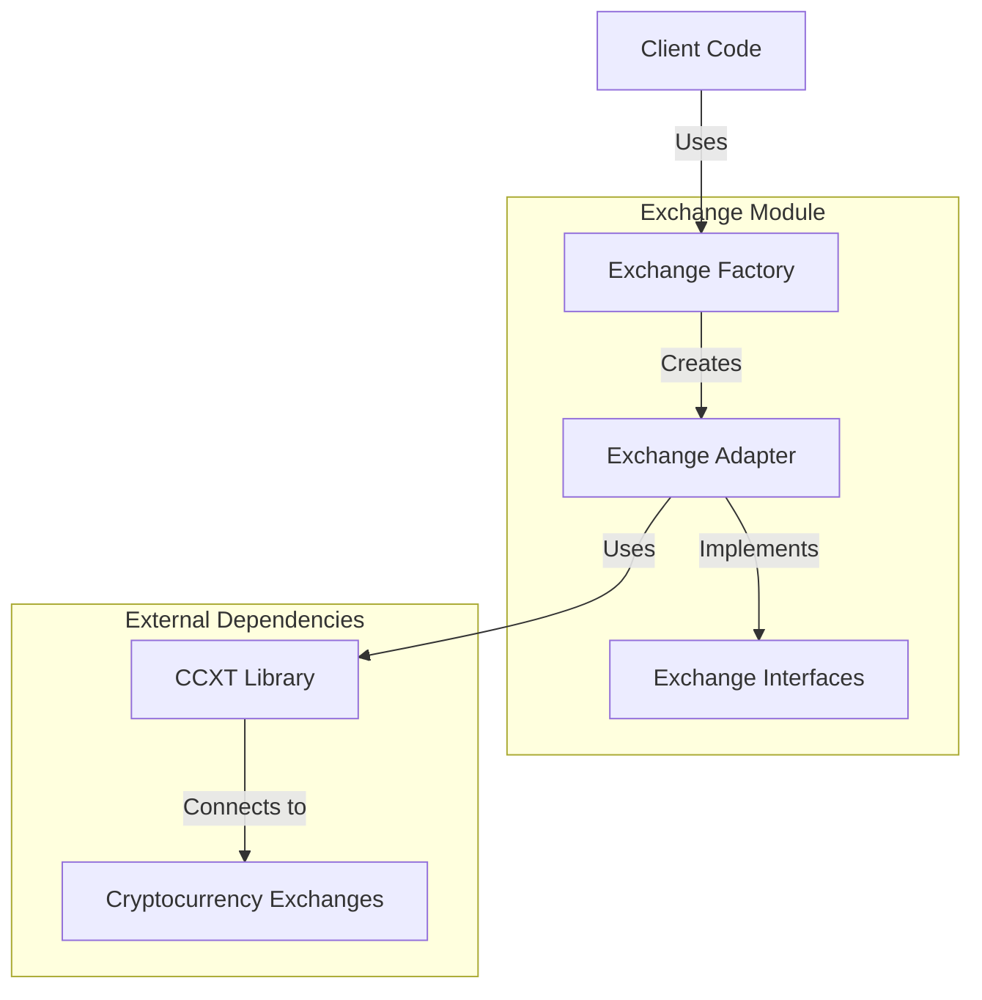
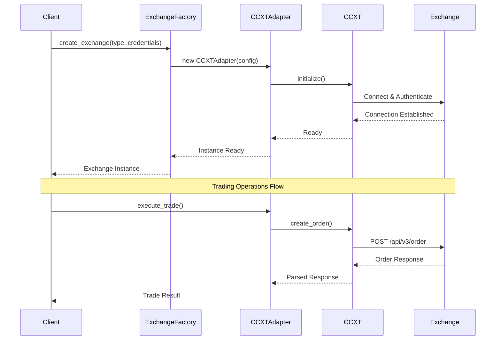
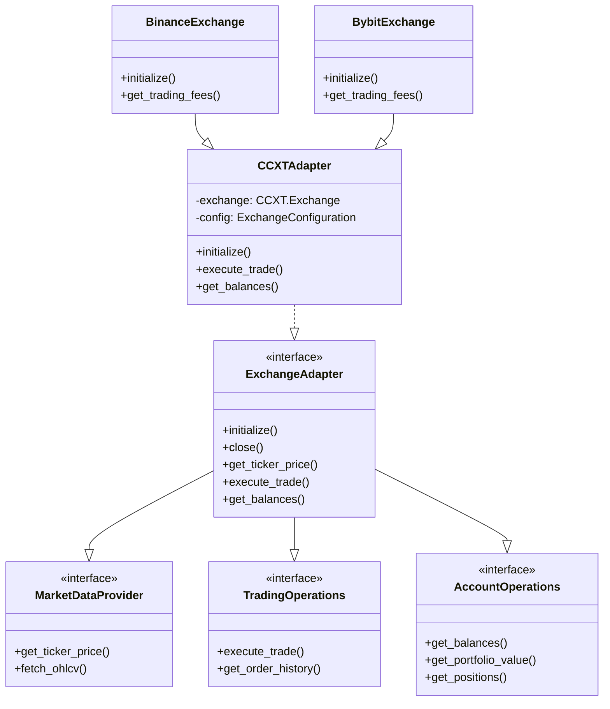
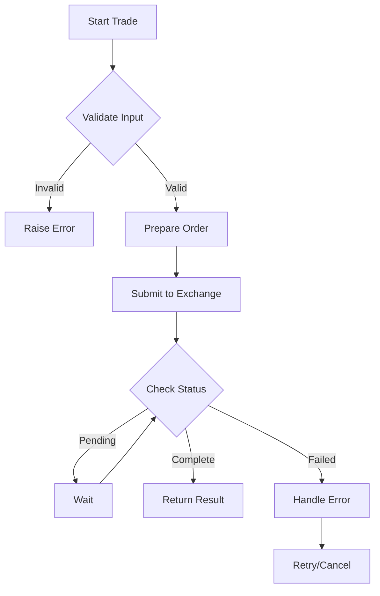
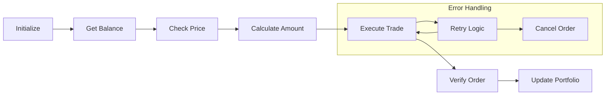

# Exchange Module Technical Documentation

## Overview and Purpose

The Exchange module is a critical component of the AlphaPulse trading system, providing a robust and extensible interface for interacting with cryptocurrency exchanges. Its primary goals are:

1. Provide a unified, consistent API for multiple cryptocurrency exchanges
2. Ensure reliable and safe trading operations
3. Support both spot and futures markets
4. Handle exchange-specific quirks and requirements
5. Maintain high performance and reliability

### Value Proposition
- **Unified Interface**: Single API for multiple exchanges
- **Type Safety**: Strong typing and runtime validation
- **Error Handling**: Comprehensive error handling and recovery
- **Performance**: Optimized for high-frequency trading
- **Extensibility**: Easy to add new exchanges and features

## System Architecture

### Component Overview



### Data Flow



## Code Structure

### Module Organization



### Key Components

1. **Interfaces** (`interfaces.py`)
   - Define core exchange functionality contracts
   - Separate concerns into focused interfaces
   - Enable dependency injection and testing

2. **Adapter** (`adapters/ccxt_adapter.py`)
   - Implements exchange interfaces
   - Wraps CCXT library
   - Handles error translation
   - Manages connection lifecycle

3. **Factory** (`factories.py`)
   - Creates exchange instances
   - Manages configuration
   - Handles registration of new exchanges

4. **Implementations** (`implementations/`)
   - Exchange-specific implementations
   - Handle unique exchange features
   - Override base functionality when needed

## Core Logic and Algorithms

### Exchange Initialization Flow

```python
async def initialize(self) -> None:
    try:
        # Create CCXT exchange instance
        exchange_class = getattr(ccxt, self.exchange_id)
        self.exchange = exchange_class({
            'apiKey': self.config.api_key,
            'secret': self.config.api_secret,
            'enableRateLimit': True,
            'options': {
                'defaultType': 'spot',
                **self.config.options
            }
        })
        
        # Configure testnet if enabled
        if self.config.testnet:
            self.exchange.set_sandbox_mode(True)
        
        # Load markets
        self._markets = await self.exchange.load_markets()
        logger.info(f"Initialized {self.exchange_id} exchange")
        
    except Exception as e:
        raise ConnectionError(f"Failed to initialize {self.exchange_id}: {str(e)}")
```

### Trade Execution Process



### Error Handling Strategy

```python
try:
    # Attempt operation
    result = await self.exchange.some_operation()
    return result
except ccxt.NetworkError as e:
    # Handle network issues
    raise ConnectionError(f"Network error: {str(e)}")
except ccxt.ExchangeError as e:
    # Handle exchange-specific errors
    raise ExchangeError(f"Exchange error: {str(e)}")
except Exception as e:
    # Handle unexpected errors
    logger.error(f"Unexpected error: {str(e)}")
    raise
```

## Workflow Examples

### Complete Trading Workflow



### Example Usage

```python
# Create exchange instance
exchange = ExchangeFactory.create_exchange(
    exchange_type=ExchangeType.BINANCE,
    api_key="your-api-key",
    api_secret="your-api-secret",
    testnet=True
)

async with exchange:
    # Get market data
    price = await exchange.get_ticker_price("BTC/USDT")
    
    # Check balance
    balances = await exchange.get_balances()
    usdt_balance = balances.get("USDT", Balance(0))
    
    # Calculate trade amount
    amount = usdt_balance.available / price * Decimal('0.95')  # 95% of available
    
    # Execute trade
    order = await exchange.execute_trade(
        symbol="BTC/USDT",
        side="buy",
        amount=amount
    )
    
    # Verify position
    positions = await exchange.get_positions()
    logger.info(f"New position: {positions['BTC']}")
```

## Best Practices and Guidelines

1. **Error Handling**
   - Always use try-except blocks
   - Implement proper error recovery
   - Log errors with context
   - Use custom exception types

2. **Resource Management**
   - Use async context managers
   - Properly close connections
   - Clean up resources
   - Handle timeouts

3. **Configuration**
   - Use environment variables
   - Validate all inputs
   - Support testnet/mainnet
   - Handle API limits

4. **Testing**
   - Mock exchange responses
   - Test error conditions
   - Use integration tests
   - Verify order validation

## Security Considerations

1. **API Credentials**
   - Never hardcode credentials
   - Use secure credential storage
   - Rotate keys regularly
   - Limit API permissions

2. **Order Safety**
   - Validate all orders
   - Implement position limits
   - Check balance before trading
   - Use price protection

3. **Error Recovery**
   - Handle connection drops
   - Implement retry logic
   - Monitor order status
   - Log all operations

Remember: This module handles real financial transactions. Always prioritize safety and correctness over performance optimizations.