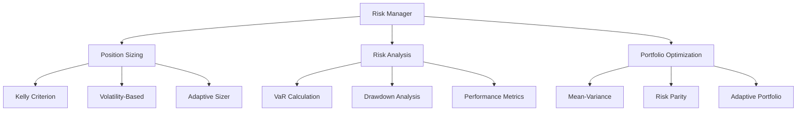
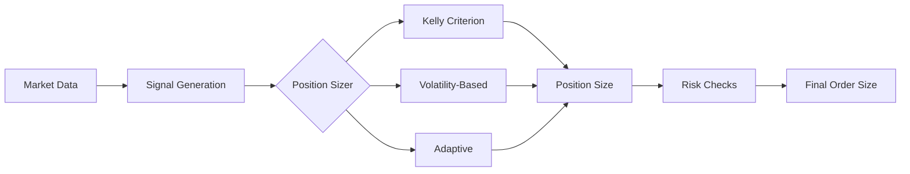
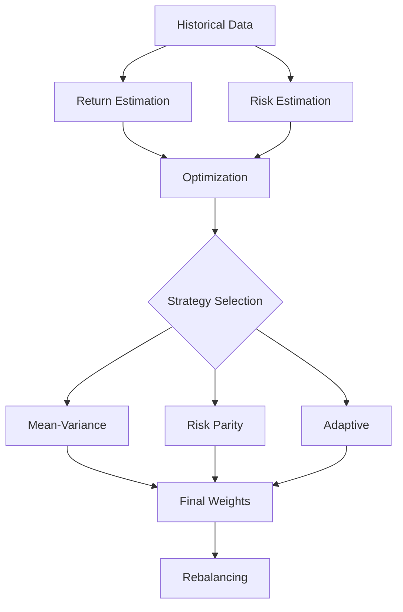

# 🛡️ Risk Management Module

The risk management module provides comprehensive tools for position sizing, portfolio optimization, and risk analysis in algorithmic trading systems. It implements advanced mathematical models and real-time monitoring capabilities.

## 🎯 Overview

The module consists of several key components:

1. 📊 Position Sizing (`position_sizing.py`)
2. 📈 Risk Analysis (`analysis.py`)
3. 💼 Portfolio Optimization (`portfolio.py`)
4. ⚡ Risk Management System (`manager.py`)

Each component is designed to be modular and can be used independently or as part of the complete risk management system.

### System Architecture


## 🔧 Components

### 1. 📊 Position Sizing

Three sophisticated position sizing strategies are available:

#### Position Sizing Workflow


#### 🎯 Kelly Criterion Sizer
```python
from alpha_pulse.risk_management import KellyCriterionSizer

sizer = KellyCriterionSizer(
    lookback_periods=100,  # Historical periods for win rate calculation
    min_trades=20,         # Minimum trades required
    max_size_pct=0.2      # Maximum position size (20% of portfolio)
)
```

Implementation details:
- 🧮 Uses dynamic win rate calculation with exponential weighting
- 📊 Implements fractional Kelly for conservative sizing
- 📈 Adjusts for market volatility using GARCH models
- 🎯 Incorporates signal strength in position sizing

#### 📈 Volatility-Based Sizer
```python
from alpha_pulse.risk_management import VolatilityBasedSizer

sizer = VolatilityBasedSizer(
    target_volatility=0.01,  # Target daily volatility
    max_size_pct=0.2,        # Maximum position size
    volatility_lookback=20    # Periods for volatility calculation
)
```

Technical features:
- 📊 Uses EWMA volatility estimation
- 🎯 Implements dynamic volatility targeting
- 📈 Supports multiple volatility models (GARCH, EWMA)
- 🔄 Adapts to changing market conditions

#### 🔄 Adaptive Position Sizer
```python
from alpha_pulse.risk_management import AdaptivePositionSizer

sizer = AdaptivePositionSizer(
    kelly_sizer=KellyCriterionSizer(),
    vol_sizer=VolatilityBasedSizer(),
    max_size_pct=0.2
)
```

Advanced features:
- 🧮 Uses Bayesian model averaging
- 📊 Implements regime detection
- 📈 Dynamic strategy weighting
- 🎯 Real-time performance monitoring

### 2. 📈 Risk Analysis

The risk analysis component calculates sophisticated risk metrics:

```python
from alpha_pulse.risk_management import RiskAnalyzer

analyzer = RiskAnalyzer(
    rolling_window=252,     # One year of daily data
    var_confidence=0.95,    # 95% VaR confidence level
    monte_carlo_sims=10000  # Simulations for Monte Carlo VaR
)

# Calculate risk metrics
metrics = analyzer.calculate_metrics(returns)
print(f"Volatility: {metrics.volatility:.2%}")
print(f"VaR (95%): {metrics.var_95:.2%}")
print(f"Max Drawdown: {metrics.max_drawdown:.2%}")
```

Implementation details:
- 📊 Value at Risk (VaR) calculation methods:
  * 📈 Historical VaR with kernel density estimation
  * 🧮 Parametric VaR with Student-t distribution
  * 🎲 Monte Carlo VaR with copula modeling
- 📉 Advanced drawdown analysis with recovery metrics
- 📊 Rolling metrics with adaptive windows
- 📈 Performance ratios with risk-adjusted calculations

### 3. 💼 Portfolio Optimization

Multiple sophisticated portfolio optimization strategies:

#### Portfolio Optimization Process


#### 📊 Mean-Variance Optimizer
```python
from alpha_pulse.risk_management import MeanVarianceOptimizer

optimizer = MeanVarianceOptimizer(
    target_return=0.10,    # Target annual return
    risk_aversion=1.0      # Risk aversion parameter
)

weights = optimizer.optimize(
    returns,
    risk_free_rate=0.02,
    constraints=PortfolioConstraints(
        min_weight=0.0,
        max_weight=0.3,
        max_total_weight=1.0
    )
)
```

Technical implementation:
- 🧮 Robust covariance estimation
- 📈 Shrinkage estimators for returns
- 🎯 Sequential quadratic programming
- 📊 Multi-objective optimization

#### ⚖️ Risk Parity Optimizer
```python
from alpha_pulse.risk_management import RiskParityOptimizer

optimizer = RiskParityOptimizer(
    target_risk=0.15  # Target portfolio volatility
)

weights = optimizer.optimize(returns)
```

Advanced features:
- 📊 Principal component analysis
- 🧮 Risk decomposition
- 📈 Hierarchical clustering
- 🎯 Dynamic risk allocation

#### 🔄 Adaptive Portfolio Optimizer
```python
from alpha_pulse.risk_management import AdaptivePortfolioOptimizer

optimizer = AdaptivePortfolioOptimizer(
    volatility_threshold=0.2  # Threshold for strategy switching
)
```

Implementation details:
- 📊 Regime detection using HMM
- 🧮 Dynamic strategy selection
- 📈 Online learning algorithms
- 🎯 Real-time adaptation

### 4. ⚡ Risk Management System

The complete risk management system integrates all components:

```python
from alpha_pulse.risk_management import RiskManager, RiskConfig

manager = RiskManager(
    config=RiskConfig(
        max_position_size=0.2,        # 20% max per position
        max_portfolio_leverage=1.5,    # 150% max leverage
        max_drawdown=0.25,            # 25% max drawdown
        stop_loss=0.1,                # 10% stop-loss
        target_volatility=0.15,       # 15% target volatility
        rebalance_threshold=0.1       # 10% weight deviation for rebalance
    )
)

# Evaluate trade
if manager.evaluate_trade(
    symbol="BTC/USD",
    side="buy",
    quantity=1.0,
    current_price=50000.0,
    portfolio_value=100000.0,
    current_positions=positions
):
    # Execute trade
    execute_trade(...)

# Update risk metrics
manager.update_risk_metrics(portfolio_returns, asset_returns)

# Get risk report
report = manager.get_risk_report()
```

System capabilities:
- 🛡️ Real-time risk monitoring
- 📊 Dynamic position sizing
- 📈 Automated portfolio rebalancing
- ⚡ Stop-loss management
- 🎯 Performance tracking

## 🚀 Usage in Multi-Asset Trading

See `examples/demo_multi_asset_risk.py` for a complete example:

```bash
# Run demo with default settings
python src/alpha_pulse/examples/demo_multi_asset_risk.py

# Run with custom symbols and parameters
python src/alpha_pulse/examples/demo_multi_asset_risk.py \
    --symbols BTC/USDT ETH/USDT BNB/USDT \
    --exchange binance \
    --interval 60
```

## 🧪 Testing

The module includes comprehensive unit tests:

```bash
# Run risk management tests
pytest src/alpha_pulse/tests/test_risk_management.py
```

Test coverage:
- 📊 Risk metrics validation
- 🎯 Position sizing algorithms
- 💼 Portfolio optimization methods
- ⚡ Trade evaluation logic
- 🛡️ Stop-loss mechanisms

## 🔧 Dependencies

- 🔢 numpy: Numerical computations
- 📊 pandas: Data manipulation and analysis
- 🧮 scipy: Optimization algorithms
- 📝 loguru: Logging

## 💡 Best Practices

1. 📊 Position Sizing:
   - Start with conservative sizes (25-50% of Kelly)
   - Use adaptive sizing in volatile markets
   - Monitor and adjust parameters weekly
   - Implement gradual position building

2. 📈 Risk Analysis:
   - Calculate metrics on multiple timeframes
   - Use both parametric and non-parametric VaR
   - Implement stress testing scenarios
   - Monitor correlation changes

3. 💼 Portfolio Optimization:
   - Use risk parity in high volatility
   - Implement regular rebalancing
   - Consider transaction costs
   - Monitor tracking error

4. ⚡ Risk Management:
   - Set conservative initial limits
   - Implement real-time monitoring
   - Use trailing stop-losses
   - Regular system validation